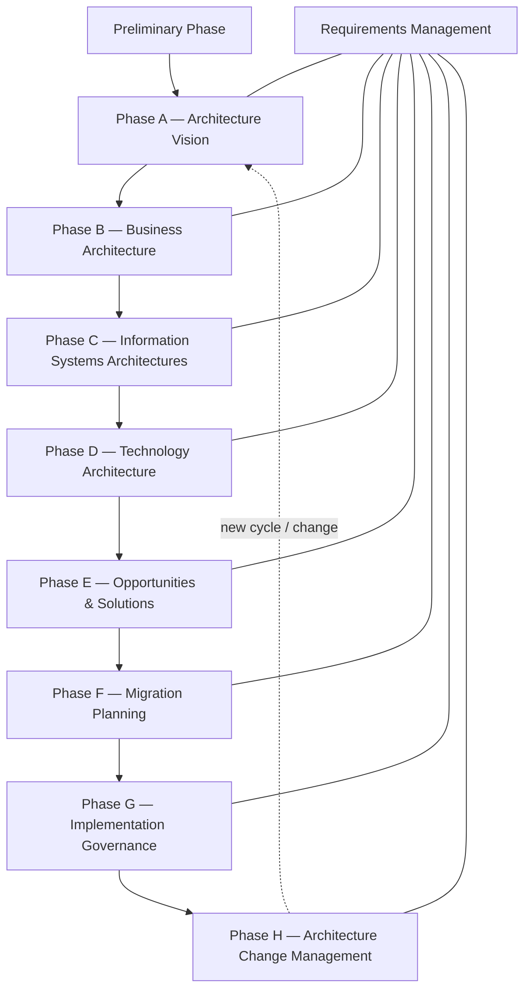
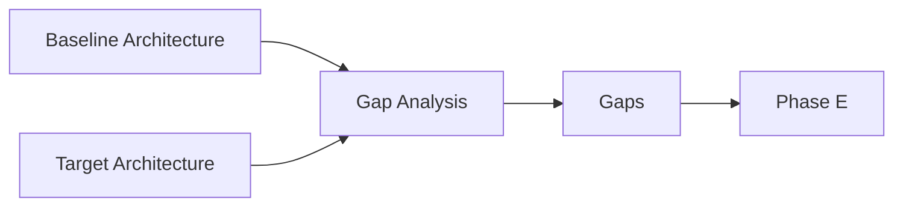
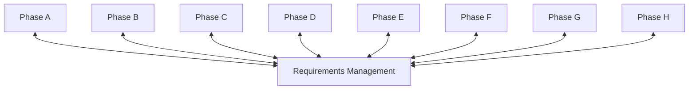

# 00 — ADM Big Picture

## 1. Definition

The **Architecture Development Method (ADM)** is the central method of the TOGAF framework for developing and managing Enterprise Architecture.

The ADM gives a structured way to move from enterprise context and architecture capability to a governed transformation.

Do **not** learn the ADM as a wheel of letters.

Learn it as a progression of decisions:

```text
Prepare the architecture capability
        ↓
Define why change is needed and align stakeholders
        ↓
Describe current and target architectures
        ↓
Identify gaps
        ↓
Turn gaps into realization options and work packages
        ↓
Prioritize migration
        ↓
Govern implementation
        ↓
Monitor change and decide whether new architecture work is needed
```

**Requirements Management** interacts with this work throughout the lifecycle.

---

## 2. The ADM at a glance



This diagram is intentionally simple. The real ADM is iterative and can be tailored.

---

## 3. The fundamental story of the ADM

Imagine MayaBank wants to modernize its European payment platform.

The ADM tells a coherent story.

### Preliminary

Before launching the transformation, MayaBank makes sure it has an effective **Architecture Capability**:

- roles ;
- Architecture Board ;
- principles ;
- governance ;
- repository ;
- method tailoring ;
- standards.

Question:

**Are we ready to perform architecture properly?**

### Phase A — Architecture Vision

Now MayaBank starts the specific engagement.

It clarifies:

- business drivers ;
- stakeholders ;
- concerns ;
- scope ;
- high-level Baseline ;
- high-level Target ;
- expected value ;
- risks ;
- Statement of Architecture Work.

Question:

**What transformation are we undertaking, why, for whom, and within what scope?**

### Phase B — Business Architecture

MayaBank develops the business Baseline and Target.

It analyzes:

- capabilities ;
- value streams ;
- organization ;
- processes ;
- business services.

Question:

**How must the business operate and what must it be able to do?**

### Phase C — Information Systems Architectures

Two distinct parts:

#### Data Architecture

What data is important, who owns it, how is it structured and managed?

#### Application Architecture

Which applications/services support the business and how should they interact?

Question:

**What information and application structure support the business target?**

### Phase D — Technology Architecture

MayaBank defines the technology capabilities and target technology architecture supporting the application/data target.

Question:

**What technology services and platforms are required?**

### Phase E — Opportunities & Solutions

Now B/C/D have produced Baseline, Target and gaps.

Phase E begins to turn architecture into a realizable transformation.

It consolidates gaps and identifies:

- major solution options ;
- candidate Work Packages ;
- Transition Architectures ;
- initial Architecture Roadmap evolution.

Question:

**What set of changes could realize the Target Architecture?**

### Phase F — Migration Planning

Phase F takes those candidate work packages and produces a more executable migration sequence using criteria such as:

- value ;
- risk ;
- cost ;
- dependencies ;
- readiness ;
- urgency.

Question:

**In what order should we implement the transformation?**

### Phase G — Implementation Governance

Delivery starts. Architecture must remain connected to implementation.

Phase G deals with:

- architecture compliance ;
- implementation governance ;
- Architecture Contract concepts ;
- deviations ;
- evidence.

Question:

**Is implementation conforming to the architecture, and how do we govern deviations?**

### Phase H — Architecture Change Management

After implementation, the enterprise keeps changing.

Triggers can include:

- regulation ;
- business strategy ;
- technology ;
- security threats ;
- mergers ;
- market change.

Phase H evaluates whether change can be handled as normal maintenance or requires new architecture work / another ADM cycle.

Question:

**Has the environment changed enough that the architecture must change?**

---

## 4. One-line purpose of every phase

| Phase | Purpose in one line |
|---|---|
| Preliminary | Prepare the Architecture Capability and configured framework |
| A | Establish scope, stakeholders, value and Architecture Vision |
| B | Develop Business Baseline/Target and gaps |
| C Data | Develop Data Baseline/Target and gaps |
| C Application | Develop Application Baseline/Target and gaps |
| D | Develop Technology Baseline/Target and gaps |
| E | Turn gaps into realization options, Work Packages and Transition Architectures |
| F | Prioritize and sequence implementation/migration |
| G | Govern implementation against the architecture |
| H | Manage architecture change and decide on further architecture work |
| Requirements Management | Identify, manage and maintain requirements throughout the lifecycle |

If you cannot explain this table without reading it, you are not ready for OGEA-103.

---

## 5. The three major transformations inside the ADM

The ADM can be remembered as three large transformations of information.

### Transformation 1 — Intent → Architecture

```text
Drivers / Goals / Stakeholders
          ↓
Architecture Vision
          ↓
Business + Data + Application + Technology Target Architectures
```

This is mainly Preliminary/A/B/C/D.

### Transformation 2 — Architecture → Roadmap

```text
Baseline + Target
       ↓
Gaps
       ↓
Work Packages / Transition Architectures
       ↓
Prioritized Migration Plan
```

This is mainly E/F.

### Transformation 3 — Roadmap → Governed Change

```text
Implementation
     ↓
Compliance / deviations
     ↓
Architecture change monitoring
     ↓
New architecture work if required
```

This is mainly G/H.

---

## 6. Baseline → Target → Gap — the engine of B/C/D

Phases B, C and D share a common logic.

For each domain:

1. determine appropriate scope and level of detail ;
2. describe Baseline Architecture ;
3. describe Target Architecture ;
4. perform Gap Analysis ;
5. identify candidate roadmap components and requirements ;
6. validate with stakeholders.

This can be represented as:



### Important

The Baseline does not need to document every existing detail.

It must be detailed enough to understand the transformation.

---

## 7. Why B, C and D are separate

### Phase B

Focus on the business.

### Phase C

Focus on information systems: Data + Application.

### Phase D

Focus on technology.

Why not design all at once?

Because separating concerns helps maintain traceability.

Example:

Business requirement:

> support instant payment status notifications.

Business Architecture:

> notification capability.

Data Architecture:

> canonical payment status information.

Application Architecture:

> event producer/consumer services.

Technology Architecture:

> event-streaming and observability services.

The domains are linked, but the separation helps prevent technology from driving everything prematurely.

---

## 8. Phase E vs Phase F — critical distinction

This is one of the most common exam confusions.

### Phase E — Opportunities & Solutions

Phase E asks:

**What realization approach and work packages can deliver the architecture?**

It uses gaps from B/C/D and identifies/consolidates:

- solution building blocks/capabilities ;
- candidate work packages ;
- transition architectures ;
- dependencies ;
- implementation strategy at a high level ;
- Architecture Roadmap evolution.

### Phase F — Migration Planning

Phase F asks:

**How do we prioritize and sequence those work packages into an actionable migration?**

It adds stronger planning criteria:

- cost/benefit ;
- risk ;
- value ;
- dependencies ;
- resource constraints ;
- readiness ;
- portfolio alignment.

### Memory

**E = identify/package the change.**

**F = prioritize/sequence the change.**

### MayaBank

Phase E:

- WP01 Platform Foundation ;
- WP02 API Foundation ;
- WP03 Event Streaming ;
- WP04 Payment Orchestration ;
- Transition 1 = legacy + API façade ;
- Transition 2 = new services + legacy settlement.

Phase F:

- WP01 before WP03 because platform is prerequisite ;
- WP02 and WP03 can partially run in parallel ;
- WP04 starts after foundational services ;
- legacy decommission delayed until regulatory migration completes.

---

## 9. Phase F vs Phase G

### Phase F

Plan migration.

### Phase G

Govern actual implementation.

If the question says:

- prioritize projects ;
- determine sequence ;
- resolve dependencies ;

→ think **F**.

If the question says:

- implementation deviates from target ;
- compliance review ;
- contractor implementation must be governed ;

→ think **G**.

---

## 10. Phase G vs Phase H

### Phase G

Concerned with implementation of the approved architecture.

Question:

**Are we implementing the architecture correctly?**

### Phase H

Concerned with changes in the environment and continued fitness of the architecture.

Question:

**Does the architecture itself need to change?**

Example:

During implementation, a team deploys a non-standard database.

→ Phase G governance/compliance issue.

Six months later, a new regulation requires different retention controls across the enterprise.

→ Phase H change trigger that may lead to new architecture work.

---

## 11. Phase H vs Requirements Management

Another common confusion.

### Requirements Management

Continuously manages requirements associated with architecture work.

Requirements can change during any phase.

### Phase H

Monitors broader architecture change after/around implementation and determines the response.

Example:

New stakeholder requirement discovered in Phase C:

→ Requirements Management + appropriate ADM phase impact.

New regulation changes enterprise strategy after implementation:

→ Phase H evaluates change and may trigger new ADM work.

---

## 12. Requirements Management — the cross-cutting process

Requirements Management is not simply a final requirements document.

It interacts with the ADM throughout the lifecycle.

Architecture work can:

- identify new requirements ;
- refine requirements ;
- change priorities ;
- discover conflicts ;
- trace requirements to decisions ;
- validate whether requirements are satisfied.



### Critical idea

Requirements Management does not mean every requirement is known before Phase A.

Architecture discovery generates new requirements.

---

## 13. ADM inputs and outputs — how to think about them

Do not memorize huge official lists without understanding.

For every phase, ask:

1. **What must already exist before this phase?**
2. **What information does the phase consume?**
3. **What decisions does it make?**
4. **What does it produce that the next phase needs?**

Example Phase E:

### Before

B/C/D Target Architectures and gaps exist.

### Inputs

Architecture Definition, gaps, requirements, constraints, roadmap components.

### Decisions

How can the target be realized? What transitions/work packages are required?

### Outputs

More concrete Architecture Roadmap, Transition Architectures and candidate implementation approach.

This reasoning is far more useful than memorizing isolated document names.

---

## 14. ADM iteration

The ADM is iterative.

Iteration can occur:

- between phases ;
- within a phase ;
- across an entire cycle ;
- at different architecture levels.

### Example

During Phase D, MayaBank discovers that the target event platform cannot meet a regulatory isolation requirement with the current application decomposition.

Possible response:

- refine the requirement ;
- revisit Application Architecture ;
- adjust Technology Architecture ;
- update gaps and roadmap implications.

A rigid waterfall approach would continue forward and create a bad target.

---

## 15. ADM tailoring

Every enterprise should configure the ADM to its context.

Tailoring can affect:

- terminology ;
- governance ;
- mandatory artifacts ;
- iteration style ;
- integration with Agile/product methods ;
- levels of detail ;
- phase depth.

### Important

Tailoring does not remove the need for sound architecture reasoning.

A fast Agile architecture engagement may produce lighter artifacts, but it still needs to address:

- stakeholders ;
- concerns ;
- requirements ;
- baseline/target ;
- gaps ;
- roadmap ;
- governance.

---

## 16. ADM and levels of architecture

Architecture can occur at different levels:

- strategic ;
- segment/domain ;
- capability ;
- solution.

The same ADM logic may be applied at different scopes and depths.

Example:

Enterprise-level architecture defines shared payment capabilities.

A lower-level solution architecture defines how Payment Orchestration is implemented.

These cycles can interact.

---

## 17. Decisions by phase

A useful memory map:

| Phase | Main decision |
|---|---|
| Preliminary | how will we practice/govern architecture? |
| A | what architecture engagement are we undertaking? |
| B | what business target is required? |
| C Data | what data target is required? |
| C App | what application target is required? |
| D | what technology target is required? |
| E | what change packages/transitions can realize it? |
| F | what migration sequence is best? |
| G | is implementation conformant and how are deviations handled? |
| H | does change require architecture adaptation/new cycle? |

---

## 18. Key outputs as a story

Rather than memorizing hundreds of items, first learn this storyline:

```text
Architecture Capability
    ↓
Architecture Vision + Statement of Architecture Work
    ↓
Business/Data/Application/Technology Architecture Definition
    ↓
Gaps + candidate roadmap components
    ↓
Work Packages + Transition Architectures + Architecture Roadmap
    ↓
Implementation and Migration Plan
    ↓
Governed implementation / compliance
    ↓
Architecture change decisions
```

Later chapters will add the official terminology and detail phase by phase.

---

## 19. MayaBank complete ADM walkthrough

### Preliminary

Create federated architecture capability, principles, repository and board.

### A

Agree payment modernization scope and vision.

### B

Target real-time payment capabilities and streamlined processes.

### C Data

Adopt canonical payment information and clear ownership.

### C Application

Move from monolith to decoupled payment services/APIs/events.

### D

Define container, event, database, identity, observability and resilience platform architecture.

### E

Create work packages and transition architectures.

### F

Prioritize foundation → migration waves → decommissioning.

### G

Review implementation evidence and deviations.

### H

Monitor new regulations/payment schemes and decide when a new cycle is needed.

### Requirements Management

Maintain requirements such as availability, RPO/RTO, compliance, latency and audit throughout.

---

## 20. Common mistakes

1. Memorizing phase names without purpose.
2. Treating ADM as rigid waterfall.
3. Starting with technology in Phase D without B/C logic.
4. Confusing Architecture Vision with detailed Target Architecture.
5. Confusing Phase E and F.
6. Confusing Phase G and H.
7. Treating Requirements Management as a single phase.
8. Assuming every cycle requires identical depth.
9. Ignoring stakeholder validation.
10. Creating a roadmap without gaps.
11. Treating implementation planning as architecture design.
12. Assuming architecture ends when implementation starts.

---

## 21. OGEA-103 recognition rules

When reading a question, look for **verbs and decisions**, not just vocabulary.

### Preliminary indicators

establish, configure, governance, principles, capability, tailor framework.

### Phase A indicators

scope, stakeholders, vision, value proposition, Statement of Architecture Work, approval to proceed.

### B/C/D indicators

Baseline, Target, domain architecture, gap analysis.

### Phase E indicators

realization options, work packages, transition architectures, consolidate gaps.

### Phase F indicators

prioritize, sequence, cost/benefit, migration plan.

### Phase G indicators

implementation compliance, Architecture Contract, deviation, governance.

### Phase H indicators

change trigger, architecture fitness, new cycle.

These are hints, not a keyword-matching algorithm. Always understand the scenario.

---

## 22. Foundation questions

### Q1
Which phase prepares the Architecture Capability?

**Answer:** Preliminary Phase.

### Q2
Which phase establishes the Architecture Vision?

**Answer:** Phase A.

### Q3
Which phase develops Business Architecture?

**Answer:** Phase B.

### Q4
Which phase includes both Data and Application Architecture?

**Answer:** Phase C.

### Q5
Which phase develops Technology Architecture?

**Answer:** Phase D.

### Q6
Which phase identifies Work Packages and Transition Architectures from consolidated gaps?

**Answer:** Phase E.

### Q7
Which phase prioritizes migration?

**Answer:** Phase F.

### Q8
Which phase governs implementation compliance?

**Answer:** Phase G.

### Q9
Which phase manages architecture change?

**Answer:** Phase H.

### Q10
What interacts with all ADM phases?

**Answer:** Requirements Management.

---

## 23. Practitioner reasoning drill

Scenario:

MayaBank has completed B/C/D. The target architectures and gaps are approved. Leadership now asks the architect to determine the major implementation initiatives and intermediate architectural states before detailed investment prioritization.

Reasoning:

1. B/C/D complete → architecture domains already defined.
2. Need implementation initiatives → Work Packages.
3. Need intermediate states → Transition Architectures.
4. Detailed prioritization comes later.

**Best phase: Phase E.**

If the question instead asked which initiatives should be funded first based on value, risk, cost and dependency, the answer would move toward **Phase F**.

---

## 24. English for Architects

### Explain the ADM in simple English

> The ADM is the core method in TOGAF. We start by preparing the architecture capability. In Phase A, we define the vision and scope. In Phases B, C and D, we develop the business, data, application and technology architectures. In Phase E, we identify work packages and transition architectures. In Phase F, we prioritize the migration. Phase G governs implementation, and Phase H manages architecture change. Requirements Management supports the whole lifecycle.

### Speak it

1. Phase A defines the vision and scope.
2. Phases B, C and D define the target architectures.
3. Phase E identifies the work packages.
4. Phase F prioritizes the migration.
5. Phase G governs implementation.
6. Phase H manages change.

---

## 25. Interview question

**Question:** Can you explain the TOGAF ADM without listing only the phase names?

**Strong simple answer:**

The ADM is a transformation lifecycle. We first prepare the architecture capability, then define the vision and scope. We develop the baseline and target architectures for business, data, applications and technology, identify the gaps, convert them into work packages and transition architectures, prioritize the migration, govern implementation, and finally monitor architecture change. Requirements are managed throughout the lifecycle.

---

## 26. Key points to remember

Do not memorize:

`P A B C D E F G H` only.

Memorize:

```text
PREPARE
→ VISION
→ BUSINESS
→ DATA/APPLICATION
→ TECHNOLOGY
→ REALIZATION OPTIONS
→ MIGRATION PRIORITY
→ IMPLEMENTATION GOVERNANCE
→ CHANGE
```

And one critical cross-cutting concept:

**Requirements Management throughout.**

If you can explain **why each transition exists**, you understand the ADM. If you can only recite the letters, you do not.
