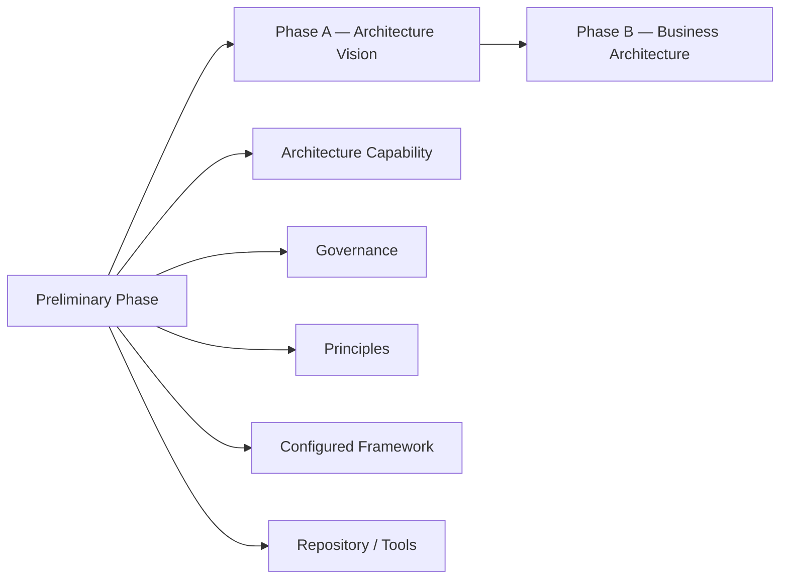
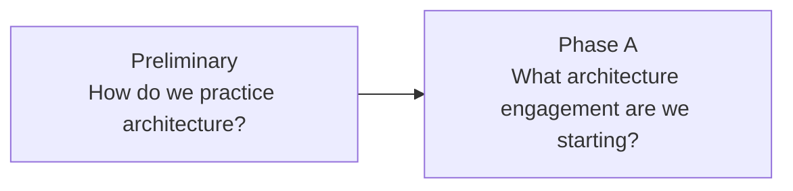

# 01 — Preliminary Phase

## 1. Definition

The **Preliminary Phase** prepares the organization to conduct Enterprise Architecture effectively.

It is the phase where the enterprise establishes or improves the **Architecture Capability**, configures how the TOGAF framework will be used, clarifies governance, roles, principles, repository structures and the organizational context in which architecture work will take place.

The simplest question is:

**Are we ready to do architecture properly?**

This phase is not about designing the Target Architecture for a specific transformation. That begins with a specific architecture engagement in **Phase A — Architecture Vision**.

---

## 2. Why the Preliminary Phase exists

A method is only useful if the organization can operate it.

Suppose MayaBank starts a major payment modernization initiative with no shared architecture practice.

Different teams may disagree on:

- what an architecture review means ;
- who approves architecture ;
- which principles apply ;
- which standards are mandatory ;
- where decisions are recorded ;
- how deviations are approved ;
- which artifacts are required ;
- which roles own the target architecture.

The project can still produce diagrams, but the enterprise lacks an effective Architecture Capability.

The Preliminary Phase reduces that risk by establishing the environment in which subsequent ADM work can succeed.

---

## 3. Where it fits in the ADM



The Preliminary Phase is logically before Phase A, but in a real enterprise it is not necessarily a one-time event.

It may be revisited when:

- the organization changes ;
- architecture maturity evolves ;
- a merger occurs ;
- governance needs change ;
- new delivery methods are introduced ;
- repeated exceptions expose weaknesses in the architecture practice.

---

## 4. Objectives

The Preliminary Phase should ensure that the enterprise can answer questions such as:

1. What is the scope of the Architecture Capability?
2. Which organizational structures participate?
3. What architecture framework will be used?
4. How will TOGAF be tailored?
5. What principles guide architecture decisions?
6. What governance and decision rights apply?
7. What roles and responsibilities exist?
8. How will architecture assets be stored and reused?
9. What methods, standards and tools are available?
10. How does architecture connect to strategy, portfolio and delivery?

The exact implementation varies by enterprise.

---

## 5. What must already exist before this phase

The Preliminary Phase can start even in a low-maturity organization.

Useful inputs may include:

- enterprise strategy ;
- existing governance ;
- current architecture organization ;
- existing standards ;
- existing repositories/tools ;
- business operating model ;
- regulatory environment ;
- existing project/product methods ;
- existing architecture frameworks or methods.

There does not need to be a mature EA practice already. The point of the phase may be to create one.

---

## 6. Main activity — understand the enterprise context

Before configuring an architecture practice, understand where it will operate.

Questions include:

- Is the enterprise centralized or federated?
- Which decisions are local vs enterprise-wide?
- Does the organization work by projects, products, platforms or programs?
- What regulations apply?
- How are investment decisions made?
- Which domains need strong standardization?
- Which domains require local autonomy?

### MayaBank example

MayaBank operates across several European countries.

Payments are centrally governed, but product teams have local delivery autonomy.

Therefore the Architecture Capability may need:

- enterprise principles and standards ;
- domain architecture ownership ;
- local solution architecture autonomy within guardrails ;
- central review only for high-impact decisions.

This is more effective than copying a generic governance structure.

---

## 7. Main activity — define the Architecture Capability

The Architecture Capability includes the organizational ability to perform architecture.

It typically covers:

### People

- Enterprise Architects ;
- Domain Architects ;
- Solution Architects ;
- business architecture roles ;
- supporting specialists.

### Skills

- stakeholder management ;
- architecture analysis ;
- business understanding ;
- technology knowledge ;
- modeling ;
- governance ;
- communication.

### Process

- architecture engagement lifecycle ;
- reviews ;
- approvals ;
- exceptions ;
- update mechanisms.

### Information

- Architecture Repository ;
- standards ;
- landscape ;
- governance records.

### Governance

- Architecture Board ;
- decision rights ;
- escalation ;
- compliance expectations.

---

## 8. Main activity — configure and tailor the framework

TOGAF is not intended to be copied mechanically.

The organization must determine how it will use the framework.

Tailoring can include:

- terminology ;
- required phases/steps ;
- mandatory deliverables ;
- artifact templates ;
- governance gates ;
- levels of architecture ;
- links with Agile/product delivery ;
- repository conventions.

### Example

A slow document-heavy process may be inappropriate for MayaBank product teams.

A configured practice might require instead:

- Architecture Vision one-pager ;
- capability and target views ;
- ADRs for key decisions ;
- requirements traceability ;
- roadmap ;
- architecture compliance evidence.

This is tailoring, provided the underlying architecture logic remains sound.

---

## 9. Main activity — define governance

Architecture Governance gives the practice authority and accountability.

The Preliminary Phase should clarify:

- which decisions require review ;
- who approves them ;
- what compliance means ;
- how exceptions are handled ;
- how conflicts are escalated ;
- how architecture connects to investment and delivery governance.

### Architecture Board

A governance body may be established or refined to provide oversight.

Typical concerns:

- architecture consistency ;
- major deviations ;
- principles ;
- standards ;
- cross-domain conflicts.

### Important

Governance is not the same as central control of every detail.

A mature capability defines which decisions can be delegated.

---

## 10. Main activity — establish Architecture Principles

The Preliminary Phase is a major point for defining or reviewing **Architecture Principles**.

Principles guide future decisions.

Examples for MayaBank:

- standard platform capabilities first ;
- managed interfaces ;
- authoritative data ownership ;
- business continuity by design ;
- observability by design.

Each principle should have a statement, rationale and implications.

### Why here?

Because principles are rules of the architecture practice, not just requirements of one specific project.

They must exist before teams start making detailed architecture decisions.

---

## 11. Main activity — establish repository and information management

The Architecture Capability needs a way to manage architecture knowledge.

The organization should determine how to maintain:

- Architecture Landscape ;
- standards ;
- reference material ;
- governance records ;
- principles ;
- reusable Building Blocks ;
- architecture descriptions.

The repository can be implemented across several tools.

The key requirement is trustworthy, governed and discoverable information.

---

## 12. Main activity — integrate with enterprise processes

Enterprise Architecture cannot operate in isolation.

It must connect with processes such as:

- strategy ;
- portfolio management ;
- investment governance ;
- product management ;
- project management ;
- security governance ;
- risk management ;
- procurement ;
- operations.

### Example

If the Architecture Board approves a target but funding committees never see the Architecture Roadmap, architecture and investment planning are disconnected.

The Preliminary Phase should clarify these interfaces.

---

## 13. Outputs — what must exist after Preliminary

Exact deliverables depend on tailoring, but conceptually the enterprise should emerge with clearer:

- Architecture Capability ;
- architecture governance ;
- roles and responsibilities ;
- tailored/configured framework ;
- Architecture Principles ;
- repository approach ;
- standards/reference approach ;
- architecture process interfaces.

The output is not simply a document.

The real output is a usable architecture operating model.

---

## 14. Stakeholders involved

Possible stakeholders include:

- CIO / CTO ;
- business leadership ;
- Chief Architect ;
- Enterprise Architecture team ;
- domain architecture leads ;
- security/risk/governance functions ;
- portfolio leadership ;
- delivery leadership ;
- operations ;
- procurement/vendor management.

Because Preliminary concerns the architecture practice itself, senior organizational stakeholders are often important.

---

## 15. Deliverables, artifacts and building blocks

Preliminary work can produce or refine content such as:

- architecture governance model ;
- role/responsibility matrix ;
- architecture principles catalog ;
- repository structure ;
- standards catalog ;
- tailored ADM guidance ;
- architecture process model.

Do not focus only on document names. Ask what organizational capability each artifact enables.

---

## 16. Requirements impact

Requirements Management is present throughout the ADM, but Preliminary has a slightly different emphasis.

The enterprise may establish:

- how architecture requirements are managed ;
- which repositories/tools support requirements ;
- traceability expectations ;
- governance rules for requirements.

Specific transformation requirements become more prominent once Phase A starts.

---

## 17. Governance considerations

The Preliminary Phase should itself be governed.

Important questions:

- Who owns the architecture framework?
- Who owns principles?
- Who can change standards?
- Who grants exceptions?
- Who decides whether architecture review is mandatory?
- How are conflicts resolved?

If nobody owns these decisions, the architecture capability is weak.

---

## 18. Relationship with Phase A

This is the most important relationship.

### Preliminary produces the environment

- roles ;
- method ;
- governance ;
- principles ;
- repository.

### Phase A uses that environment

- starts a specific architecture engagement ;
- identifies stakeholders for that engagement ;
- sets scope ;
- creates Architecture Vision ;
- defines Statement of Architecture Work.



---

## 19. Preliminary vs Phase A — detailed comparison

| Topic | Preliminary | Phase A |
|---|---|---|
| Primary focus | architecture practice | specific architecture engagement |
| Scope | organizational capability | transformation/initiative scope |
| Governance | establish/configure | apply to engagement |
| Principles | define/review | apply and confirm relevance |
| Stakeholders | architecture practice stakeholders | initiative-specific stakeholders |
| Output emphasis | capability/framework | Vision + Statement of Architecture Work |
| Key question | Are we ready to do architecture? | What are we going to architect and why? |

### Exam signal

If the scenario says:

> The company has no architecture function and wants to establish one.

→ Preliminary.

If it says:

> The architecture function exists and a payment modernization initiative needs scope, stakeholders and vision.

→ Phase A.

---

## 20. Real architecture example

A company wants to migrate all applications to cloud.

Poor approach:

1. select cloud provider ;
2. launch migrations ;
3. ask architects to document afterwards.

Preliminary-oriented approach:

1. clarify cloud architecture governance ;
2. define principles and standards ;
3. define exception process ;
4. establish cloud architecture roles ;
5. connect architecture review with portfolio planning ;
6. create reusable platform/reference assets ;
7. then start specific architecture initiatives via Phase A.

This reduces inconsistent cloud adoption.

---

## 21. MayaBank example

MayaBank’s old architecture model is fragmented.

### Problems

- infrastructure architects maintain standards in Confluence ;
- application architects use local documents ;
- security has separate review processes ;
- business architects are not connected to delivery ;
- exceptions are stored in email ;
- no shared architecture landscape.

### Preliminary actions

MayaBank establishes:

1. **Architecture Capability** — federated model.
2. **Architecture Board** — reviews enterprise-impacting decisions.
3. **Principles** — common enterprise architecture principles.
4. **Repository** — architecture landscape + standards + governance log.
5. **Tailored ADM** — light artifacts integrated with product delivery.
6. **Roles** — Enterprise, Domain and Solution Architect responsibilities.
7. **Governance** — review thresholds and exception process.

After this, the Payment Modernization engagement can enter Phase A.

---

## 22. Common mistakes

1. Treating Preliminary as « Phase 0 of a project » only.
2. Defining detailed Target Architecture in Preliminary.
3. Confusing enterprise principles with project requirements.
4. Establishing an Architecture Board with no decision rights.
5. Copying TOGAF without tailoring.
6. Creating a repository without ownership.
7. Ignoring existing governance and organization culture.
8. Believing Preliminary happens only once in the life of an enterprise.
9. Starting specific stakeholder analysis for a project and calling it Preliminary when it belongs in Phase A.
10. Treating the phase as a documentation exercise instead of capability building.

---

## 23. OGEA-103 exam traps

### Trap 1 — establish vs apply

**Establish architecture capability/governance/principles** → Preliminary.

**Apply them to a new engagement** → Phase A or later.

### Trap 2 — organization vs initiative

If the problem is organizational architecture maturity, think Preliminary.

If the problem is the scope/value/stakeholders of one transformation, think Phase A.

### Trap 3 — tailoring

A scenario says the enterprise uses Agile and therefore cannot use TOGAF.

→ incorrect. TOGAF is configurable; the method should be tailored.

### Trap 4 — principles

A scenario asks where architecture principles should be established as part of preparing the architecture practice.

→ Preliminary.

---

## 24. Foundation questions

### Q1
What is the main purpose of the Preliminary Phase?

**Answer:** to establish or improve the Architecture Capability and configure how architecture will be practiced and governed.

### Q2
Which phase is responsible for defining the scope of a specific architecture engagement?

**Answer:** Phase A, not Preliminary.

### Q3
Where are Architecture Principles commonly established or reviewed as part of the architecture practice?

**Answer:** Preliminary Phase.

### Q4
Why is framework tailoring important?

**Answer:** because TOGAF must be configured to the enterprise context, governance and delivery model rather than applied mechanically.

---

## 25. Practitioner scenario

MayaBank acquires another financial institution. The acquired organization has a separate architecture team, different principles, no shared standards and a different governance process. A major cross-company payment program is about to start.

### Reasoning

1. The issue is not yet the detailed target payment architecture.
2. The enterprise architecture capability is fragmented.
3. Governance, roles, principles and methods are inconsistent.
4. Starting Phase B immediately would create conflicting architecture work.

**Best TOGAF direction:** revisit the Preliminary Phase to establish a coherent architecture capability and tailored framework before launching the specific engagement.

A weaker answer would immediately create the Target Application Architecture. Technically useful, but wrong sequence.

---

## 26. English for Architects

### Useful sentence

> During the Preliminary Phase, we establish the architecture capability, governance model, principles and tailored architecture framework.

### French meaning

Pendant la Preliminary Phase, nous mettons en place la capacité d’architecture, le modèle de gouvernance, les principes et le framework adapté.

### Speak it

1. We define how architecture is governed.
2. We tailor TOGAF to our enterprise context.
3. We establish architecture roles and responsibilities.
4. Phase A starts the specific engagement.

---

## 27. Interview question

**Question:** What is the difference between the Preliminary Phase and Phase A?

**Simple answer:**

The Preliminary Phase prepares the architecture practice. It defines the capability, governance, principles and tailored framework. Phase A starts a specific architecture engagement. It identifies the stakeholders, defines the scope and establishes the Architecture Vision and Statement of Architecture Work.

---

## 28. Key points to remember

Preliminary is about the **architecture practice**, not the Target Architecture.

Memorize:

```text
PRELIMINARY
= Capability
+ Governance
+ Principles
+ Roles
+ Tailoring
+ Repository
+ Standards
```

Then:

```text
PHASE A
= Specific engagement
+ Stakeholders
+ Scope
+ Vision
+ Value
+ Statement of Architecture Work
```

Final memory sentence:

**Preliminary prepares the machine; Phase A starts the architecture mission.**
