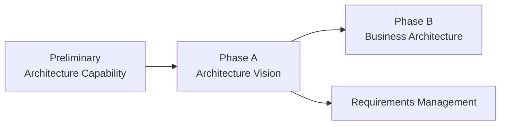
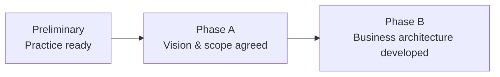

# 02 — Phase A: Architecture Vision

## 1. Definition

**Phase A — Architecture Vision** initiates a specific architecture development engagement.

Its purpose is to establish a shared, high-level understanding of:

- why the architecture work is needed ;
- who the important stakeholders are ;
- what their major concerns are ;
- what is in and out of scope ;
- what the high-level Baseline and Target look like ;
- what business value is expected ;
- what major risks and constraints exist ;
- what architecture work will be performed.

Phase A transforms a vague transformation idea into an agreed architecture engagement.

The key question is:

**What are we going to architect, why, for whom, and under what mandate?**

---

## 2. Why Phase A exists

Many architecture failures start because teams enter detailed design too early.

Typical symptoms:

- scope is unclear ;
- different stakeholders expect different outcomes ;
- a technology solution has already been chosen without agreed business value ;
- dependencies outside the project are ignored ;
- nobody agrees who has authority to approve the architecture ;
- the architecture team works for weeks before discovering a critical constraint.

Phase A creates alignment before deep domain architecture begins.

---

## 3. Where Phase A fits



### Before Phase A

The architecture practice should be sufficiently prepared through Preliminary work.

### After Phase A

The architecture team should have enough shared direction to enter detailed Business Architecture in Phase B and the subsequent domain phases.

---

## 4. Preliminary vs Phase A

This distinction must be automatic.

### Preliminary

Prepares the **architecture practice**.

### Phase A

Starts a **specific architecture engagement**.

Example:

- defining the Architecture Board → Preliminary.
- identifying the Head of Payments as a stakeholder for a payment modernization → Phase A.
- establishing enterprise architecture principles → Preliminary.
- applying those principles to determine the scope of the payment target → Phase A.

---

## 5. Objectives

Phase A should create alignment around several core areas.

### Confirm the architecture engagement

Why is architecture work being requested?

### Identify stakeholders and concerns

Who matters, what do they care about and how much influence do they have?

### Confirm business goals, drivers and constraints

What enterprise outcomes justify the architecture work?

### Define scope

What part of the enterprise is included?

### Develop Architecture Vision

What does the high-level future look like and why is it valuable?

### Identify major risks

What could prevent the architecture effort or transformation from succeeding?

### Establish the Statement of Architecture Work

What work will the architecture team perform, with what scope, governance and expected outputs?

---

## 6. What must exist before Phase A

Typical inputs may include:

- architecture capability and governance model ;
- business strategy ;
- architecture principles ;
- existing architecture landscape ;
- existing standards and reference material ;
- request for architecture work ;
- business goals/drivers ;
- existing requirements and constraints ;
- previous architecture assets.

Not all inputs will be perfect or complete. Phase A itself clarifies uncertainty.

---

## 7. Start with the Request for Architecture Work

A specific architecture engagement is usually triggered because something changed or needs to change.

Possible triggers:

- new strategy ;
- regulatory requirement ;
- business transformation ;
- technology obsolescence ;
- merger/acquisition ;
- major cost problem ;
- new capability need ;
- platform modernization.

The **Request for Architecture Work** represents the initiation/request context for architecture work.

Do not obsess over a specific template. Understand the purpose: architecture does not begin randomly; it responds to an enterprise need.

---

## 8. Identify business drivers

A **Business Driver** is a condition or force that motivates change.

Examples MayaBank:

- new instant payment regulation ;
- high legacy cost ;
- slow product delivery ;
- rising transaction volumes ;
- new fraud patterns ;
- need for 24/7 availability.

Drivers explain why the current situation is no longer acceptable.

### Driver vs Goal

Driver:

> Market and regulatory pressure for instant payments.

Goal:

> Support new payment schemes within a shorter onboarding cycle while preserving compliance and resilience.

The driver creates pressure. The goal describes an intended outcome.

---

## 9. Identify stakeholders

Stakeholder identification is a major Phase A activity.

For each stakeholder, consider:

- role ;
- concerns ;
- influence ;
- interest ;
- required engagement ;
- decision rights.

### MayaBank stakeholder map

| Stakeholder | Concern | Influence |
|---|---|---|
| Executive Sponsor | value and delivery | High |
| Head of Payments | business capability | High |
| CISO | security/compliance | High |
| Operations | availability/recovery | High |
| Finance | cost | Medium/High |
| Product Teams | usability/time-to-market | Medium |
| Architecture Board | coherence/compliance | High |

### Why this matters

If a high-influence stakeholder is discovered only after Phase D, the architecture may need major rework.

---

## 10. Understand stakeholder concerns

Concerns must be translated into architecture implications.

Example:

Stakeholder: Operations.

Concern:

> The target platform may increase operational complexity.

Possible consequences:

- observability requirements ;
- support model requirements ;
- automation expectations ;
- resilience architecture ;
- transition risk.

A concern is therefore not merely a communication issue. It can drive architecture requirements.

---

## 11. Define scope

Scope is one of the most important Phase A decisions.

TOGAF architecture scope can be considered across several dimensions.

### Breadth

How much of the enterprise is included?

Example:

- all payments ;
- only instant payments ;
- only a specific country/platform.

### Depth

How detailed will the architecture be?

Example:

- enterprise-level capability target ;
- detailed solution architecture.

### Time period

What planning horizon is relevant?

Example:

- 18-month migration ;
- five-year target.

### Architecture domains

Which domains require development?

Example:

- Business, Data, Application and Technology ;
- or a more limited scope if justified.

### Common mistake

Scope is not simply « project boundary ».

Architecture scope may need to include dependencies outside the formal delivery project.

---

## 12. Establish constraints

Phase A should identify major constraints early.

Examples:

- regulatory deadlines ;
- existing contracts ;
- mandatory enterprise standards ;
- budget boundaries ;
- data residency ;
- unavailable skills ;
- legacy systems that cannot yet be changed.

### MayaBank example

Constraint:

> Legacy settlement engine cannot be retired before Q4 2028.

This single constraint may create the need for a Transition Architecture.

---

## 13. Develop the Architecture Vision

The **Architecture Vision** is a high-level description of the desired outcome that helps stakeholders understand and support the transformation.

It should communicate:

- why change ;
- major business value ;
- key scope ;
- high-level current state ;
- high-level future state ;
- major capabilities ;
- significant constraints/risks ;
- expected outcomes.

### Architecture Vision is intentionally high-level

It is not the full Business/Data/Application/Technology Target Architecture.

Those are developed in B/C/D.

### Example

MayaBank Architecture Vision:

> Create a modular payment platform capable of supporting real-time payment schemes through governed APIs and events, with standardized security, observability and multi-site resilience, while allowing controlled coexistence with legacy settlement during migration.

This sentence gives direction without pretending the detailed target has already been designed.

---

## 14. Architecture Vision vs Target Architecture

Another critical distinction.

| Architecture Vision | Target Architecture |
|---|---|
| high-level | detailed enough for domain decisions |
| created in Phase A | developed mainly in B/C/D |
| aligns stakeholders | defines target structures |
| explains value/scope | describes business/data/app/technology target |
| supports approval to proceed | supports gap analysis and realization |

### Exam trap

A Phase A answer that tries to fully design the Technology Architecture is usually too detailed/too early.

---

## 15. High-level Baseline and Target

Phase A may use high-level Baseline and Target views to communicate the Vision.

### MayaBank high-level Baseline

```text
Channels
   ↓
Legacy Payment Monolith
   ↓
Point-to-point integrations
   ↓
Settlement systems
```

Problems:

- slow change ;
- strong coupling ;
- limited real-time capabilities ;
- fragmented observability.

### High-level Target

```text
Channels / Partners
        ↓
Managed Payment APIs
        ↓
Payment Orchestration Services
      ↙   ↓   ↘
Fraud  Events  Settlement Adapter
        ↓
Shared Platform Services
```

The detailed target will be developed later.

---

## 16. Define the value proposition

Architecture work must explain value.

Possible value dimensions:

- revenue enablement ;
- faster time-to-market ;
- regulatory compliance ;
- risk reduction ;
- simplification ;
- cost reduction ;
- resilience ;
- customer experience.

### Example

MayaBank’s value proposition:

- onboard future payment schemes faster ;
- reduce legacy coupling ;
- improve operational resilience ;
- standardize integration and observability ;
- reduce duplicated capabilities.

### Common mistake

Value proposition ≠ list of technology benefits.

« Kubernetes is scalable » is not enough.

The value must connect to enterprise outcomes.

---

## 17. Assess readiness and risks

Phase A should identify major architecture/business transformation risks.

Examples:

- stakeholder disagreement ;
- insufficient funding ;
- missing skills ;
- unrealistic scope ;
- regulatory uncertainty ;
- dependency on legacy ;
- organization not ready to adopt new operating model.

Risk analysis at this stage is high-level but important.

### Example

Risk:

> Product teams are not prepared to own services in production.

This may affect target operating model, platform design and migration sequence.

---

## 18. Develop the Statement of Architecture Work

The **Statement of Architecture Work** formalizes what architecture work will be performed.

It can clarify:

- scope ;
- approach ;
- governance ;
- work plan ;
- deliverables ;
- responsibilities ;
- assumptions ;
- constraints.

### Purpose

Architecture Vision says:

**where/why we intend to go.**

Statement of Architecture Work says:

**what architecture work we agree to perform to develop that architecture.**

Do not confuse the two.

---

## 19. Obtain approval to proceed

Phase A is an alignment and authorization point.

Stakeholders should have enough information to decide whether to proceed with detailed architecture work.

Approval means they understand at a suitable level:

- purpose ;
- scope ;
- expected value ;
- approach ;
- major risks ;
- governance.

This prevents architecture teams from doing extensive work without sponsorship or mandate.

---

## 20. Requirements impact

Phase A identifies and refines architecture requirements.

Sources can include:

- stakeholder concerns ;
- business goals ;
- principles ;
- constraints ;
- existing requirements ;
- risks.

Example:

Concern:

> Payment availability must improve.

Phase A may capture a high-level requirement such as:

> Critical payment capabilities shall support multi-site continuity.

Later B/C/D will refine how this requirement impacts business, data, application and technology architectures.

---

## 21. Governance considerations

Phase A uses governance structures defined in Preliminary.

Questions include:

- who approves scope?
- who sponsors the work?
- which Architecture Board reviews apply?
- what decision rights do domain architects have?
- what standards/principles are mandatory?

If governance is unclear, the engagement may need to revisit Preliminary issues.

---

## 22. Relationship with previous and next phases

### Previous — Preliminary

Provides:

- Architecture Capability ;
- governance ;
- principles ;
- tailored method ;
- repository structure.

### Current — Phase A

Creates:

- Architecture Vision ;
- scope ;
- stakeholder alignment ;
- Statement of Architecture Work ;
- initial requirements/risks.

### Next — Phase B

Uses the agreed vision and scope to develop the **Business Architecture** in more detail.



---

## 23. Phase A vs Phase B

### Phase A

High-level alignment.

Question:

**What transformation and why?**

### Phase B

Detailed Business Architecture.

Question:

**What business capabilities, processes, organization and services must change?**

### Example

Phase A:

> MayaBank needs a modular payment platform supporting instant payments.

Phase B:

> Define the Baseline/Target for Payment Initiation, Validation, Fraud Screening, Clearing/Settlement and operating roles.

---

## 24. Deliverables and artifacts

Phase A can involve artifacts such as:

- stakeholder map ;
- high-level capability view ;
- high-level Baseline/Target diagrams ;
- business value assessment ;
- risk assessment ;
- scope definition ;
- requirements list.

Key formal outputs include the **Architecture Vision** and **Statement of Architecture Work**.

Exact content is tailored.

---

## 25. MayaBank Phase A — complete example

### 25.1 Business drivers

- instant payment market pressure ;
- regulatory evolution ;
- slow onboarding of schemes ;
- high maintenance cost ;
- resilience expectations.

### 25.2 Stakeholders

- Executive Sponsor ;
- Head of Payments ;
- CISO ;
- Operations ;
- Finance ;
- Product Teams ;
- Architecture Board.

### 25.3 Scope

In scope:

- payment initiation and orchestration ;
- fraud interaction ;
- settlement integration ;
- payment status events ;
- platform capabilities supporting these services.

Out of scope for this cycle:

- replacement of core account ledger ;
- complete channel redesign.

### 25.4 High-level Baseline

- legacy monolith ;
- batch interfaces ;
- point-to-point integrations ;
- fragmented observability.

### 25.5 High-level Target

- modular payment services ;
- managed APIs ;
- event-driven integration ;
- shared container platform ;
- standard observability ;
- resilient multi-site operation.

### 25.6 Major constraint

Legacy settlement remains temporarily.

### 25.7 Initial risk

Teams lack experience operating distributed services.

### 25.8 Value proposition

Faster payment scheme onboarding + lower coupling + improved resilience.

### 25.9 Statement of Architecture Work

The architecture team will develop Business, Data, Application and Technology Target Architectures, identify gaps, create transition options and build the Architecture Roadmap under the enterprise governance model.

Now Phase B can begin.

---

## 26. Common mistakes

1. Jumping directly to detailed solution design.
2. Treating stakeholder identification as a communication checklist only.
3. Creating a Vision without business value.
4. Defining scope only from the project manager’s work breakdown.
5. Ignoring external dependencies.
6. Confusing Architecture Vision and Target Architecture.
7. Confusing Architecture Vision and Statement of Architecture Work.
8. Trying to complete full B/C/D architecture in Phase A.
9. Ignoring major constraints because « they will be solved later ».
10. Failing to secure stakeholder alignment before proceeding.

---

## 27. OGEA-103 exam traps

### Trap 1 — specific engagement

Question mentions:

- stakeholders ;
- scope ;
- Architecture Vision ;
- business value ;
- Statement of Architecture Work.

→ **Phase A**.

### Trap 2 — governance capability

Question asks to establish enterprise architecture governance and principles from scratch.

→ **Preliminary**, not Phase A.

### Trap 3 — Vision vs detailed Target

If a response designs detailed Application/Technology Architecture during Vision work, it may be premature.

### Trap 4 — stakeholder concern

If an influential stakeholder raises a concern that could affect scope, do not ignore it and continue. Phase A exists to resolve this alignment.

### Trap 5 — Statement of Architecture Work

This defines the architecture engagement/work; it is not the implementation project plan.

---

## 28. Foundation questions

### Q1
What is the primary purpose of Phase A?

**Answer:** to establish the Architecture Vision, scope, stakeholder alignment and agreed architecture work for a specific engagement.

### Q2
Which formal output describes the architecture work to be performed?

**Answer:** Statement of Architecture Work.

### Q3
Architecture Vision vs Target Architecture?

**Answer:** Vision is high-level and created in Phase A; detailed Target Architectures are developed in B/C/D.

### Q4
Why identify stakeholders in Phase A?

**Answer:** to understand concerns, influence and required alignment before detailed architecture development.

### Q5
What follows Phase A in the normal ADM progression?

**Answer:** Phase B — Business Architecture.

---

## 29. Practitioner scenario

MayaBank receives executive approval to investigate a new payment platform. The technology team wants to start selecting Kafka/OpenShift topology immediately. The Head of Payments and CISO disagree about the transformation scope, and the Operations team has not yet been involved.

### Reasoning

1. Specific initiative exists → not primarily Preliminary.
2. Scope is disputed.
3. Key stakeholders are not aligned.
4. Detailed Technology Architecture is premature.
5. The engagement needs a shared vision and agreed architecture work.

**Best TOGAF direction:** perform/complete Phase A activities: identify stakeholders and concerns, confirm business drivers, define scope, create Architecture Vision, capture initial requirements/risks, and agree the Statement of Architecture Work.

A technically sophisticated Kafka/OpenShift design would be the wrong answer at this point because the architecture question has not yet been framed.

---

## 30. English for Architects

### Useful sentence

> During Phase A, I identify the key stakeholders, define the scope and establish the Architecture Vision.

French meaning:

Pendant la Phase A, j’identifie les principales parties prenantes, je définis le périmètre et j’établis la Vision d’Architecture.

### More useful sentences

- We clarified the business drivers and expected value.
- We identified the main constraints and initial risks.
- The Architecture Vision describes the target at a high level.
- The Statement of Architecture Work defines the architecture engagement.

### Speak it

1. The main business driver is faster payment delivery.
2. The security team is a key stakeholder.
3. The scope includes payment orchestration but excludes the core ledger.
4. The target architecture is still high-level in Phase A.
5. We need stakeholder approval before detailed architecture work.

---

## 31. Interview question

**Question:** How do you start an architecture engagement?

### Simple answer

I start by understanding the business drivers, identifying the stakeholders and their concerns, defining the scope and major constraints, and creating a high-level Architecture Vision. I also clarify the expected value, initial risks and the Statement of Architecture Work before moving into detailed Business, Data, Application and Technology Architecture.

### Stronger answer

I first confirm that the architecture capability and governance are in place. Then, in Phase A, I frame the specific engagement: business drivers, stakeholder map, concerns, scope, high-level baseline and target, value proposition, constraints and risks. I use that to establish the Architecture Vision and secure agreement on the Statement of Architecture Work. Only after that alignment do I move into detailed domain architecture.

---

## 32. Key points to remember

Phase A = **specific architecture engagement**.

Memorize:

```text
DRIVERS
→ STAKEHOLDERS
→ CONCERNS
→ SCOPE
→ HIGH-LEVEL BASELINE/TARGET
→ VALUE
→ RISKS/CONSTRAINTS
→ ARCHITECTURE VISION
→ STATEMENT OF ARCHITECTURE WORK
→ APPROVAL TO PROCEED
```

Critical comparisons:

**Preliminary prepares the practice.**

**Phase A starts the mission.**

**Architecture Vision is high-level.**

**B/C/D build the detailed Target Architectures.**
