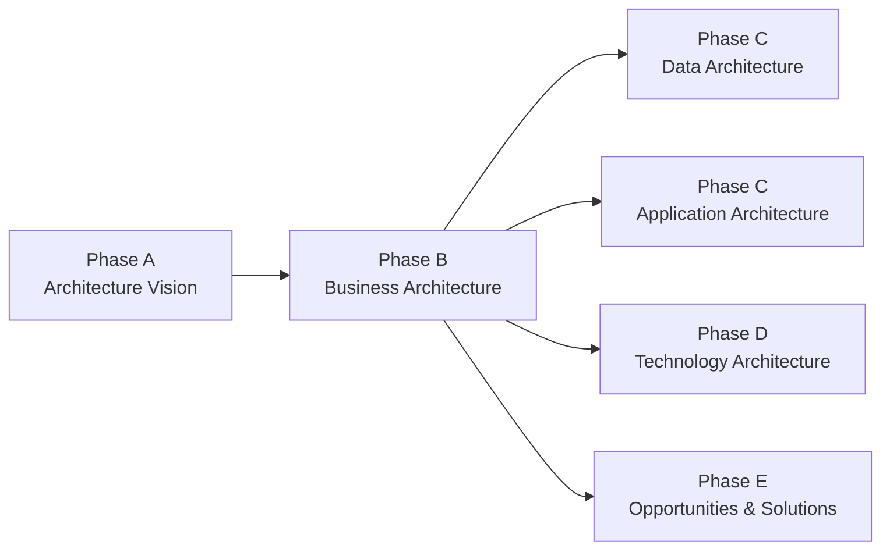

# Phase B — Business Architecture

## 1. Definition

La **Phase B — Business Architecture** développe la compréhension de l’architecture métier nécessaire pour atteindre les objectifs définis en Phase A. Elle décrit comment l’entreprise fonctionne aujourd’hui (**Baseline Business Architecture**), comment elle doit fonctionner demain (**Target Business Architecture**), et quels écarts doivent être traités (**Gap Analysis**).

La Phase B ne consiste pas à choisir des produits techniques. Elle travaille d’abord sur le métier : capacités, organisation, processus, services métier, rôles, acteurs, flux de valeur, règles et responsabilités.

## 2. Pourquoi cette phase existe

Une transformation technique peut être parfaitement exécutée et pourtant échouer si elle ne répond pas à un besoin métier réel. La Phase B force l’équipe d’architecture à établir le lien entre :

**drivers métier → objectifs → capacités → processus/services → exigences → architecture cible**.

Elle répond à des questions comme :

- Quelles capacités doivent évoluer ?
- Quels processus posent problème ?
- Quels services métier doivent être créés, améliorés ou supprimés ?
- Quels acteurs et rôles sont impactés ?
- Quelles dépendances organisationnelles empêchent la cible ?
- Quels changements doivent être soutenus par les architectures Data, Application et Technology ?

## 3. Position dans l’ADM

Phase A définit le **pourquoi**, le périmètre et la vision de haut niveau. Phase B commence le travail détaillé de domaine.

## 4. Ce qui doit déjà exister

Avant d’entrer sérieusement en Phase B, on doit normalement disposer d’éléments issus de Phase A :

- Architecture Vision ;
- Statement of Architecture Work ;
- scope ;
- stakeholders et concerns ;
- business drivers et goals ;
- contraintes majeures ;
- principes applicables ;
- besoins/exigences initiales ;
- compréhension de haut niveau de la Baseline et de la Target.

## 5. Objectifs

Les objectifs pédagogiques à retenir sont :

1. développer la Baseline Business Architecture au niveau nécessaire ;
2. développer la Target Business Architecture ;
3. analyser les écarts entre Baseline et Target ;
4. identifier les éléments qui devront être pris en charge par les phases suivantes ;
5. mettre à jour les exigences, risques, hypothèses et artefacts de roadmap.

## 6. Entrées importantes

Entrées typiques :

- Architecture Vision ;
- Statement of Architecture Work ;
- Architecture Principles ;
- Capability Assessment ;
- Request for Architecture Work ;
- Architecture Repository ;
- business strategy, objectives, drivers ;
- modèles métier existants ;
- exigences et contraintes.

Attention : à l’examen, une liste d’inputs n’a de valeur que si tu comprends **pourquoi** ces informations sont nécessaires.

## 7. Activités principales

### 7.1 Choisir les viewpoints et techniques adaptés

On ne modélise pas “tout”. On choisit les représentations utiles aux concerns des stakeholders.

Exemples :

- Capability Map pour comprendre les capacités ;
- Value Stream pour comprendre la création de valeur ;
- Process Model pour comprendre les activités ;
- Organization Map pour les responsabilités ;
- Business Service view pour les services fournis.

### 7.2 Décrire la Baseline Business Architecture

La Baseline explique suffisamment l’existant pour identifier les problèmes et écarts.

Elle peut couvrir :

- business capabilities ;
- value streams ;
- business processes ;
- business services ;
- actors / roles ;
- organizational units ;
- rules and policies ;
- information usage ;
- interfaces avec partenaires externes.

Il ne faut pas documenter l’existant avec un niveau de détail inutile.

### 7.3 Décrire la Target Business Architecture

La cible traduit la stratégie et les objectifs de Phase A en fonctionnement métier futur.

Elle répond notamment à :

- quelles capacités seront renforcées ?
- quelles responsabilités changent ?
- quels services métier seront exposés ?
- quels processus seront automatisés ou supprimés ?
- quelle organisation doit soutenir la cible ?

### 7.4 Effectuer la Gap Analysis

On compare Baseline et Target pour identifier :

- éléments à conserver ;
- éléments à supprimer ;
- éléments à créer ;
- éléments à modifier ;
- dépendances et contraintes.

La Gap Analysis n’est pas encore le plan de migration détaillé. Elle produit la matière qui sera consolidée plus tard, particulièrement en Phase E.

### 7.5 Résoudre les impacts et dépendances

Un gap métier peut entraîner :

- un besoin de nouvelles données → Phase C Data ;
- un besoin de nouveaux services applicatifs → Phase C Application ;
- une exigence d’infrastructure ou de plateforme → Phase D ;
- un work package futur → Phase E.

## 8. Sorties importantes

Les sorties importantes comprennent la Business Architecture développée et des mises à jour de l’architecture globale :

- Baseline Business Architecture ;
- Target Business Architecture ;
- Gap Analysis ;
- exigences métier nouvelles ou modifiées ;
- risques et contraintes mis à jour ;
- Architecture Definition Document enrichi ;
- Architecture Requirements Specification enrichie ;
- Architecture Roadmap mise à jour à un niveau approprié.

Les noms exacts des deliverables doivent être distingués des artifacts qu’ils contiennent.

## 9. Stakeholders impliqués

Selon le contexte :

- business sponsor ;
- business owners ;
- product owners ;
- process owners ;
- operations ;
- compliance ;
- risk ;
- finance ;
- enterprise architects ;
- solution architects.

La valeur de Phase B dépend fortement de la qualité de l’engagement métier.

## 10. Requirements Management

Requirements Management agit en parallèle :

- les exigences initiales sont utilisées ;
- des exigences détaillées apparaissent ;
- des exigences deviennent obsolètes ou sont reformulées ;
- les conflits sont identifiés ;
- les exigences sont tracées vers les éléments d’architecture.

Exemple : “réduire le délai de paiement” est trop général. Phase B peut produire des exigences plus précises sur les processus, SLA et responsabilités.

## 11. Gouvernance

La gouvernance vérifie que :

- la Business Architecture respecte les principes ;
- les stakeholders significatifs ont été engagés ;
- les décisions sont traçables ;
- les écarts et risques sont explicites ;
- la cible reste cohérente avec la vision approuvée.

## 12. Relation avec Phase C

Phase B décrit ce que le métier doit être capable de faire. Phase C analyse les architectures Data et Application nécessaires pour supporter ce fonctionnement.

**Business need** → **information need** → **application service**.

C’est une relation de dépendance logique, pas une séparation artificielle.

## 13. Exemple MayaBank

### Contexte

MayaBank veut moderniser les paiements européens, améliorer les paiements instantanés, réduire les interventions manuelles et préparer ISO 20022.

### Baseline

- plusieurs chaînes de paiement séparées ;
- contrôles manuels ;
- processus de rapprochement lents ;
- responsabilité dispersée ;
- faible visibilité temps réel.

### Target

Capacités cibles :

- Payment Initiation ;
- Payment Validation ;
- Fraud/Risk Screening ;
- Payment Orchestration ;
- Clearing & Settlement Integration ;
- Exception Management ;
- Real-Time Monitoring.

### Gaps

- absence d’orchestration temps réel ;
- trop de tâches manuelles ;
- capacités de monitoring insuffisantes ;
- responsabilités de traitement d’exception fragmentées.

Ces gaps alimentent Phase C et D.

## 14. ArchiMate — extension professionnelle

Phase B peut être modélisée avec :

- Business Actor ;
- Business Role ;
- Business Process ;
- Business Service ;
- Capability ;
- Value Stream.

ArchiMate est utile pour modéliser ; TOGAF fournit la méthode. Ne confonds pas les deux.

## 15. Erreurs fréquentes

- transformer Phase B en inventaire applicatif ;
- partir directement sur Kubernetes, Kafka ou Oracle ;
- documenter l’existant sans définir la cible ;
- confondre Capability et Application ;
- confondre Business Architecture et organisation chart ;
- oublier les gaps ;
- croire que Phase B produit déjà le plan de migration détaillé.

## 16. Pièges OGEA-103

### Piège 1 — Phase A vs B

Phase A crée une vision de haut niveau et obtient l’alignement initial. Phase B développe la Business Architecture en détail suffisant.

### Piège 2 — Business Capability vs Application

Une capability exprime **ce que l’entreprise doit être capable de faire**. Une application est un moyen possible de soutenir cette capability.

### Piège 3 — Gap Analysis vs Migration Planning

Identifier un gap en B n’est pas le même travail que prioriser et séquencer les projets en F.

## 17. Foundation questions

### Q1
Quelle phase développe la Baseline et la Target Business Architecture ?

A. Phase A  
B. Phase B  
C. Phase E  
D. Phase G

**Réponse : B.**

### Q2
Quel énoncé décrit le mieux une Business Capability ?

A. Un produit logiciel  
B. Une capacité que l’entreprise doit posséder pour atteindre ses objectifs  
C. Un serveur  
D. Un document de gouvernance

**Réponse : B.**

## 18. Practitioner scenario

MayaBank a validé en Phase A une vision de paiement instantané. Une équipe propose immédiatement de sélectionner une plateforme Kafka et un produit API Management. Les processus métier actuels, les responsabilités et les capacités nécessaires n’ont pas encore été analysés.

La meilleure action TOGAF est d’abord de développer la **Business Architecture** : comprendre la Baseline, définir la Target et identifier les gaps avant de figer les choix technologiques.

Le piège est qu’une décision Kafka peut être techniquement raisonnable mais prématurée du point de vue ADM.

## 19. English for Architects

Useful sentence:

> During Phase B, we develop the baseline and target business architectures and identify the main business gaps.

Meaning:

Pendant la Phase B, nous développons les architectures métier existante et cible et nous identifions les principaux écarts métier.

### Speak it

1. The business architecture describes how the enterprise operates.
2. We identified the capabilities required by the target state.
3. These business gaps will drive the data, application and technology work.

## 20. Interview question

**Question:** What is the purpose of Phase B in TOGAF?

**Simple answer:**

Phase B develops the Business Architecture. I compare the current and target business capabilities, processes and services, identify gaps, and use them to guide the following architecture phases.

## 21. Key points to remember

- Phase B = Business Architecture.
- Elle développe Baseline, Target et Gaps métier.
- Elle part de la Vision définie en Phase A.
- Elle traite capacités, processus, services, rôles et organisation.
- Elle alimente les architectures Data, Application et Technology.
- Elle ne choisit pas encore les solutions de migration détaillées.

---

Official baseline: The Open Group TOGAF Standard, 10th Edition — Fundamental Content / Architecture Development Method. This chapter is an original educational explanation and does not reproduce the standard.