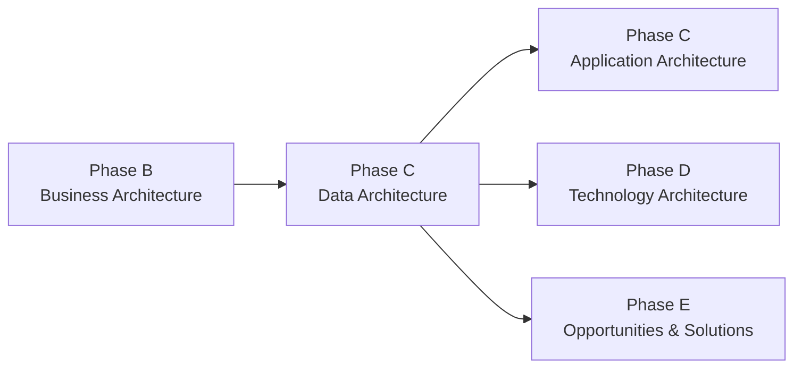

# Phase C — Data Architecture

## 1. Definition

La **Phase C — Information Systems Architectures** comprend deux domaines distincts : **Data Architecture** et **Application Architecture**. Ce chapitre traite uniquement de la **Data Architecture**.

La Data Architecture décrit comment les données nécessaires au fonctionnement de l’entreprise sont structurées, gouvernées, créées, utilisées, partagées, protégées, conservées et déplacées entre les acteurs et systèmes.

Elle ne se limite pas au choix d’une base de données. Le cœur de la phase est la compréhension de l’information et de sa gouvernance.

## 2. Pourquoi la Data Architecture existe

Une transformation métier échoue rapidement si les applications reposent sur :

- des données incohérentes ;
- des définitions métier différentes ;
- des propriétaires non identifiés ;
- une mauvaise qualité ;
- des doublons ;
- des flux non maîtrisés ;
- des règles de rétention contradictoires ;
- une traçabilité insuffisante.

La Data Architecture cherche donc à aligner :

**business capabilities → information needs → data entities → ownership → lifecycle → exchange → controls**.

## 3. Position dans l’ADM

Data et Application sont toutes deux en Phase C. Il est possible d’itérer entre elles selon le contexte.

## 4. Ce qui doit déjà exister

Avant de développer la Data Architecture, on dispose normalement de :

- Architecture Vision ;
- Business Architecture suffisamment développée ;
- business capabilities et processes pertinents ;
- exigences métier ;
- principles ;
- contraintes sécurité/réglementaires connues ;
- informations de Baseline déjà disponibles.

La Business Architecture explique **pourquoi** les données sont nécessaires.

## 5. Objectifs

Les objectifs principaux sont :

1. développer la Baseline Data Architecture au niveau nécessaire ;
2. développer la Target Data Architecture ;
3. effectuer une Gap Analysis ;
4. identifier les impacts sur applications et technologies ;
5. mettre à jour exigences, risques et Architecture Roadmap.

## 6. Questions essentielles

La Data Architecture doit permettre de répondre à :

- Quelles informations sont critiques ?
- Quelle est la signification commune des données ?
- Qui en est propriétaire ?
- Où les données sont-elles produites ?
- Où sont-elles consommées ?
- Quels systèmes les stockent ?
- Quels flux existent ?
- Quelle qualité est requise ?
- Quelles règles de sécurité s’appliquent ?
- Quelle durée de conservation ?
- Quelles données doivent être historisées ou supprimées ?
- Quel niveau de lineage est nécessaire ?

## 7. Baseline Data Architecture

La Baseline peut inclure :

- principales entités métier ;
- modèles de données existants ;
- données de référence ;
- data owners ;
- flux principaux ;
- systèmes maîtres ;
- règles de qualité ;
- rétention ;
- classification sécurité ;
- problèmes connus.

L’objectif n’est pas de documenter chaque table SQL. Il faut décrire suffisamment l’existant pour permettre les décisions d’architecture.

## 8. Target Data Architecture

La cible peut définir :

- modèle canonique ou sémantique partagé ;
- ownership et stewardship ;
- règles de qualité ;
- data lifecycle ;
- principes de partage ;
- mécanismes de référence et synchronisation ;
- exigences de confidentialité ;
- lineage ;
- besoins analytiques et opérationnels ;
- stratégie de conservation.

## 9. Gap Analysis

Exemples de gaps :

| Baseline | Target | Gap |
|---|---|---|
| plusieurs définitions de “Payment Status” | modèle commun | absence de sémantique partagée |
| données clients dupliquées | ownership défini | duplication / responsabilité floue |
| flux batch | information temps réel | mécanisme événementiel manquant |
| conservation illimitée | règles de rétention | politique lifecycle manquante |
| faible traçabilité | lineage | observabilité data insuffisante |

Ces gaps pourront devenir des candidats pour des work packages en Phase E.

## 10. Concepts importants

### 10.1 Data Entity

Une entité représente un concept informationnel significatif pour l’entreprise.

Exemples MayaBank :

- Payment Instruction ;
- Account ;
- Party ;
- Beneficiary ;
- Transaction ;
- Settlement Position ;
- Fraud Alert.

### 10.2 System of Record

Le système autoritatif d’une donnée ne doit pas être confondu avec tous les systèmes qui en possèdent une copie.

### 10.3 Data Ownership

Le propriétaire est responsable de la donnée du point de vue métier/gouvernance. Ce n’est pas nécessairement l’administrateur de la base.

### 10.4 Data Quality

Les dimensions utiles peuvent inclure exactitude, complétude, cohérence, fraîcheur, unicité et validité.

### 10.5 Lifecycle

Création → utilisation → partage → archivage → suppression.

## 11. Relation avec Application Architecture

La Data Architecture répond :

> quelles informations doivent exister et comment doivent-elles être gouvernées ?

L’Application Architecture répond :

> quels composants/services applicatifs utilisent ou fournissent ces informations ?

Exemple :

- Data : `Payment Instruction` est une entité canonique.
- Application : `Payment Orchestrator` consomme et produit cette entité via une API ou un événement.

## 12. Relation avec Technology Architecture

Data Architecture peut induire des besoins technologiques :

- stockage ;
- chiffrement ;
- réplication ;
- streaming ;
- backup ;
- archivage ;
- haute disponibilité ;
- disaster recovery.

Mais Phase C ne doit pas être réduite au produit technique choisi.

## 13. Requirements Management

Exemples d’exigences nouvelles :

- une donnée de paiement doit être disponible en moins de X secondes ;
- le lineage doit permettre de tracer la transformation de bout en bout ;
- les données personnelles doivent être conservées selon une politique donnée ;
- un event schema doit être versionné.

Ces exigences sont intégrées au cycle de Requirements Management.

## 14. Gouvernance

La gouvernance Data doit clarifier :

- ownership ;
- classification ;
- qualité ;
- accès ;
- retention ;
- conformité ;
- exceptions ;
- responsabilité de correction.

Une architecture sans ownership réel devient rapidement théorique.

## 15. MayaBank — exemple complet

### Baseline

MayaBank possède plusieurs moteurs historiques avec des structures de paiement différentes. Le même statut peut avoir des codes différents selon le système. Les données de rapprochement arrivent en batch et certaines copies ne sont pas clairement gouvernées.

### Target

MayaBank définit :

- canonical payment information model inspiré ISO 20022 ;
- ownership métier explicite ;
- schemas d’événements versionnés ;
- règles de qualité ;
- classification des données sensibles ;
- lineage des principales étapes ;
- stratégie de rétention ;
- audit trail.

### Gaps

- absence de modèle canonique ;
- mapping incohérent ;
- lineage incomplet ;
- rétention disparate ;
- ownership insuffisant ;
- données temps réel non disponibles partout.

Ces gaps seront reliés à la cible applicative et technologique.

## 16. ArchiMate — extension professionnelle

ArchiMate peut représenter des objets et relations informationnelles via les concepts appropriés de la couche métier/application, mais le modèle détaillé de données relève souvent d’autres notations complémentaires.

TOGAF n’impose pas une seule notation de modélisation.

## 17. Erreurs fréquentes

- croire que Data Architecture = choix Oracle/PostgreSQL ;
- modéliser toutes les tables ;
- oublier la sémantique métier ;
- oublier ownership et lifecycle ;
- confondre données et applications ;
- ne pas identifier les gaps ;
- ignorer les exigences réglementaires.

## 18. Pièges OGEA-103

### Data vs Application

**Data Architecture** = structure, gestion et gouvernance de l’information.

**Application Architecture** = composants applicatifs et leurs interactions pour fournir des services et manipuler les données.

### Data Architecture vs Technology Architecture

Choisir une technologie de stockage relève principalement du domaine Technology lorsque l’on traite la plateforme concrète ; définir la nature, gouvernance et exigences de la donnée relève de Data Architecture.

## 19. Foundation questions

### Q1
Dans quelle phase la Data Architecture est-elle développée ?

A. Phase B  
B. Phase C  
C. Phase D  
D. Phase F

**Réponse : B.**

### Q2
Quel sujet est le plus directement lié à la Data Architecture ?

A. choix du nombre de workers Kubernetes  
B. ownership et lifecycle des données  
C. priorisation budgétaire des work packages  
D. Architecture Contract

**Réponse : B.**

## 20. Practitioner scenario

Une banque veut remplacer plusieurs bases par une plateforme unique. L’équipe commence par comparer Oracle, PostgreSQL et MongoDB. Cependant, personne ne sait quelle application est autoritative pour les données client, ni quelles règles de qualité et de rétention doivent s’appliquer.

La meilleure démarche TOGAF est d’abord de clarifier la **Data Architecture** : entités, ownership, lifecycle, qualité, flux et exigences. Le choix technologique viendra ensuite au bon niveau.

## 21. English for Architects

Useful sentence:

> In the Data Architecture, we define the key information entities, ownership, lifecycle, quality requirements and data flows.

### Speak it

1. We identified the main payment data entities.
2. The target architecture introduces clear data ownership.
3. The main gap is the lack of a common information model.

## 22. Interview question

**Question:** What is the difference between Data Architecture and Application Architecture?

**Simple answer:**

Data Architecture focuses on the information itself: its structure, ownership, lifecycle, quality and movement. Application Architecture focuses on the applications and services that create, consume and exchange that information.

## 23. Key points to remember

- Data Architecture appartient à Phase C.
- Elle ne se réduit pas aux bases de données.
- Baseline + Target + Gap Analysis sont essentiels.
- Ownership, quality, lifecycle, security et flows sont centraux.
- Elle alimente Application et Technology Architecture.
- Les gaps Data seront consolidés plus tard en Phase E.

---

Official baseline: The Open Group TOGAF Standard, 10th Edition — Fundamental Content / Architecture Development Method. Original educational explanation.