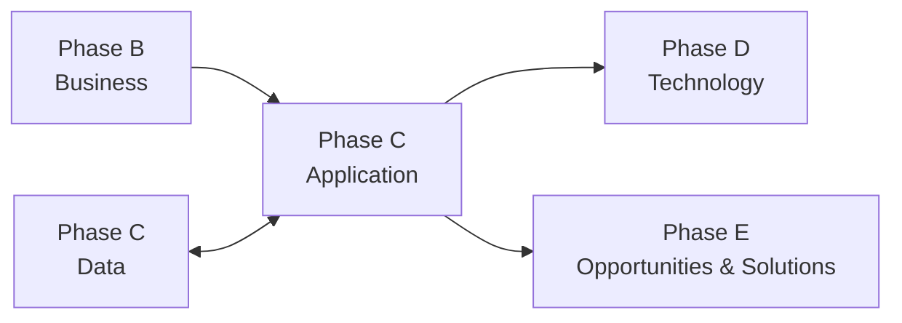
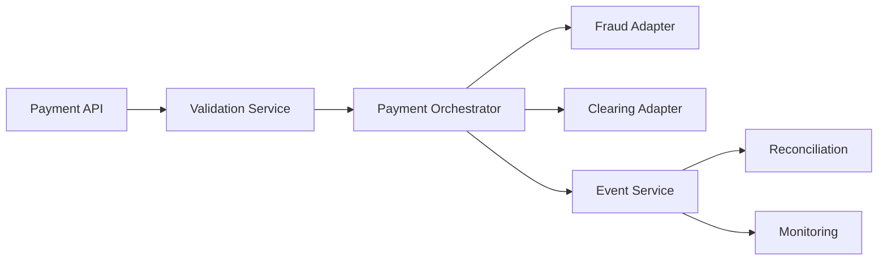

# Phase C — Application Architecture

## 1. Definition

La **Application Architecture** est la seconde partie de la **Phase C — Information Systems Architectures**. Elle décrit les applications, services applicatifs, responsabilités fonctionnelles, interfaces et interactions nécessaires pour supporter la Business Architecture et manipuler les données définies dans la Data Architecture.

Elle ne consiste pas simplement à dresser une liste d’applications. Elle cherche à comprendre :

- quelles capacités applicatives sont nécessaires ;
- quels composants existent déjà ;
- quels services doivent être fournis ;
- comment les applications interagissent ;
- quelles fonctions doivent être conservées, remplacées, rationalisées ou créées.

## 2. Pourquoi cette phase existe

Un paysage applicatif grandit souvent par accumulation : acquisitions, projets successifs, doublons, interfaces point-à-point, technologies anciennes, fonctions redondantes. L’Application Architecture apporte une vue cohérente permettant d’aligner le système applicatif avec les besoins métier et informationnels.

Elle relie :

**Business Capability → Business Service → Application Service → Application Component → Data**.

## 3. Position dans l’ADM

Data et Application peuvent être développées dans un ordre adapté au contexte avec itération entre les deux.

## 4. Ce qui doit déjà exister

Éléments importants :

- Architecture Vision ;
- Business Architecture ;
- exigences métier ;
- Data Architecture ou au minimum les besoins informationnels nécessaires ;
- Architecture Principles ;
- contraintes majeures ;
- informations sur le portefeuille applicatif existant.

## 5. Objectifs

1. développer la Baseline Application Architecture ;
2. développer la Target Application Architecture ;
3. identifier les gaps ;
4. comprendre les dépendances avec Data et Technology ;
5. mettre à jour exigences, risques et roadmap.

## 6. Baseline Application Architecture

La Baseline peut montrer :

- applications existantes ;
- application services ;
- interfaces ;
- intégrations ;
- fonctions couvertes ;
- ownership ;
- dépendances ;
- doublons ;
- contraintes ;
- problèmes de support ou d’obsolescence.

Le but n’est pas de faire un inventaire exhaustif sans finalité, mais de disposer du niveau nécessaire pour décider.

## 7. Target Application Architecture

La Target décrit le paysage applicatif futur.

Elle peut introduire :

- nouveaux services applicatifs ;
- consolidation de fonctions ;
- API ;
- event-driven interactions ;
- découpage de composants ;
- remplacement d’applications legacy ;
- rationalisation ;
- nouveaux patterns d’intégration.

La cible doit rester indépendante du choix final de produit lorsqu’il est encore trop tôt pour le figer.

## 8. Application Service vs Application Component

Un **Application Service** décrit un service exposé par la couche applicative.

Un **Application Component** représente un élément applicatif qui réalise ou fournit ce service.

Exemple MayaBank :

- Application Service : `Validate Payment` ;
- Application Component : `Payment Validation Service`.

Cette distinction est importante pour raisonner en architecture plutôt qu’en simple inventaire produit.

## 9. Gap Analysis

Exemples :

| Baseline | Target | Gap |
|---|---|---|
| orchestration dans plusieurs applications | orchestrateur commun | composant cible absent |
| interfaces point-à-point | API/events gouvernés | intégration à refondre |
| duplications de fonctions | services partagés | redondance |
| batch | temps réel | traitement événementiel manquant |
| application monolithique | services séparables | découplage nécessaire |

## 10. Interactions applicatives

L’architecture doit décrire les relations significatives :

- synchrones / asynchrones ;
- API ;
- messaging ;
- events ;
- batch ;
- file transfer ;
- services externes.

Ce niveau permet de comprendre les dépendances et les risques.

## 11. Relation avec Business Architecture

Business Architecture décrit les capacités, processus et services métier.

Application Architecture répond :

> quelles fonctions et services applicatifs doivent supporter ce fonctionnement ?

Exemple :

Business capability : **Payment Exception Management**.

Application services :

- Detect Exception ;
- Route Exception ;
- Resolve Exception ;
- Notify Operator.

## 12. Relation avec Data Architecture

Une application n’est pas décrite indépendamment des données qu’elle utilise.

Il faut comprendre :

- quelles entités elle crée ;
- quelles entités elle lit ;
- quelles données elle expose ;
- quelles sources sont autoritatives ;
- quelles transformations elle effectue.

## 13. Relation avec Technology Architecture

L’Application Architecture exprime des besoins qui seront traduits en capacités technologiques :

- runtime ;
- middleware ;
- container platform ;
- messaging ;
- network ;
- storage ;
- IAM ;
- observability ;
- HA/DR.

Exemple : une architecture applicative event-driven peut induire un besoin de plateforme de streaming ; la sélection précise du produit relève du travail technologique et de solution.

## 14. Requirements Management

Des exigences peuvent apparaître :

- SLA d’un service ;
- nombre maximal de dépendances critiques ;
- auditabilité ;
- sécurité des interfaces ;
- idempotence ;
- compatibilité ;
- versioning des APIs ;
- résilience.

Ces exigences rejoignent Requirements Management.

## 15. Gouvernance

La gouvernance doit éviter :

- duplication non justifiée ;
- dépendances incontrôlées ;
- choix incohérents avec les principes ;
- interfaces non gouvernées ;
- création de nouveaux silos ;
- solutions qui ne répondent pas réellement aux besoins métier.

## 16. MayaBank — exemple

### Baseline

- plusieurs applications historiques traitent les paiements ;
- fichiers et interfaces propriétaires ;
- traitements batch ;
- fonctions de validation dupliquées ;
- monitoring hétérogène.

### Target

Architecture applicative cible :

- Payment API ;
- Payment Validation Service ;
- Payment Orchestrator ;
- Fraud Screening Adapter ;
- Event Publisher/Consumer ;
- Exception Management Service ;
- Reconciliation Service ;
- Notification Service.

### Gaps

- orchestrateur absent ;
- absence d’API commune ;
- duplication de validation ;
- événements non standardisés ;
- dépendances batch à éliminer.

## 17. Mermaid simplifié

Ce diagramme est pédagogique : une architecture réelle nécessiterait des viewpoints adaptés aux stakeholders.

## 18. ArchiMate — extension professionnelle

Concepts utiles :

- Application Component ;
- Application Service ;
- Application Interface ;
- Data Object.

ArchiMate sert à modéliser la structure ; TOGAF structure la démarche.

## 19. Erreurs fréquentes

- faire une simple CMDB ;
- sélectionner les produits trop tôt ;
- ignorer la Business Architecture ;
- ignorer Data Architecture ;
- confondre application et capability ;
- considérer chaque microservice comme un objectif d’architecture ;
- produire des diagrammes sans concerns ni décisions.

## 20. Pièges OGEA-103

### Phase C Application vs Phase D

Application = logique applicative, services et interactions.

Technology = infrastructure et services technologiques supportant les applications.

### Application Architecture vs Solution Architecture

Application Architecture dans ADM décrit le domaine applicatif de l’Enterprise Architecture. Une Solution Architecture peut aller beaucoup plus loin dans le design détaillé d’une solution spécifique.

## 21. Foundation questions

### Q1
Quel domaine décrit les applications et leurs interactions ?

A. Business Architecture  
B. Data Architecture  
C. Application Architecture  
D. Technology Architecture

**Réponse : C.**

### Q2
Quelle phase contient Application Architecture ?

A. B  
B. C  
C. D  
D. E

**Réponse : B.**

## 22. Practitioner scenario

Un architecte constate que trois applications effectuent la même validation de paiement. Il souhaite immédiatement acheter un nouveau produit de BPM. La meilleure étape consiste d’abord à définir la Target Application Architecture, rationaliser les services nécessaires et identifier les gaps. Le choix de produit n’est pas le premier objectif.

## 23. English for Architects

Useful sentence:

> The target application architecture defines the application services, components and interactions required to support the business capabilities.

### Speak it

1. We found duplicated application functions.
2. The target introduces a common payment orchestration service.
3. The application gaps will drive technology and migration decisions.

## 24. Interview question

**Question:** What do you produce in Application Architecture?

**Simple answer:**

I describe the baseline and target application landscape, the main application services and interactions, identify gaps, and make sure the applications support the business and data requirements.

## 25. Key points to remember

- Application Architecture appartient à Phase C.
- Elle traite services, composants, interfaces et interactions applicatives.
- Elle s’appuie sur Business et Data Architecture.
- Elle produit Baseline, Target et Gaps.
- Elle alimente Technology Architecture et Phase E.
- Elle ne doit pas devenir un inventaire ou une sélection de produits prématurée.

---

Official baseline: The Open Group TOGAF Standard, 10th Edition — Fundamental Content / Architecture Development Method. Original educational explanation.