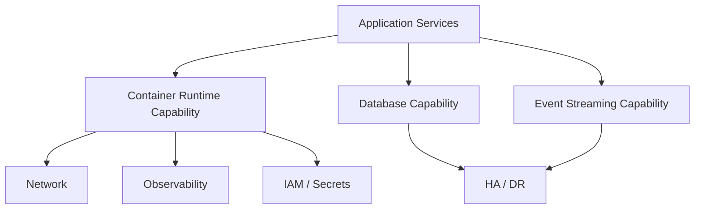

# Phase D — Technology Architecture

## 1. Definition

La **Phase D — Technology Architecture** développe l’architecture technologique nécessaire pour supporter les architectures Business, Data et Application définies précédemment.

Elle décrit les services et capacités technologiques de la Baseline et de la Target : plateformes d’exécution, infrastructure, réseau, stockage, sécurité technique, middleware, observabilité, intégration, résilience, haute disponibilité et reprise après sinistre.

Phase D ne signifie pas “faire une liste de produits”. On part d’abord des **technology capabilities** et des exigences avant de figer les choix de solution.

## 2. Pourquoi cette phase existe

Une cible applicative n’est réalisable que si une plateforme technologique adaptée existe.

Le raisonnement suit :

**Business requirements → Application/Data needs → Technology capabilities → Target Technology Architecture**.

Exemples :

- besoin métier : paiement 24/7 ;
- besoin applicatif : service disponible en continu ;
- besoin technologique : haute disponibilité, multi-zone/site, monitoring, failover.

## 3. Position dans l’ADM

Phase D termine le développement détaillé des quatre domaines d’architecture avant leur consolidation en Phase E.

## 4. Prérequis

Avant Phase D, on doit comprendre suffisamment :

- Business Architecture ;
- Data Architecture ;
- Application Architecture ;
- exigences fonctionnelles et non fonctionnelles ;
- principes ;
- contraintes ;
- risques ;
- Baseline technologique disponible.

## 5. Objectifs

1. développer la Baseline Technology Architecture ;
2. développer la Target Technology Architecture ;
3. identifier les technology gaps ;
4. vérifier la capacité de la cible à supporter Data/Application ;
5. mettre à jour exigences, risques et roadmap.

## 6. Technology capabilities avant products

Une règle professionnelle essentielle :

> définir d’abord **ce dont la plateforme doit être capable**, puis sélectionner les technologies.

Exemples de capabilities :

- container orchestration ;
- event streaming ;
- API management ;
- identity federation ;
- secrets management ;
- persistent storage ;
- database service ;
- monitoring/logging/tracing ;
- backup and recovery ;
- multi-site failover ;
- configuration management ;
- CI/CD / GitOps.

Dire “OpenShift” ou “Kafka” trop tôt peut cacher l’exigence réelle.

## 7. Baseline Technology Architecture

La Baseline peut couvrir :

- compute ;
- operating systems ;
- virtualization ;
- container platforms ;
- network ;
- storage ;
- databases ;
- middleware ;
- IAM ;
- observability ;
- security controls ;
- backup ;
- HA/DR ;
- deployment tooling ;
- standards existants.

## 8. Target Technology Architecture

La Target décrit les capacités technologiques futures nécessaires.

Exemple :

| Need | Technology capability |
|---|---|
| scalable services | elastic container/runtime platform |
| asynchronous payments | event streaming/messaging |
| secure APIs | API gateway + identity controls |
| resilient database | HA database + replication |
| operational visibility | metrics, logs, traces |
| multi-site continuity | DR/failover capabilities |

La cible peut ensuite être réalisée avec des technologies spécifiques.

## 9. Gap Analysis

Exemples :

- absence de plateforme conteneur ;
- monitoring incomplet ;
- réseau non compatible avec la cible ;
- absence de secrets management ;
- stockage non adapté ;
- pas de mécanisme de réplication ;
- CI/CD non industrialisé ;
- standards de sécurité insuffisants.

## 10. Standards et Architecture Repository

Phase D réutilise les standards et building blocks disponibles dans l’Architecture Repository. La réutilisation évite de redéfinir une plateforme différente pour chaque projet.

Le Standard Information Base peut contenir les standards technologiques applicables.

## 11. Non-functional requirements

Les NFR sont souvent déterminants :

- availability ;
- performance ;
- scalability ;
- security ;
- recoverability ;
- operability ;
- maintainability ;
- observability ;
- cost ;
- sustainability.

Un produit choisi sans NFR mesurables est difficile à gouverner.

## 12. Requirements Management

Phase D peut créer ou préciser des exigences :

- RPO/RTO ;
- disponibilité ;
- latence ;
- capacité ;
- chiffrement ;
- segmentation réseau ;
- audit ;
- logging ;
- résilience ;
- patching ;
- supportability.

Ces exigences sont tracées dans Requirements Management.

## 13. Gouvernance

Questions de gouvernance :

- respecte-t-on les Technology Principles ?
- réutilise-t-on les standards ?
- les exceptions sont-elles justifiées ?
- les NFR sont-ils testables ?
- les choix sont-ils cohérents avec sécurité et opérations ?
- les risques technologiques sont-ils explicites ?

## 14. MayaBank — Baseline

MayaBank utilise :

- applications Java historiques ;
- serveurs/VM ;
- middleware propriétaire ;
- bases Oracle ;
- transferts fichiers ;
- monitoring fragmenté ;
- déploiements manuels partiels.

## 15. MayaBank — Target capabilities

La cible nécessite :

- container orchestration ;
- event streaming ;
- API exposure ;
- centralized IAM ;
- secrets management ;
- database HA ;
- object/block storage selon usage ;
- observability complète ;
- GitOps ;
- multi-site DR ;
- security policy enforcement.

Exemples de réalisations possibles : OpenShift/Kubernetes, Kafka-compatible streaming, Oracle HA, GitOps tooling. Ce sont des **solution choices**, pas la définition abstraite de la capability.

## 16. Diagramme pédagogique

## 17. Phase D vs Phase E

C’est une confusion majeure.

### Phase D

Définit **la Target Technology Architecture et les gaps technologiques**.

### Phase E

Prend les gaps de B/C/D et cherche **comment réaliser la transformation** : candidate solutions, work packages, Transition Architectures et évolution de la roadmap.

**D = architecture technologique cible.**  
**E = options de réalisation et packaging du changement.**

## 18. Erreurs fréquentes

- commencer par le produit ;
- confondre Technology Architecture et infrastructure diagram ;
- ignorer les NFR ;
- oublier sécurité/opérations ;
- faire du sizing détaillé trop tôt ;
- créer une cible non alignée avec Application/Data ;
- faire le travail de Phase E dans Phase D.

## 19. Pièges OGEA-103

Si un scénario demande de développer la plateforme technologique cible ou d’identifier les gaps technologiques : **Phase D**.

Si le scénario demande de regrouper les gaps en work packages ou de déterminer des Transition Architectures : **Phase E**.

Si le scénario demande de prioriser les projets et créer le plan de migration détaillé : **Phase F**.

## 20. Foundation questions

### Q1
Quelle phase développe la Technology Architecture ?

A. C  
B. D  
C. E  
D. F

**Réponse : B.**

### Q2
Quel est le meilleur ordre de raisonnement ?

A. choisir un produit puis inventer les exigences  
B. définir les capabilities technologiques puis évaluer les solutions  
C. commencer par le budget uniquement  
D. attendre Phase G

**Réponse : B.**

## 21. Practitioner scenario

Une équipe veut migrer une plateforme critique. Elle a déjà défini la cible applicative et les exigences de disponibilité, mais propose directement un produit cloud précis sans analyser réseau, stockage, IAM, observabilité et DR.

La meilleure action est de développer d’abord la **Target Technology Architecture**, en partant des capabilities et NFR nécessaires, puis d’évaluer les solutions réalisables.

## 22. English for Architects

> During Phase D, we define the technology capabilities required to support the target data and application architectures.

### Speak it

1. The target platform must support high availability and disaster recovery.
2. We define capabilities before selecting products.
3. The technology gaps will be consolidated in Phase E.

## 23. Interview question

**Question:** What is the difference between Phase D and Phase E?

**Answer:**

Phase D defines the target Technology Architecture and identifies technology gaps. Phase E takes the gaps from all architecture domains and starts organizing how the target will be realized through solution options, work packages and transition architectures.

## 24. Key points

- Phase D = Technology Architecture.
- Baseline + Target + Gap Analysis.
- Capabilities avant produits.
- NFR essentiels.
- Supporte Data/Application.
- D produit les gaps ; E organise leur réalisation.

---

Official baseline: The Open Group TOGAF Standard, 10th Edition — Fundamental Content / Architecture Development Method. Original educational explanation.