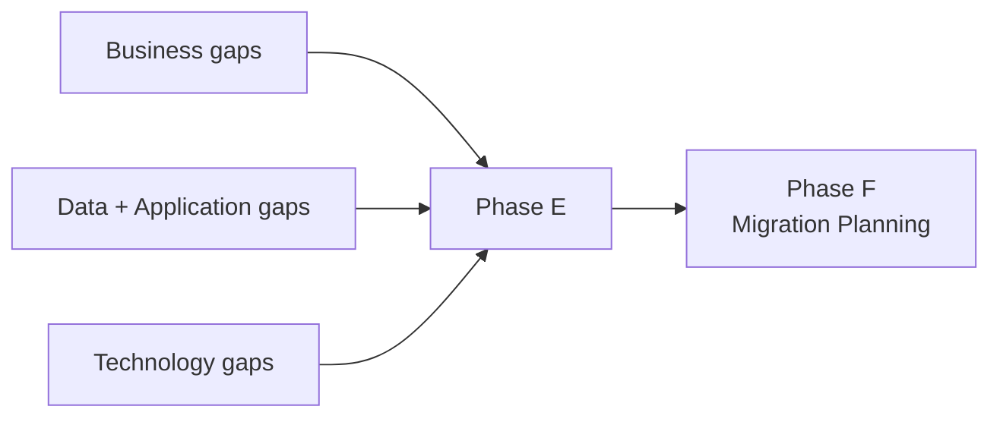
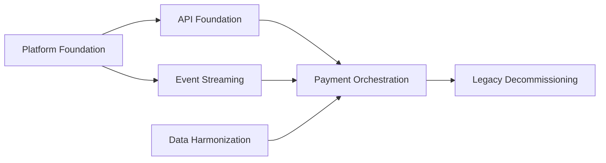

# Phase E — Opportunities and Solutions

## 1. Definition

La **Phase E — Opportunities and Solutions** transforme les architectures et gaps définis dans les Phases B, C et D en une première logique de réalisation.

Elle ne redéfinit pas la cible métier, data, application ou technologie. Elle consolide ces résultats afin de déterminer **comment organiser le changement**.

Les concepts centraux sont :

- gaps consolidés ;
- solution options ;
- candidate work packages ;
- Transition Architectures ;
- Architecture Roadmap enrichie ;
- dependencies ;
- benefits ;
- risks.

## 2. Pourquoi Phase E existe

À la fin de Phase D, on sait globalement :

- où l’entreprise est aujourd’hui ;
- où elle veut aller ;
- quels écarts existent dans chaque domaine.

Mais on ne sait pas encore clairement **comment grouper ces écarts en initiatives réalisables**.

Phase E répond donc à :

- quels changements doivent être regroupés ?
- quels work packages sont nécessaires ?
- quelles dépendances existent ?
- faut-il des états intermédiaires ?
- quelles solutions sont possibles ?
- quels bénéfices et risques sont associés ?

## 3. Position dans l’ADM



Phase E est le pont entre **architecture design** et **migration planning**.

## 4. Ce qui doit déjà exister

Avant Phase E :

- Baseline/Target Business Architecture ;
- Baseline/Target Data Architecture ;
- Baseline/Target Application Architecture ;
- Baseline/Target Technology Architecture ;
- gap analyses ;
- requirements ;
- risks ;
- constraints ;
- Architecture Roadmap déjà amorcée.

## 5. Objectifs

1. consolider les gaps des quatre domaines ;
2. évaluer des solution options ;
3. identifier et grouper les changements en candidate work packages ;
4. identifier les Transition Architectures nécessaires ;
5. affiner l’Architecture Roadmap ;
6. préparer le terrain pour la priorisation détaillée de Phase F.

## 6. Consolidation des gaps

Il ne faut pas traiter chaque gap isolément.

Exemple MayaBank :

- Business gap : traitement d’exception trop manuel ;
- Data gap : statuts non harmonisés ;
- Application gap : absence d’orchestrateur commun ;
- Technology gap : absence de plateforme événementielle standard.

Ces quatre gaps peuvent contribuer à un même **work package** de modernisation du traitement de paiement.

## 7. Work Package

Un **Work Package** représente un ensemble cohérent de travaux nécessaires pour produire un résultat ou faire évoluer l’architecture.

Exemples MayaBank :

- WP01 Platform Foundation ;
- WP02 API Foundation ;
- WP03 Event Streaming ;
- WP04 Payment Orchestration ;
- WP05 Observability ;
- WP06 Security ;
- WP07 Data Migration ;
- WP08 Legacy Decommissioning.

Le work package n’est pas nécessairement un projet final déjà planifié dans tous ses détails.

## 8. Transition Architecture

Une **Transition Architecture** est un état intermédiaire architecturalement significatif entre Baseline et Target.

Elle est utile lorsque la cible ne peut pas être atteinte en une seule étape.

Exemple :

```text
Baseline
Legacy payments on VM
   ↓
Transition 1
API layer + legacy core
   ↓
Transition 2
OpenShift + event streaming + partial legacy coexistence
   ↓
Target
Modernized payment platform + legacy decommissioned
```

Une transition n’est pas simplement une date de projet. C’est un état architectural cohérent.

## 9. Architecture Roadmap

La roadmap évolue pendant l’ADM.

En Phase E, elle devient plus concrète grâce aux :

- work packages ;
- dependencies ;
- Transition Architectures ;
- benefits ;
- risks ;
- timing hypotheses.

Mais Phase E n’est pas encore la phase de priorisation et planification détaillée finale.

## 10. Solution options

Phase E peut comparer plusieurs voies de réalisation.

Exemple :

Option A : modernisation progressive ;

Option B : remplacement massif ;

Option C : coexistence durable + strangler pattern.

L’évaluation considère notamment :

- valeur ;
- coût ;
- risque ;
- faisabilité ;
- dépendances ;
- contraintes ;
- readiness.

## 11. Phase E vs Phase F

C’est la confusion la plus importante de cette partie de l’ADM.

### Phase E — Opportunities and Solutions

Question dominante :

> **Quelles options de réalisation et quels work packages peuvent transformer la Baseline en Target ?**

On identifie, regroupe et structure.

### Phase F — Migration Planning

Question dominante :

> **Dans quel ordre et avec quelle priorité doit-on exécuter les work packages ?**

On priorise, séquence et finalise le Implementation and Migration Plan.

Résumé :

**E = WHAT TO IMPLEMENT / HOW TO PACKAGE CHANGE**  
**F = WHEN / IN WHAT ORDER / WITH WHAT PRIORITY**

## 12. Requirements Management

Phase E doit vérifier que les work packages et transitions répondent aux exigences.

De nouvelles exigences peuvent apparaître :

- coexistence temporaire ;
- compatibilité ;
- migration de données ;
- rollback ;
- sécurité de transition ;
- continuity requirements.

## 13. Gouvernance

La gouvernance vérifie :

- cohérence entre work packages et architecture cible ;
- couverture des gaps ;
- dépendances explicites ;
- transitions cohérentes ;
- risques documentés ;
- principes respectés.

## 14. MayaBank — exemple complet

### Inputs

Gaps consolidés :

- API inexistantes sur certains parcours ;
- traitement batch ;
- duplication de validation ;
- modèles de données divergents ;
- observabilité insuffisante ;
- plateforme runtime ancienne ;
- HA/DR hétérogène.

### Candidate work packages

**WP01 — Platform Foundation**  
Container platform, network, IAM integration, GitOps baseline.

**WP02 — Event Streaming**  
Streaming capability, schemas, governance.

**WP03 — API Foundation**  
API gateway, standards, authentication.

**WP04 — Payment Orchestration**  
New orchestration services and migration of payment flows.

**WP05 — Data Harmonization**  
Canonical model, mappings, ownership.

**WP06 — Observability**  
Metrics, logs, traces, operational dashboards.

**WP07 — Legacy Decommissioning**  
Removal after migration completion.

### Transition Architectures

TA1 : legacy + APIs ;

TA2 : legacy + APIs + OpenShift + event streaming ;

TA3 : majority modern platform + limited legacy ;

Target : legacy payment core decommissioned where appropriate.

## 15. Dependencies

Exemple :



L’identification des dépendances est cruciale avant Phase F.

## 16. Erreurs fréquentes

- confondre E avec D ;
- sélectionner les technologies alors que la target tech est déjà définie ;
- confondre work package et projet détaillé ;
- ignorer Transition Architectures ;
- faire la priorisation détaillée de F trop tôt ;
- considérer la roadmap comme un document créé seulement à la fin.

## 17. Pièges OGEA-103

### Piège 1 — “Identify work packages”

→ Phase E.

### Piège 2 — “Prioritize projects according to business value and risk”

→ Phase F.

### Piège 3 — “Develop Target Technology Architecture”

→ Phase D.

### Piège 4 — “Govern implementation compliance”

→ Phase G.

## 18. Foundation questions

### Q1
Quelle phase identifie les candidate work packages et Transition Architectures ?

A. D  
B. E  
C. F  
D. G

**Réponse : B.**

### Q2
Quelle phrase décrit le mieux Phase E ?

A. elle définit le budget détaillé du programme  
B. elle développe la Technology Architecture  
C. elle convertit les gaps en options de réalisation et work packages  
D. elle réalise les compliance reviews

**Réponse : C.**

## 19. Practitioner scenario

Une organisation a terminé B/C/D. Elle dispose de 40 gaps mais aucun regroupement cohérent. Le sponsor demande quelles initiatives pourraient réaliser la cible et quels états intermédiaires sont nécessaires.

La meilleure réponse est de travailler en **Phase E** : consolider les gaps, identifier les work packages, examiner les solution options et définir les Transition Architectures.

Il serait prématuré de produire directement un plan de migration détaillé sans cette consolidation.

## 20. English for Architects

> In Phase E, we consolidate the gaps, identify candidate work packages and define the transition architectures required to reach the target state.

### Speak it

1. We grouped the architecture gaps into coherent work packages.
2. The target cannot be reached in one step, so we defined two transition architectures.
3. Phase F will prioritize and sequence these work packages.

## 21. Interview question

**Question:** What is the difference between Phase E and Phase F?

**Answer:**

Phase E identifies how the target architecture can be realized through solution options, work packages and transition architectures. Phase F takes those work packages and prioritizes and sequences them into the implementation and migration plan.

## 22. Key points

- E commence après B/C/D.
- consolide les gaps ;
- identifie work packages ;
- identifie Transition Architectures ;
- affine Architecture Roadmap ;
- prépare F ;
- ne fait pas encore toute la priorisation détaillée.

---

Official baseline: The Open Group TOGAF Standard, 10th Edition — Fundamental Content / Architecture Development Method. Original educational explanation.