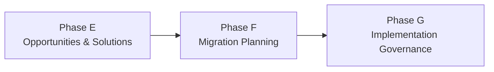
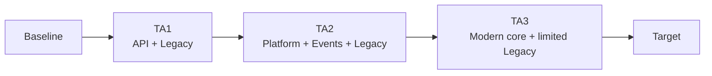

# Phase F — Migration Planning

## 1. Definition

La **Phase F — Migration Planning** transforme les work packages et Transition Architectures identifiés en Phase E en un **Implementation and Migration Plan** cohérent, priorisé et séquencé.

La question centrale devient :

> **Dans quel ordre devons-nous réaliser la transformation, en tenant compte de la valeur, du risque, du coût, des dépendances et de la capacité d’exécution ?**

Phase F est donc la phase où la roadmap devient un plan de migration beaucoup plus exploitable.

## 2. Pourquoi cette phase existe

Avoir une liste de work packages n’est pas suffisant. Une entreprise doit décider :

- ce qui vient en premier ;
- ce qui dépend d’autre chose ;
- ce qui apporte le plus de valeur ;
- ce qui réduit le plus de risque ;
- ce qui est urgent réglementairement ;
- ce qui est réellement réalisable avec les ressources disponibles.

Phase F convertit l’architecture en trajectoire de transformation gouvernable.

## 3. Position dans l’ADM

## 4. Ce qui doit déjà exister

Avant Phase F, on doit disposer au minimum de :

- work packages candidats ;
- Transition Architectures ;
- dependencies ;
- Architecture Roadmap ;
- architecture requirements ;
- risks ;
- benefits ;
- solution options ;
- contraintes de réalisation.

## 5. Objectifs

1. prioriser les work packages ;
2. confirmer les dépendances ;
3. définir une séquence de migration ;
4. finaliser l’Implementation and Migration Plan ;
5. mettre à jour l’Architecture Roadmap ;
6. aligner architecture et portefeuille/programme de transformation.

## 6. Critères de priorisation

Les critères peuvent inclure :

- business value ;
- risk ;
- cost ;
- dependencies ;
- regulatory urgency ;
- readiness ;
- resource availability ;
- complexity ;
- technical debt reduction ;
- benefit realization.

Il n’existe pas une seule formule universelle. L’important est que les critères soient explicites, partagés et cohérents avec les objectifs.

## 7. Exemple de matrice

| Work Package | Value | Risk reduction | Dependency | Urgency | Priority |
|---|---:|---:|---|---:|---|
| Platform Foundation | high | high | none | high | 1 |
| Event Streaming | high | medium | Platform | high | 2 |
| API Foundation | high | medium | Platform | high | 2 |
| Payment Orchestration | very high | high | API + Events + Data | high | 3 |
| Legacy Decommissioning | medium | high | Payment migration | medium | 4 |

Les nombres sont pédagogiques, pas une règle TOGAF obligatoire.

## 8. Implementation and Migration Plan

Ce plan structure la transformation de façon exploitable.

Il peut inclure :

- work packages ;
- projects/programs ;
- sequence ;
- milestones ;
- Transition Architectures ;
- dependencies ;
- benefits ;
- risks ;
- resource implications ;
- timing ;
- governance points.

## 9. Architecture Roadmap vs Implementation and Migration Plan

Confusion classique.

### Architecture Roadmap

Vue architecturale de la trajectoire : work packages, transitions, direction, dépendances et évolution vers la cible.

### Implementation and Migration Plan

Plan plus opérationnel de mise en œuvre et migration, aligné avec portfolio/program management.

Ils sont liés mais ne sont pas synonymes.

## 10. Phase E vs Phase F

### E

- consolider les gaps ;
- identifier options ;
- former les work packages ;
- définir Transition Architectures.

### F

- prioriser ;
- ordonnancer ;
- confirmer dépendances ;
- produire le plan de migration détaillé.

Mémo :

**E = package the change**  
**F = plan the change**

## 11. Coordination avec portfolio/program management

Phase F doit s’articuler avec les mécanismes réels de financement et de delivery.

TOGAF ne remplace pas la gestion de programme. L’architecture fournit la cohérence de cible, les dépendances et les contraintes ; le portfolio/program management gère l’exécution, les budgets, ressources et calendriers selon le cadre de l’organisation.

## 12. Requirements Management

La planification peut révéler de nouvelles exigences :

- coexistence plus longue que prévu ;
- besoin de migration par vagues ;
- contraintes de cutover ;
- besoin de double-run ;
- rollback ;
- disponibilité pendant migration ;
- restrictions réglementaires.

Ces exigences doivent être intégrées et tracées.

## 13. Gouvernance

Phase F doit assurer :

- cohérence entre priorités et objectifs ;
- transparence des arbitrages ;
- traçabilité des dépendances ;
- validation des Transition Architectures ;
- prise en compte des risques ;
- alignement avec les capacités de delivery.

## 14. MayaBank — séquencement

### Wave 1 — Foundation

- Platform Foundation ;
- IAM/Secrets baseline ;
- Observability baseline ;
- API Foundation.

### Wave 2 — Integration

- Event Streaming ;
- canonical schemas ;
- integration adapters.

### Wave 3 — Payment Core

- Payment Orchestration ;
- validation services ;
- exception management.

### Wave 4 — Migration

- migrate flows ;
- coexistence ;
- production validation.

### Wave 5 — Decommission

- remove obsolete interfaces ;
- retire legacy components ;
- optimize target state.

## 15. Transition Architectures

Le plan doit respecter les états intermédiaires définis.

Exemple :

## 16. Risque et valeur

Un work package très rentable mais dépendant de trois fondations ne peut pas forcément être premier.

Un autre peu visible métier peut être prioritaire parce qu’il réduit un risque réglementaire majeur.

Le meilleur ordre n’est donc pas toujours celui de la valeur brute maximale.

## 17. Erreurs fréquentes

- refaire Phase E ;
- prioriser sans dépendances ;
- confondre Architecture Roadmap et plan projet ;
- ignorer readiness et capacité d’exécution ;
- planifier sans exigences de transition ;
- oublier les bénéfices attendus ;
- considérer TOGAF comme un outil de planning projet détaillé.

## 18. Pièges OGEA-103

Si la question parle de :

- priorization ;
- sequencing ;
- business value vs risk ;
- detailed migration planning ;
- Implementation and Migration Plan ;

la réponse est très probablement liée à **Phase F**.

Si elle parle d’identifier les work packages : Phase E.

Si elle parle de conformité de l’implémentation : Phase G.

## 19. Foundation questions

### Q1
Quelle phase priorise les work packages ?

A. E  
B. F  
C. G  
D. H

**Réponse : B.**

### Q2
Quel deliverable/concept est particulièrement associé à Phase F ?

A. Architecture Vision  
B. Implementation and Migration Plan  
C. Architecture Contract uniquement  
D. Business Scenario

**Réponse : B.**

## 20. Practitioner scenario

Une banque a identifié cinq work packages mais le budget ne permet d’en exécuter que trois cette année. Certains ont une forte valeur métier, d’autres réduisent un risque réglementaire et deux sont prérequis pour les autres.

La meilleure démarche est d’utiliser **Phase F** pour évaluer valeur, risque, dépendances, coût et readiness, puis produire une séquence de migration cohérente.

## 21. English for Architects

> In Phase F, we prioritize and sequence the work packages and finalize the implementation and migration plan.

### Speak it

1. The platform foundation is a prerequisite for the payment migration.
2. We prioritized the work packages using value, risk and dependencies.
3. The migration is divided into several waves.

## 22. Interview question

**Question:** How do you build an architecture migration roadmap?

**Answer:**

I start from the work packages and transition architectures identified in Phase E. In Phase F, I assess value, risk, cost, dependencies and readiness, then sequence the work into a realistic implementation and migration plan.

## 23. Key points

- Phase F = Migration Planning.
- Priorité + séquence + dépendances.
- E identifie les work packages ; F les planifie.
- Implementation and Migration Plan est central.
- Roadmap et migration plan sont liés mais différents.
- F prépare Phase G.

---

Official baseline: The Open Group TOGAF Standard, 10th Edition — Fundamental Content / Architecture Development Method. Original educational explanation.