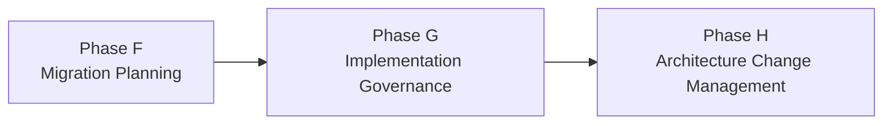

# Phase G — Implementation Governance

## 1. Definition

La **Phase G — Implementation Governance** assure que la mise en œuvre reste conforme à l’architecture approuvée pendant l’exécution.

Elle relie l’architecture à la réalité du delivery. Une architecture cible peut être excellente sur le papier, mais perdre sa cohérence si l’implémentation introduit des écarts non contrôlés, des contournements, des choix non conformes ou des changements non tracés.

La question centrale de Phase G est :

> **L’implémentation respecte-t-elle l’architecture approuvée, et comment traiter les écarts ?**

## 2. Pourquoi cette phase existe

Entre le plan et l’exécution, beaucoup de choses changent :

- contraintes techniques découvertes tardivement ;
- délais ;
- budget ;
- nouvelles exigences ;
- incidents ;
- limitations produit ;
- changements réglementaires ;
- décisions projet.

Sans gouvernance, le delivery peut dériver progressivement de l’architecture cible.

## 3. Position dans l’ADM



Phase F prépare l’exécution. Phase G gouverne l’implémentation. Phase H gère ensuite l’évolution de l’architecture dans la durée.

## 4. Prérequis

Avant Phase G, on dispose normalement de :

- Target Architectures ;
- Architecture Roadmap ;
- Implementation and Migration Plan ;
- Architecture Requirements Specification ;
- work packages ;
- governance arrangements ;
- architecture principles and standards ;
- risques et contraintes.

## 5. Objectifs

1. fournir une supervision architecturale de l’implémentation ;
2. vérifier la conformité de la solution aux architectures approuvées ;
3. gérer les écarts, exceptions et décisions ;
4. maintenir la traçabilité entre exigences, architecture et delivery ;
5. confirmer que les capacités livrées correspondent à l’intention architecturale.

## 6. Architecture Contract

L’**Architecture Contract** est un concept important de gouvernance. Il formalise les attentes et responsabilités entre les parties qui définissent l’architecture et celles qui la mettent en œuvre.

Selon le contexte, il peut couvrir :

- architecture obligations ;
- acceptance criteria ;
- conformance expectations ;
- roles and responsibilities ;
- reporting ;
- exception handling ;
- change control.

Il ne faut pas le réduire à un contrat juridique commercial.

## 7. Architecture Compliance Review

Une **Architecture Compliance Review** évalue si une implémentation respecte :

- architecture principles ;
- standards ;
- requirements ;
- target architecture ;
- approved building blocks ;
- security constraints ;
- operational expectations.

Le but n’est pas de “punir” les équipes, mais de maintenir la cohérence et de traiter les écarts explicitement.

## 8. Exception et deviation

Un écart peut être :

- acceptable temporairement ;
- acceptable avec mitigation ;
- rejeté ;
- escaladé ;
- suffisamment important pour nécessiter une modification d’architecture.

Processus type :

```text
Deviation detected
   ↓
Impact analysis
   ↓
Risk assessment
   ↓
Accept / Mitigate / Reject / Escalate
   ↓
Trace decision
```

## 9. Governance vs Project Governance

### Architecture Governance

Vérifie la conformité à l’architecture, aux principes, standards et décisions architecturales.

### Project Governance

Gère plus largement budget, planning, ressources, risques projet, livraison et reporting.

Les deux se croisent mais ne sont pas synonymes.

## 10. Architecture Board

L’Architecture Board peut jouer un rôle d’arbitrage et d’escalade :

- approuver des architectures ;
- traiter des exceptions majeures ;
- maintenir les principes et standards ;
- assurer la cohérence transverse.

Il ne remplace pas l’équipe d’architecture ni le management projet.

## 11. Evidence-based governance

Une bonne gouvernance s’appuie sur des preuves :

- diagrams approved ;
- ADRs ;
- test evidence ;
- security evidence ;
- performance evidence ;
- compliance review records ;
- exception decisions ;
- traceability to requirements.

## 12. Requirements Management

Phase G vérifie que l’implémentation satisfait les exigences d’architecture.

Si une exigence change, elle doit être analysée :

- est-elle locale au projet ?
- modifie-t-elle l’architecture ?
- crée-t-elle un nouveau gap ?
- doit-elle remonter vers Phase H ou initier un nouvel ADM cycle ?

## 13. MayaBank — exemple

### Situation

Le programme Payment Orchestration est en réalisation.

Architecture approuvée :

- APIs authentifiées via IAM central ;
- événements versionnés ;
- secrets externalisés ;
- observabilité standard ;
- haute disponibilité ;
- GitOps pour déploiements.

### Déviation

Une équipe souhaite stocker temporairement un secret dans une variable de configuration applicative pour accélérer la livraison.

### Gouvernance

La demande est évaluée contre les principes de sécurité. L’architecte documente l’écart, évalue le risque, propose une mitigation et fait arbitrer l’exception selon le cadre de gouvernance.

Le point essentiel : l’écart n’est pas simplement ignoré ni accepté verbalement.

## 14. Autre exemple — performance

La cible exige une latence donnée. Les tests montrent une latence supérieure.

Phase G doit vérifier :

- si le problème vient de l’implémentation ;
- si l’exigence est réaliste ;
- si l’architecture doit évoluer ;
- quelles décisions doivent être tracées.

## 15. Phase F vs G

### Phase F

Planifie la transformation.

### Phase G

Gouverne ce qui est réellement implémenté.

Mémo :

**F = plan**  
**G = govern delivery**

## 16. Phase G vs H

### G

Conformité de l’implémentation en cours.

### H

Évolution de l’architecture après ou autour de la transformation, gestion des change triggers et décision sur un nouveau cycle ADM.

## 17. Erreurs fréquentes

- croire que l’architecte disparaît après Phase F ;
- confondre architecture governance et project governance ;
- accepter des exceptions sans trace ;
- traiter la conformité comme une checklist purement documentaire ;
- ignorer les preuves ;
- ne pas remonter les changements significatifs.

## 18. Pièges OGEA-103

Mots-clés fréquents :

- implementation compliance ;
- Architecture Contract ;
- compliance review ;
- implementation deviation ;
- governance of delivery.

→ **Phase G**.

Si la question parle de changement de l’architecture elle-même ou de déclencheur d’un nouveau cycle → Phase H.

## 19. Foundation questions

### Q1
Quelle phase assure l’Implementation Governance ?

A. E  
B. F  
C. G  
D. H

**Réponse : C.**

### Q2
Quel mécanisme vérifie la conformité d’une implémentation à l’architecture ?

A. Architecture Compliance Review  
B. Business Scenario  
C. Gap Analysis uniquement  
D. Migration wave

**Réponse : A.**

## 20. Practitioner scenario

Une équipe projet décide de remplacer un composant approuvé par une technologie non standard pour respecter un délai. L’option est techniquement possible mais crée un risque de support.

La meilleure réponse TOGAF n’est ni d’accepter automatiquement ni de bloquer sans analyse. Il faut appliquer la gouvernance : évaluer l’impact, vérifier la conformité, documenter l’exception et faire arbitrer selon le cadre défini.

## 21. English for Architects

> During Phase G, we govern the implementation and verify that the delivered solution remains compliant with the approved architecture.

### Speak it

1. We performed an architecture compliance review.
2. The implementation introduced a deviation from the approved standard.
3. We documented the exception and assessed the risk.

## 22. Interview question

**Question:** How do you handle an implementation deviation?

**Answer:**

I assess the impact against the architecture principles, standards and requirements. I document the deviation, evaluate the risk and mitigation, and use the architecture governance process to accept, reject or escalate the exception.

## 23. Key points

- Phase G = Implementation Governance.
- Architecture Contract et Compliance Review sont centraux.
- Les exceptions doivent être gouvernées.
- G ne remplace pas la project governance.
- G vérifie la conformité de la réalisation.
- Les changements structurants peuvent alimenter Phase H.

---

Official baseline: The Open Group TOGAF Standard, 10th Edition — Fundamental Content / Architecture Development Method. Original educational explanation.