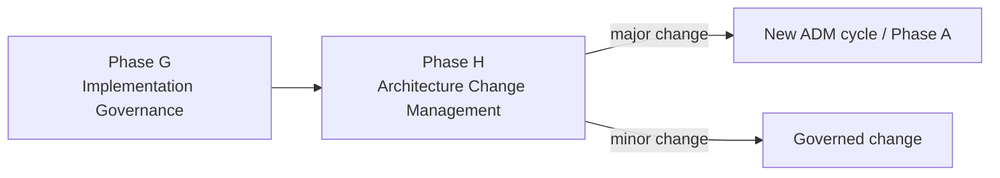

# Phase H — Architecture Change Management

## 1. Definition

La **Phase H — Architecture Change Management** organise la surveillance et l’évolution de l’architecture après sa mise en place, afin de déterminer quand un changement peut être traité comme une évolution limitée et quand il justifie un nouveau travail d’architecture ou un nouveau cycle ADM.

La question centrale est :

> **Le changement demandé peut-il être absorbé par la gouvernance courante, ou faut-il lancer un nouveau cycle d’architecture ?**

## 2. Pourquoi cette phase existe

Une architecture n’est jamais définitivement “finie”. L’environnement évolue :

- nouvelles réglementations ;
- nouvelles offres métier ;
- nouveaux risques ;
- nouvelles technologies ;
- changement de fournisseur ;
- croissance ;
- acquisition ;
- nouveaux modèles opérationnels ;
- nouvelles contraintes de sécurité.

Phase H permet d’éviter deux extrêmes :

1. lancer un ADM complet pour chaque petite modification ;
2. laisser l’architecture dériver sans contrôle.

## 3. Position dans l’ADM

Phase H boucle donc naturellement vers un nouveau cycle lorsque nécessaire.

## 4. Ce qui doit déjà exister

Phase H s’appuie sur :

- Target Architecture ;
- architecture principles ;
- governance structure ;
- Architecture Repository ;
- delivered capabilities ;
- operational feedback ;
- risks ;
- requirements ;
- lessons learned ;
- change requests.

## 5. Objectifs

1. surveiller l’environnement et les changements pertinents ;
2. évaluer leur impact architectural ;
3. maintenir la valeur et la pertinence de l’architecture ;
4. décider du niveau d’action approprié ;
5. déclencher un nouveau travail ADM si nécessaire.

## 6. Change triggers

Exemples de triggers :

- nouvelle réglementation ;
- nouvelle stratégie métier ;
- changement de modèle économique ;
- acquisition/fusion ;
- changement de fournisseur critique ;
- fin de support technologique ;
- nouvelles menaces ;
- changement majeur de volumétrie ;
- nouvelles exigences de disponibilité ;
- évolution d’un schéma de paiement ;
- nouvelle plateforme d’entreprise.

## 7. Évaluer l’impact

Questions :

- Le changement affecte-t-il une architecture cible approuvée ?
- Affecte-t-il plusieurs domaines ?
- Modifie-t-il des principes ?
- Crée-t-il de nouveaux stakeholders ou concerns ?
- Introduit-il de nouveaux risques ?
- Modifie-t-il les requirements ?
- Remet-il en cause la roadmap ?
- Nécessite-t-il une nouvelle vision ?

## 8. Minor vs major change

Il ne faut pas chercher une règle mécanique universelle. L’organisation doit disposer de critères de gouvernance.

### Exemple de changement mineur

Une version de composant remplace une version précédente sans modifier les capacités, interfaces ou principes.

### Exemple de changement majeur

Une nouvelle réglementation impose un traitement de paiement totalement différent, de nouveaux acteurs, de nouvelles données, de nouveaux services et une nouvelle cible technologique.

Le second cas justifie potentiellement un nouveau cycle ADM.

## 9. Architecture Change Request

Un changement significatif doit être documenté avec :

- description ;
- rationale ;
- impact ;
- urgency ;
- stakeholders ;
- risks ;
- architecture domains affected ;
- recommendation.

## 10. Continuous monitoring

Phase H repose sur des signaux provenant de :

- operations ;
- business strategy ;
- regulatory watch ;
- security ;
- technology lifecycle ;
- architecture governance ;
- incidents ;
- audit ;
- portfolio management.

Le rôle de l’architecte devient un rôle de maintien de cohérence dans le temps.

## 11. Relation avec Requirements Management

Requirements Management traite les exigences à travers le cycle ADM.

Phase H, elle, traite la **gestion du changement architectural global**.

Un change trigger peut créer ou modifier des requirements, mais Requirements Management n’est pas équivalent à Phase H.

## 12. Phase G vs H

### Phase G

- implementation en cours ;
- compliance ;
- deviations ;
- Architecture Contract ;
- governance de delivery.

### Phase H

- architecture dans la durée ;
- change triggers ;
- architecture evolution ;
- décision de nouveau cycle ADM.

## 13. MayaBank — exemple réglementaire

MayaBank a terminé une première modernisation. Une nouvelle règle européenne impose de nouveaux contrôles sur certains paiements.

Impact :

- nouveaux requirements métier ;
- nouvelles données à conserver ;
- évolution des services de validation ;
- nouvelles règles de sécurité ;
- changements d’audit.

Le changement affecte plusieurs domaines et modifie la cible. L’Architecture Board peut recommander un nouveau cycle ADM ciblé.

## 14. MayaBank — exemple mineur

Le runtime OpenShift passe à une nouvelle version supportée sans changement de capabilities ni design significatif.

Le changement peut être traité dans le cycle normal de lifecycle/platform governance si les impacts sont limités.

## 15. Gouvernance

Phase H doit définir clairement :

- qui détecte les triggers ;
- qui évalue l’impact ;
- qui décide du niveau de changement ;
- comment la décision est tracée ;
- quand relancer l’ADM ;
- comment mettre à jour le Repository.

## 16. Erreurs fréquentes

- croire que Phase H = maintenance technique ;
- confondre H avec Requirements Management ;
- confondre H avec G ;
- relancer un ADM complet pour toute modification ;
- ne jamais relancer l’ADM malgré des changements majeurs ;
- oublier le contexte externe.

## 17. Pièges OGEA-103

Si un scénario parle :

- change trigger ;
- major architecture change ;
- ongoing architecture monitoring ;
- decision to start a new ADM cycle ;

→ **Phase H**.

Si le changement est une déviation d’implémentation d’un projet en cours → plutôt Phase G.

## 18. Foundation questions

### Q1
Quelle phase gère l’évolution de l’architecture dans le temps ?

A. F  
B. G  
C. H  
D. Requirements Management uniquement

**Réponse : C.**

### Q2
Quel événement peut déclencher un nouveau cycle ADM ?

A. uniquement un changement de serveur  
B. un changement majeur de stratégie ou réglementation  
C. uniquement un audit  
D. jamais

**Réponse : B.**

## 19. Practitioner scenario

Une organisation vient d’achever une transformation. Six mois plus tard, une acquisition modifie la structure métier, introduit de nouvelles applications et de nouvelles obligations réglementaires.

La meilleure approche consiste à traiter cela comme un **change trigger majeur**, analyser l’impact via Phase H et lancer un nouveau travail d’architecture si nécessaire.

## 20. English for Architects

> In Phase H, we monitor architecture change and decide whether a change can be handled through normal governance or requires a new ADM cycle.

### Speak it

1. A new regulation triggered an architecture review.
2. The change affects several architecture domains.
3. We decided to start a new ADM cycle.

## 21. Interview question

**Question:** When would you start a new ADM cycle?

**Answer:**

I would start a new cycle when a change is significant enough to affect the approved architecture, major requirements, several domains, key stakeholders or strategic objectives. Phase H helps assess that impact.

## 22. Key points

- H = Architecture Change Management.
- surveille les change triggers ;
- évalue l’impact ;
- distingue changement limité et changement majeur ;
- peut déclencher un nouveau cycle ADM ;
- H ≠ G ;
- H ≠ Requirements Management.

---

Official baseline: The Open Group TOGAF Standard, 10th Edition — Fundamental Content / Architecture Development Method. Original educational explanation.