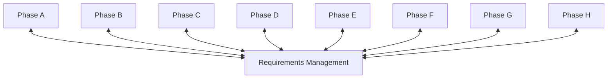

# Requirements Management

## 1. Definition

**Requirements Management** est le processus transverse qui accompagne l’ensemble du cycle ADM. Il sert à identifier, stocker, analyser, prioriser, valider, tracer, modifier et communiquer les exigences d’architecture.

Ce n’est pas simplement une “phase de plus” placée entre A et B. Dans le modèle ADM, Requirements Management interagit avec toutes les phases.

## 2. Pourquoi il est central

Une architecture existe pour répondre à des besoins et contraintes. Si les exigences ne sont pas maîtrisées, l’architecture peut devenir :

- incohérente ;
- impossible à vérifier ;
- déconnectée des objectifs ;
- difficile à gouverner ;
- impossible à faire évoluer proprement.

Le flux fondamental est :

**Stakeholder → Concern → Requirement → Architecture Decision → Architecture Element → Verification**.

## 3. Requirements Management dans l’ADM



Chaque phase consomme des requirements et peut en créer, modifier ou supprimer.

## 4. Requirement vs Concern

Un **Concern** est une préoccupation d’un stakeholder.

Exemple :

> “Je crains que le nouveau système de paiement soit indisponible lors d’un incident de datacenter.”

Un **Requirement** traduit cette préoccupation en attente exploitable.

Exemple :

> “Le service critique doit continuer à fonctionner après perte d’un site selon les objectifs RPO/RTO approuvés.”

## 5. Requirement vs Principle

### Architecture Principle

Règle générale et durable qui guide les décisions.

Exemple :

> Security by Design.

### Requirement

Besoin ou contrainte spécifique à satisfaire dans un contexte donné.

Exemple :

> Toutes les APIs de paiement exposées doivent utiliser une authentification forte conforme au standard interne.

Un principle peut générer ou influencer plusieurs requirements.

## 6. Requirement vs Constraint

Une **Constraint** limite les options possibles.

Exemple :

- date réglementaire imposée ;
- technologie imposée ;
- budget maximum ;
- localisation des données.

Une constraint peut être gérée comme une forme particulière d’exigence selon le contexte, mais il faut comprendre sa nature limitante.

## 7. Cycle de vie d’une exigence

Une exigence peut passer par :

```text
Identify
  ↓
Clarify
  ↓
Validate
  ↓
Prioritize
  ↓
Trace
  ↓
Implement / Verify
  ↓
Change / Retire
```

## 8. Qualités d’une bonne exigence

Une exigence doit être aussi claire que possible.

Faible :

> “Le système doit être rapide.”

Meilleure :

> “Le service de validation de paiement doit répondre dans un délai défini pour 95 % des requêtes sous la charge cible.”

Les exigences doivent être :

- compréhensibles ;
- traçables ;
- vérifiables ;
- non ambiguës autant que possible ;
- liées à un stakeholder/concern ;
- priorisées lorsque nécessaire.

## 9. Sources des requirements

Les exigences peuvent provenir de :

- business goals ;
- stakeholders ;
- regulation ;
- security ;
- risk ;
- operations ;
- architecture principles ;
- existing standards ;
- business scenarios ;
- gap analysis ;
- implementation feedback ;
- change triggers.

## 10. Requirements et phases ADM

### Preliminary

Définit le cadre de gestion, standards et gouvernance.

### Phase A

Capture et structure les high-level requirements et concerns.

### Phase B

Produit des exigences métier détaillées.

### Phase C

Produit des exigences Data/Application.

### Phase D

Produit des exigences technologiques et NFR.

### Phase E

Ajoute des exigences de transition/coexistence.

### Phase F

Ajoute des contraintes liées à la migration et au séquencement.

### Phase G

Vérifie la conformité de l’implémentation aux exigences.

### Phase H

Les changements peuvent créer, modifier ou retirer des exigences et déclencher un nouveau cycle.

## 11. Traceability

La traçabilité permet de répondre :

- Pourquoi cette décision existe-t-elle ?
- Quel stakeholder l’a demandée ?
- Quel concern est couvert ?
- Quel élément d’architecture satisfait l’exigence ?
- Comment a-t-elle été vérifiée ?

Exemple :

```text
Concern: payment availability
→ Requirement: multi-site recovery
→ Architecture decision: active/standby design
→ Technology elements: replicated database + failover
→ Verification: DR test evidence
```

## 12. Prioritization

Toutes les exigences n’ont pas nécessairement la même priorité.

Critères possibles :

- regulatory mandatory ;
- security critical ;
- business value ;
- operational risk ;
- dependency ;
- cost ;
- feasibility.

Le classement doit être explicite.

## 13. Requirement conflict

Exemple :

- métier : latence minimale ;
- sécurité : contrôle supplémentaire ;
- coûts : infrastructure limitée.

L’architecte doit rendre le conflit visible et organiser un arbitrage fondé sur stakeholders, principles, risk et priorities.

## 14. MayaBank — exemples

### Business requirement

Les paiements instantanés doivent être traités 24/7.

### Data requirement

Les statuts de paiement doivent avoir une signification canonique partagée.

### Application requirement

Le service d’orchestration doit être idempotent pour éviter un double traitement.

### Technology requirement

La plateforme doit respecter les objectifs RPO/RTO approuvés.

### Governance requirement

Toute exception de sécurité doit être enregistrée et approuvée.

## 15. Requirements Repository

Les requirements doivent être gérés dans un mécanisme permettant :

- versioning ;
- ownership ;
- status ;
- source ;
- priority ;
- rationale ;
- traceability ;
- history.

L’outil peut varier. TOGAF ne dépend pas d’un produit particulier.

## 16. Requirements Management vs Phase H

### Requirements Management

Gère le cycle de vie des exigences à travers l’ADM.

### Phase H

Gère le changement architectural global et décide si un nouveau cycle est nécessaire.

Un changement d’exigence peut alimenter H, mais les deux ne sont pas équivalents.

## 17. Requirements Management vs Project Requirements

Les exigences d’architecture peuvent traverser plusieurs projets. Un projet peut aussi avoir des exigences très détaillées non pertinentes au niveau Enterprise Architecture.

L’architecte doit conserver le bon niveau d’abstraction.

## 18. Gouvernance

La gouvernance doit clarifier :

- qui peut créer/modifier une requirement ;
- qui l’approuve ;
- comment gérer les conflits ;
- comment tracer les décisions ;
- comment vérifier la conformité ;
- comment gérer le changement.

## 19. Erreurs fréquentes

- écrire des requirements non vérifiables ;
- ne pas tracer leur origine ;
- oublier de les mettre à jour ;
- confondre requirement et solution ;
- confondre requirement et principle ;
- ne pas gérer les conflits ;
- traiter Requirements Management comme une phase isolée.

## 20. Pièges OGEA-103

### Piège 1

“Requirements Management” n’est pas seulement utilisé au début.

### Piège 2

Une nouvelle requirement peut apparaître dans n’importe quelle phase.

### Piège 3

Phase H ≠ Requirements Management.

### Piège 4

Une requirement doit exprimer le besoin, pas imposer inutilement une solution.

## 21. Foundation questions

### Q1
Quel processus interagit avec toutes les phases ADM ?

A. Migration Planning  
B. Requirements Management  
C. Architecture Contract  
D. Business Scenario

**Réponse : B.**

### Q2
Quelle affirmation est correcte ?

A. les requirements sont fixées une fois pour toutes en Phase A  
B. elles peuvent évoluer pendant le cycle ADM  
C. elles concernent uniquement le métier  
D. elles remplacent les principles

**Réponse : B.**

## 22. Practitioner scenario

Une nouvelle exigence de sécurité apparaît pendant Phase D. Une équipe propose de l’ignorer car “les requirements ont déjà été approuvées en Phase A”.

La meilleure réponse est de traiter l’exigence via **Requirements Management** : analyser son impact, la valider, mettre à jour la specification et les architectures affectées si nécessaire.

## 23. English for Architects

> Requirements Management is a continuous process that interacts with every ADM phase.

### Speak it

1. This requirement comes from a regulatory concern.
2. We traced the requirement to the relevant architecture decision.
3. The requirement changed during the technology architecture work.

## 24. Interview question

**Question:** How do you manage architecture requirements?

**Answer:**

I capture the source and rationale, clarify and prioritize the requirement, trace it to architecture decisions and elements, and keep it updated throughout the ADM cycle. I also make sure conflicts and changes are governed.

## 25. Key points

- transverse à toutes les phases ;
- requirements évoluent ;
- traceability essentielle ;
- requirement ≠ concern ≠ principle ≠ constraint ;
- exigences peuvent être métier, data, application, technology ou transition ;
- vérification en G ;
- changements majeurs peuvent alimenter H.

---

Official baseline: The Open Group TOGAF Standard, 10th Edition — Fundamental Content / Architecture Development Method. Original educational explanation.