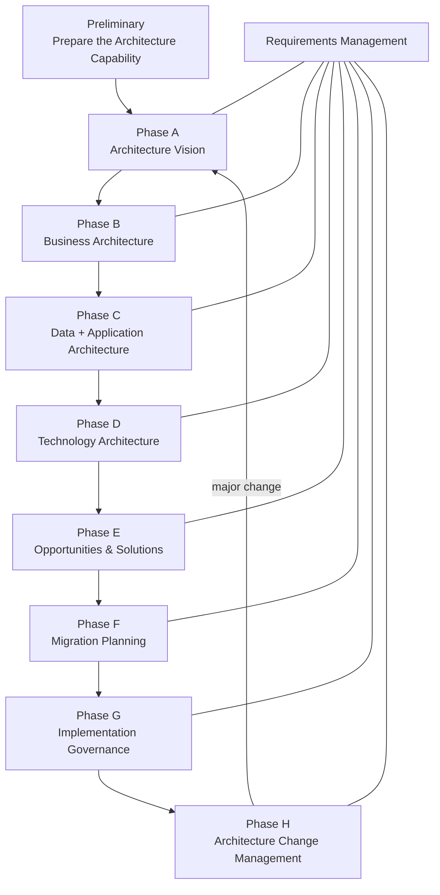
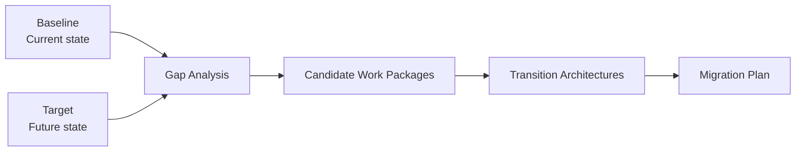

# ADM Complete Flow — From Architecture Capability to Continuous Change

## 1. Purpose of this chapter

Ce chapitre relie toutes les phases de l’**Architecture Development Method (ADM)** dans un seul raisonnement. Il ne remplace pas les chapitres détaillés. Son objectif est de te permettre d’expliquer de mémoire :

- pourquoi chaque phase existe ;
- ce qui doit exister avant ;
- ce qui se passe pendant ;
- ce qui en sort ;
- comment la phase alimente la suivante ;
- où intervient Requirements Management ;
- où se situent les principales confusions OGEA-103.

## 2. Le flux fondamental



Le raisonnement peut être résumé ainsi :

```text
Prepare capability
→ agree why and scope
→ understand business
→ understand information and applications
→ define technology support
→ turn gaps into realization packages
→ prioritize migration
→ govern implementation
→ manage architectural change
```

## 3. Preliminary — Prepare the capability

### Question

> Sommes-nous capables de conduire et gouverner le travail d’architecture ?

### Focus

- Architecture Capability ;
- governance ;
- roles ;
- Architecture Board ;
- principles ;
- method tailoring ;
- repository ;
- standards.

### MayaBank

MayaBank définit son Architecture Board, ses principes, ses rôles, ses standards et son mode de gouvernance avant d’engager la transformation Payments.

### Next

Une fois la capacité prête, Phase A peut cadrer un engagement précis.

## 4. Phase A — Architecture Vision

### Question

> Pourquoi faisons-nous ce travail, pour qui, sur quel périmètre et avec quelle vision ?

### Focus

- stakeholders ;
- concerns ;
- business drivers ;
- goals ;
- scope ;
- high-level Baseline ;
- high-level Target ;
- value proposition ;
- initial risks ;
- Statement of Architecture Work ;
- Architecture Vision.

### MayaBank

Vision : moderniser les paiements pour supporter temps réel, ISO 20022, résilience et efficacité opérationnelle.

### Next

Phase B développe en profondeur ce que le métier doit devenir.

## 5. Phase B — Business Architecture

### Question

> Comment le métier fonctionne-t-il aujourd’hui et comment doit-il fonctionner demain ?

### Focus

- capabilities ;
- value streams ;
- processes ;
- business services ;
- organization ;
- roles ;
- Baseline ;
- Target ;
- gaps.

### MayaBank

Gap métier : traitement d’exception manuel, manque d’orchestration et monitoring temps réel.

### Next

Les besoins métier déterminent les besoins Data et Application.

## 6. Phase C — Data Architecture

### Question

> Quelles informations doivent exister et comment doivent-elles être gouvernées ?

### Focus

- data entities ;
- semantics ;
- ownership ;
- lifecycle ;
- quality ;
- lineage ;
- security ;
- flows ;
- Baseline ;
- Target ;
- gaps.

### MayaBank

Gap Data : plusieurs définitions et formats de statuts de paiement, ownership incomplet, lineage limité.

## 7. Phase C — Application Architecture

### Question

> Quels services et composants applicatifs doivent supporter le métier et les données ?

### Focus

- application services ;
- components ;
- interfaces ;
- interactions ;
- integration ;
- rationalization ;
- Baseline ;
- Target ;
- gaps.

### MayaBank

Gap Application : fonctions de validation dupliquées, absence de Payment Orchestrator commun.

### Next

Phase D définit les capacités technologiques nécessaires pour supporter la cible Information Systems.

## 8. Phase D — Technology Architecture

### Question

> Quelles capacités technologiques doivent supporter les architectures Data et Application ?

### Focus

- compute/runtime ;
- network ;
- storage ;
- middleware ;
- database ;
- IAM ;
- observability ;
- HA/DR ;
- security controls ;
- deployment platform ;
- Baseline ;
- Target ;
- gaps.

### MayaBank

Gap Technology : pas de container platform standard, event streaming insuffisant, observabilité fragmentée.

### Next

À la fin de D, les principaux gaps des quatre domaines existent. Phase E les consolide.

## 9. Phase E — Opportunities and Solutions

### Question

> Comment pouvons-nous organiser la réalisation de la cible ?

### Focus

- consolidate gaps ;
- solution options ;
- candidate work packages ;
- dependencies ;
- Transition Architectures ;
- Architecture Roadmap.

### MayaBank

Work packages : Platform Foundation, API Foundation, Event Streaming, Payment Orchestration, Data Harmonization, Observability, Legacy Decommissioning.

### Next

Phase F décide dans quel ordre exécuter ces work packages.

## 10. Phase F — Migration Planning

### Question

> Dans quel ordre et avec quelle priorité devons-nous réaliser la transformation ?

### Focus

- value ;
- risk ;
- cost ;
- dependencies ;
- regulatory urgency ;
- readiness ;
- migration waves ;
- Implementation and Migration Plan.

### MayaBank

Foundation → Integration → Payment Core → Migration → Decommission.

### Next

Le plan est approuvé ; Phase G gouverne le delivery réel.

## 11. Phase G — Implementation Governance

### Question

> Ce qui est livré reste-t-il conforme à l’architecture approuvée ?

### Focus

- Architecture Contract ;
- compliance reviews ;
- conformance ;
- deviations ;
- exceptions ;
- evidence ;
- implementation oversight.

### MayaBank

Une équipe dévie du standard secrets management. L’écart est analysé, tracé et arbitré.

### Next

Après et pendant la réalisation, l’environnement continue d’évoluer. Phase H gère ces changements.

## 12. Phase H — Architecture Change Management

### Question

> Le changement peut-il être traité localement ou faut-il relancer un travail d’architecture ?

### Focus

- change triggers ;
- impact analysis ;
- architecture evolution ;
- minor vs major change ;
- new ADM cycle decision.

### MayaBank

Une nouvelle réglementation de paiement affecte métier, data, applications et sécurité : nouveau cycle ADM ciblé.

## 13. Requirements Management — Cross-cutting

### Question

> Quelles exigences devons-nous satisfaire et comment évoluent-elles ?

Requirements Management :

- reçoit des requirements de toutes les phases ;
- les analyse ;
- les trace ;
- les priorise ;
- gère les changements ;
- les redistribue vers les phases impactées.

Exemple :

```text
Phase A: 24/7 availability requirement
→ Phase B: business continuity expectations
→ Phase C: application/data availability implications
→ Phase D: HA/DR technology requirement
→ Phase F: migration without unacceptable downtime
→ Phase G: evidence through tests
→ Phase H: requirement evolves after new regulation
```

## 14. Baseline → Target → Gap

Ce raisonnement apparaît principalement dans B/C/D.



### Baseline

L’état actuel pertinent.

### Target

L’état futur souhaité.

### Gap

La différence qui doit être traitée.

### Transition Architecture

État intermédiaire architecturalement significatif.

## 15. The critical E → F → G chain

C’est un des axes les plus importants pour l’examen.

### E — Opportunities and Solutions

> **What changes should be packaged?**

- work packages ;
- transition architectures ;
- realization options.

### F — Migration Planning

> **In what order should we implement them?**

- priority ;
- sequencing ;
- Implementation and Migration Plan.

### G — Implementation Governance

> **Are we implementing them correctly?**

- compliance ;
- deviations ;
- Architecture Contract.

Mémo :

```text
E = PACKAGE
F = PLAN
G = GOVERN
```

## 16. The critical G → H distinction

### G

La solution **est en train d’être implémentée**.

### H

L’architecture **doit évoluer dans le temps**.

Exemple :

- développeur dévie d’un standard en cours de projet → G ;
- nouvelle réglementation transforme le besoin après livraison → H.

## 17. Preliminary vs Phase A

### Preliminary

Prépare **la capacité permanente d’architecture**.

### Phase A

Cadre **un engagement d’architecture spécifique**.

Mémo :

```text
Preliminary = prepare the architecture practice
Phase A = start and frame the architecture engagement
```

## 18. Phase A vs B

### A

High-level vision, scope, stakeholders, value.

### B

Detailed Business Architecture Baseline/Target/Gaps.

## 19. Phase C Data vs Application

### Data

Information, ownership, lifecycle, semantics, flows.

### Application

Services, components, interfaces, interactions.

## 20. Phase D vs E

### D

Target Technology Architecture + technology gaps.

### E

Consolidate all gaps into realization options, work packages and transitions.

## 21. Phase H vs Requirements Management

### H

Architecture-level change management.

### Requirements Management

Requirement lifecycle across every phase.

## 22. Complete MayaBank storyline

### Preliminary

MayaBank establishes architecture governance, principles and repository.

### A

Vision: modern real-time European payment architecture.

### B

Target capabilities: payment orchestration, exception management, real-time monitoring.

### C Data

Canonical payment model, ownership, quality and lineage.

### C Application

Payment API, Validation Service, Orchestrator, Event Services, Reconciliation.

### D

Container runtime, event streaming, IAM, observability, database HA/DR, GitOps.

### E

Work packages and Transition Architectures.

### F

Migration waves prioritized by value, risk, dependencies and regulatory urgency.

### G

Compliance reviews and governed exceptions during delivery.

### H

New regulation triggers architecture impact assessment and possibly a new ADM cycle.

## 23. Decision-oriented ADM table

| Phase | Primary decision |
|---|---|
| Preliminary | How will architecture be practiced and governed? |
| A | What are we trying to achieve and what is the scope? |
| B | What must the business become? |
| C Data | What information architecture is required? |
| C Application | What application architecture is required? |
| D | What technology architecture is required? |
| E | How can the gaps be packaged into realizable change? |
| F | What priority and sequence should implementation follow? |
| G | Is implementation conforming to the architecture? |
| H | How should architecture respond to ongoing change? |
| Requirements Management | What requirements exist, change and need traceability? |

## 24. Practitioner reasoning algorithm

Pour un scénario Part 2 :

### STEP 1 — Context

Quelle transformation ?

### STEP 2 — Phase

Où sommes-nous dans l’ADM ?

### STEP 3 — Problem

Quel concern/problème doit être résolu ?

### STEP 4 — Requested action

Que demande réellement la question ?

### STEP 5 — Eliminate wrong phase

Une réponse peut être techniquement correcte mais appartenir à la mauvaise phase.

### STEP 6 — Stakeholders

Les bonnes parties prenantes sont-elles impliquées ?

### STEP 7 — Requirements

Les exigences sont-elles prises en compte ?

### STEP 8 — Governance

Le bon mécanisme de gouvernance est-il utilisé ?

### STEP 9 — Sequence

L’action arrive-t-elle au bon moment ?

### STEP 10 — Best TOGAF answer

Choisir la réponse la plus complète selon la logique TOGAF, pas seulement une solution techniquement plausible.

## 25. Foundation rapid recall

Réponds sans regarder :

1. Preliminary ? → prepare capability.
2. A ? → vision and scope.
3. B ? → business.
4. C ? → data + application.
5. D ? → technology.
6. E ? → work packages and transitions.
7. F ? → prioritization and migration plan.
8. G ? → implementation governance.
9. H ? → architecture change management.
10. Cross-cutting ? → Requirements Management.

## 26. English — explain the ADM in 60 seconds

> TOGAF uses the Architecture Development Method, or ADM. In the Preliminary Phase, we establish the architecture capability and governance. In Phase A, we define the vision, scope and stakeholders. Phases B, C and D develop the business, information systems and technology architectures and identify the gaps. In Phase E, we organize the gaps into work packages and transition architectures. In Phase F, we prioritize and sequence the migration. In Phase G, we govern implementation. In Phase H, we manage architecture change. Requirements Management supports all phases.

### French meaning

TOGAF utilise l’ADM. Preliminary prépare la capacité et la gouvernance. A définit vision, périmètre et stakeholders. B/C/D développent les architectures et les gaps. E organise la réalisation. F planifie la migration. G gouverne l’implémentation. H gère le changement. Requirements Management traverse tout.

## 27. Interview challenge

**Question:** Can you explain how a business requirement becomes an implemented architecture using TOGAF?

**Answer structure:**

1. Phase A establishes the business need and scope.
2. Phase B translates it into business capabilities and gaps.
3. Phase C identifies the required data and application services.
4. Phase D defines the enabling technology architecture.
5. Phase E groups gaps into work packages and transitions.
6. Phase F prioritizes and sequences implementation.
7. Phase G governs implementation against the architecture and requirements.
8. Phase H manages future change.
9. Requirements Management maintains traceability throughout.

## 28. Final mental model

Ne mémorise pas uniquement des lettres.

Mémorise cette histoire :

> **Prepare → Understand why → Design business → Design information systems → Design technology → Organize change → Plan change → Govern delivery → Manage change.**

Puis relie chaque étape aux requirements, stakeholders, risks, deliverables et governance.

C’est cette logique qui permet de réussir à la fois :

- les questions Foundation ;
- les scénarios Practitioner ;
- les entretiens d’architecte ;
- l’utilisation réelle de TOGAF.

---

Official baseline: The Open Group TOGAF Standard, 10th Edition — Fundamental Content / Architecture Development Method. Original educational explanation.