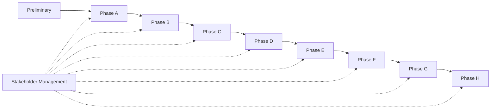

# Stakeholder Management

## 1. Definition

Le **Stakeholder Management** est la discipline qui consiste à identifier les parties prenantes d’un travail d’architecture, comprendre leurs **concerns**, évaluer leur influence et leur intérêt, puis organiser une communication et un engagement adaptés.

Dans TOGAF, une architecture n’est pas seulement un modèle technique. Elle doit répondre à des préoccupations réelles portées par des acteurs qui ont des objectifs, des contraintes, des pouvoirs de décision et des niveaux d’exposition différents.

Le raisonnement fondamental est :

**Stakeholder → Concern → Viewpoint → View → Decision / Requirement**.

## 2. Pourquoi cette technique existe

Une architecture peut être techniquement excellente et échouer parce que :

- le sponsor ne comprend pas la valeur ;
- les équipes métier ne se reconnaissent pas dans la cible ;
- la sécurité découvre trop tard une non-conformité ;
- l’exploitation refuse une solution impossible à opérer ;
- le delivery ne comprend pas les règles d’architecture ;
- les contraintes budgétaires ont été ignorées ;
- une partie prenante influente bloque la transformation.

Stakeholder Management sert donc à réduire un risque architectural souvent sous-estimé : **la mauvaise compréhension des intérêts et préoccupations des personnes concernées**.

## 3. Où cette technique intervient dans l’ADM

Elle est particulièrement visible dès **Phase A — Architecture Vision**, mais elle concerne en pratique tout le cycle ADM.

### Phase A

On identifie les stakeholders clés, leurs concerns et les besoins de communication.

### Phases B/C/D

On implique les spécialistes métier, data, application, technologie, sécurité, exploitation et conformité selon les sujets.

### Phases E/F

On élargit l’attention vers les sponsors de transformation, responsables de portefeuille, finance, delivery et dépendances projet.

### Phase G

Les équipes de mise en œuvre deviennent centrales pour la conformité et la gestion des écarts.

### Phase H

Les stakeholders signalent de nouveaux drivers ou changements qui peuvent déclencher un nouveau travail d’architecture.

## 4. Concepts essentiels

### Stakeholder

Une personne, un groupe ou une organisation qui a un intérêt dans l’architecture ou qui peut être affecté par elle.

Exemples :

- sponsor ;
- métier ;
- architecture ;
- sécurité ;
- risk ;
- compliance ;
- operations ;
- finance ;
- delivery ;
- utilisateurs ;
- partenaires externes ;
- autorités de régulation.

### Concern

Une préoccupation importante pour un stakeholder.

Exemples :

- disponibilité ;
- délai de mise sur le marché ;
- sécurité ;
- coût ;
- simplicité opérationnelle ;
- conformité ;
- capacité de montée en charge ;
- résilience ;
- capacité de migration.

### Viewpoint

La convention qui explique comment construire une vue répondant à un ensemble de concerns.

### View

La représentation concrète d’une architecture construite pour répondre aux concerns de stakeholders déterminés.

## 5. Méthode pratique

### Étape 1 — Identifier les stakeholders

On part du scope, du sponsor, des domaines impactés et des responsabilités organisationnelles.

Questions utiles :

- Qui décide ?
- Qui finance ?
- Qui utilise ?
- Qui opère ?
- Qui porte le risque ?
- Qui peut bloquer ?
- Qui devra accepter la cible ?
- Qui sera responsable après la mise en production ?

### Étape 2 — Comprendre les concerns

Ne pas se contenter du rôle officiel.

Deux personnes avec le même titre peuvent avoir des concerns différents.

Exemple :

- CTO : standardisation, stratégie technologique, coût ;
- CISO : sécurité, contrôle, audit ;
- COO : disponibilité, exploitation, continuité ;
- Product Owner : délai, valeur, expérience ;
- Finance : coût, trajectoire d’investissement.

### Étape 3 — Évaluer influence et intérêt

Une matrice simple peut être utilisée :

| Influence | Intérêt | Approche |
|---|---|---|
| Forte | Fort | gérer étroitement |
| Forte | Faible | maintenir satisfait |
| Faible | Fort | tenir informé |
| Faible | Faible | surveiller proportionnellement |

La matrice n’est pas une fin en soi. Elle sert à décider **comment engager** chaque stakeholder.

### Étape 4 — Définir les vues et messages

Un même modèle ne convient pas à tous.

Exemple :

- sponsor : Architecture Vision et valeur ;
- sécurité : flux, trust boundaries, controls ;
- exploitation : run model, monitoring, failover ;
- finance : coûts, roadmap, dépendances ;
- delivery : building blocks, contraintes et acceptance criteria.

### Étape 5 — Planifier l’engagement

Le plan doit préciser :

- qui ;
- quand ;
- pourquoi ;
- quel message ;
- quelle décision attendue ;
- quel niveau de détail ;
- quel canal ou forum.

### Étape 6 — Maintenir la carte à jour

Les stakeholders et leurs concerns changent au cours du cycle.

Un sponsor peut partir, une contrainte réglementaire peut apparaître, un fournisseur peut devenir critique, ou un sujet opérationnel peut gagner en importance.

## 6. Stakeholder Map

Exemple MayaBank :

| Stakeholder | Concern principal | Influence | Vue utile |
|---|---|---:|---|
| Sponsor Payments | valeur, délai | forte | Architecture Vision |
| CISO | sécurité, IAM, secrets | forte | Security View |
| Operations | disponibilité, run | forte | Operational View |
| Product | capacité fonctionnelle | forte | Capability / Service View |
| Finance | coût et séquencement | moyenne | Roadmap / Cost View |
| Delivery Teams | contraintes d’implémentation | forte | Solution / Building Block View |
| Compliance | réglementation | forte | Requirement / Control View |

## 7. Relation avec Requirements Management

Les concerns sont une source essentielle d’exigences.

Exemple :

Concern : « je veux éviter une interruption des paiements ».

Ce concern peut produire :

- exigence de disponibilité ;
- exigence RTO ;
- exigence RPO ;
- exigence de redondance ;
- exigence de test de bascule ;
- exigence de monitoring.

Le rôle de l’architecte est de transformer des concerns parfois vagues en exigences exploitables et traçables.

## 8. Relation avec Views et Viewpoints

Un piège fréquent est de traiter les vues comme des documents décoratifs.

La logique correcte est :

1. identifier le stakeholder ;
2. comprendre le concern ;
3. sélectionner un viewpoint approprié ;
4. produire une view ;
5. utiliser la view pour prendre une décision ou obtenir un accord.

## 9. Relation avec la gouvernance

Stakeholder Management soutient la gouvernance car les décisions doivent être :

- comprises ;
- approuvées au bon niveau ;
- communiquées ;
- traçables ;
- réévaluées si le contexte change.

Une Architecture Board ne remplace pas les stakeholders. Elle constitue un mécanisme de gouvernance parmi d’autres.

## 10. Exemple MayaBank

MayaBank prépare une nouvelle plateforme de paiement instantané.

### Situation initiale

L’équipe technique veut présenter directement une cible OpenShift + Kafka + API Management.

### Problème

Le sponsor veut surtout réduire le délai de traitement.
Le CISO s’inquiète de la gestion des secrets.
Les opérations craignent une complexité de run.
La conformité s’intéresse aux obligations de traçabilité.

### Bonne approche

L’architecte construit d’abord la carte des stakeholders et des concerns.

Ensuite il produit plusieurs vues :

- Vision métier pour le sponsor ;
- vue de flux et sécurité pour le CISO ;
- vue opérationnelle pour le run ;
- roadmap pour finance et delivery.

Le même modèle ne répond pas à toutes les préoccupations.

## 11. Erreurs fréquentes

- penser que « stakeholder = sponsor » ;
- confondre concern et requirement ;
- envoyer le même diagramme à tout le monde ;
- identifier les stakeholders une seule fois ;
- oublier les opposants ou acteurs à forte influence ;
- limiter l’analyse aux équipes IT ;
- communiquer une architecture sans expliciter les décisions attendues.

## 12. Pièges OGEA-103

### Piège 1 — View vs Viewpoint

Le **Viewpoint** définit la manière de construire la représentation.
La **View** est la représentation produite.

### Piège 2 — Concern vs Requirement

Un concern est une préoccupation.
Une requirement est une expression plus formelle de ce qui doit être satisfait.

### Piège 3 — mauvaise priorité

Dans un scénario, une réponse techniquement correcte peut être moins bonne si elle ignore un stakeholder critique ou son concern.

### Piège 4 — surcommunication documentaire

TOGAF ne dit pas de produire le maximum de documentation. Il faut produire les vues nécessaires pour les décisions et préoccupations réelles.

## 13. Foundation questions

### Q1
Quel concept représente une préoccupation importante d’un stakeholder ?

A. Concern  
B. Building Block  
C. Work Package  
D. Plateau

**Réponse : A.**

### Q2
Quel est le meilleur enchaînement ?

A. View → Stakeholder → Concern  
B. Stakeholder → Concern → Viewpoint → View  
C. Requirement → Stakeholder → Contract  
D. Roadmap → Viewpoint → Stakeholder

**Réponse : B.**

## 14. Practitioner scenario

Un programme de modernisation est bloqué parce que l’exploitation refuse une architecture déjà approuvée par le sponsor. Le run indique que la solution n’a pas de modèle de support clair.

La meilleure action n’est pas simplement de rappeler l’approbation du sponsor. Il faut reconnaître Operations comme stakeholder important, comprendre son concern, produire la vue appropriée et intégrer les exigences opérationnelles dans l’architecture et la gouvernance.

## 15. English for Architects

Useful sentence:

> I identify the key stakeholders, understand their concerns, and select the views needed to support architecture decisions.

### Speak it

1. The sponsor is focused on value and delivery time.
2. Operations is concerned about resilience and supportability.
3. We created different architecture views for different stakeholders.

## 16. Interview question

**Question:** How do you manage stakeholders during an architecture engagement?

**Answer:**

I identify the stakeholders, assess their influence and concerns, define the views they need, and maintain an engagement plan throughout the ADM. I also make sure that important concerns are translated into requirements and governance decisions.

## 17. Key points to remember

- Stakeholders portent des concerns.
- Les concerns guident les viewpoints et views.
- La technique commence tôt mais reste utile tout au long de l’ADM.
- Les stakeholders ne sont pas uniquement les sponsors.
- Une bonne architecture communique différemment selon les audiences.
- Le meilleur choix Practitioner respecte souvent mieux les stakeholders, requirements et governance qu’une simple bonne idée technique.

---

Official baseline: TOGAF Standard, 10th Edition and associated guidance. This chapter is an original educational explanation.