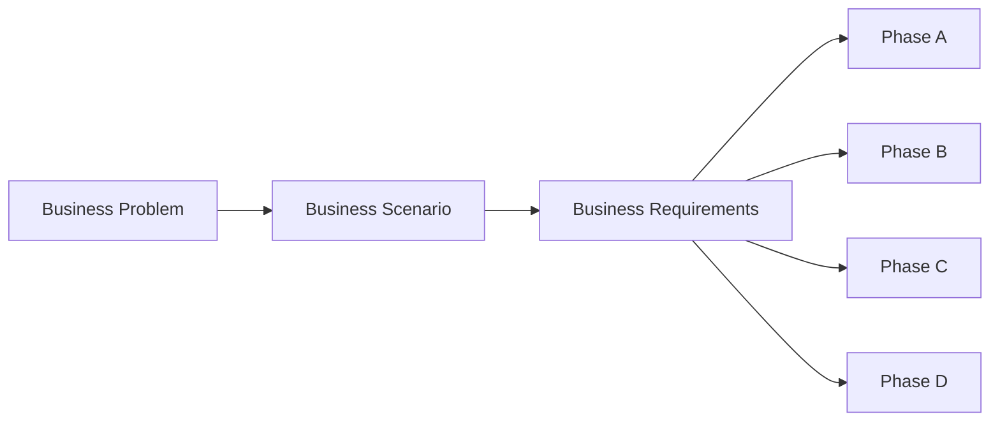
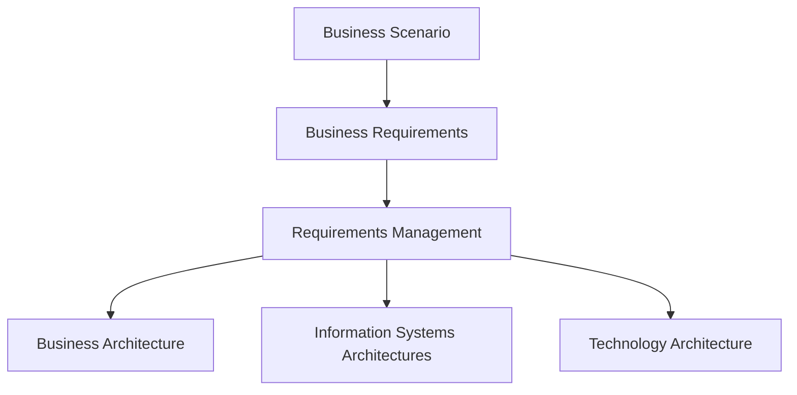

# Business Scenarios

## 1. Definition

Un **Business Scenario** est une technique utilisée pour relier un besoin métier significatif à des exigences d’architecture compréhensibles et vérifiables.

L’objectif n’est pas d’écrire une histoire décorative. Il s’agit de décrire suffisamment le contexte métier, les acteurs, l’environnement, le problème et le résultat attendu afin d’identifier les exigences que l’architecture devra satisfaire.

Le raisonnement est :

**Business problem / opportunity → actors → environment → desired outcome → business requirements → architecture implications**.

## 2. Pourquoi cette technique existe

Les projets techniques commencent souvent par des formulations trop vagues :

- « moderniser les paiements » ;
- « aller dans le cloud » ;
- « améliorer la performance » ;
- « mettre de l’IA » ;
- « sécuriser la plateforme ».

Ces formulations ne sont pas assez précises pour guider une architecture.

Le Business Scenario aide à passer d’un besoin général à des exigences liées à une situation réelle.

## 3. Position dans l’ADM

La technique est particulièrement utile au début du travail d’architecture, notamment autour de **Phase A — Architecture Vision**, mais les exigences qu’elle aide à identifier sont réutilisées et affinées pendant les phases suivantes.

## 4. Ce qu’un Business Scenario doit clarifier

Un scénario utile permet de répondre à des questions comme :

- Quel problème métier doit être résolu ?
- Dans quel environnement ?
- Quels acteurs interviennent ?
- Quels événements déclenchent le scénario ?
- Que doit-il se passer ?
- Quel résultat est attendu ?
- Comment sait-on que le résultat est acceptable ?
- Quelles exigences métier en découlent ?

## 5. Composants d’un scénario

### 5.1 Business process / situation

Décrire la situation significative.

Exemple :

Un client initie un paiement instantané depuis son application bancaire.

### 5.2 Business environment

Contexte organisationnel et métier :

- canal ;
- réglementation ;
- contraintes de disponibilité ;
- organisations impliquées ;
- horaires ;
- volumes ;
- criticité.

### 5.3 Technology environment

Sans figer trop tôt une solution, on peut décrire les contraintes technologiques existantes :

- systèmes legacy ;
- dépendances ;
- protocoles ;
- interfaces ;
- contraintes de sécurité ;
- plateformes obligatoires.

### 5.4 Actors

Acteurs humains ou systèmes qui participent au scénario.

Exemples MayaBank :

- customer ;
- mobile channel ;
- payment orchestration service ;
- fraud screening ;
- account system ;
- external clearing interface ;
- operations team.

### 5.5 Desired outcome

Le résultat attendu doit être explicite.

Exemple :

« Le paiement valide doit être accepté, contrôlé, routé et confirmé au client dans le délai défini par le service, avec traçabilité complète. »

## 6. Méthode de construction

### Étape 1 — Identifier le problème

Il faut distinguer problème, symptôme et solution supposée.

Mauvais départ :

« Il nous faut Kafka. »

Meilleur départ :

« Le système actuel ne peut pas diffuser les événements de paiement aux consommateurs dans le délai et avec le découplage requis. »

### Étape 2 — Décrire le contexte

Préciser les conditions réalistes :

- charge normale ;
- pic ;
- erreur ;
- indisponibilité partielle ;
- interaction partenaire ;
- contrainte réglementaire.

### Étape 3 — Identifier les acteurs

Ne pas oublier les acteurs non techniques :

- client ;
- opérateur ;
- compliance ;
- support ;
- risk manager.

### Étape 4 — Décrire le déroulement

Le scénario peut être décrit sous forme narrative ou séquentielle.

Exemple :

1. le client soumet un paiement ;
2. le canal transmet la demande ;
3. la plateforme valide les données ;
4. les contrôles risk/fraud sont exécutés ;
5. le paiement est routé ;
6. la confirmation est retournée ;
7. les événements sont tracés et observables.

### Étape 5 — Identifier les résultats attendus

Les résultats doivent être reliés à la valeur métier.

### Étape 6 — Dériver les requirements

Exemple :

Scenario concern : confirmation rapide au client.

Requirements possibles :

- temps de réponse cible ;
- disponibilité ;
- traçabilité ;
- idempotence ;
- gestion d’erreur ;
- reprise ;
- confidentialité.

## 7. Validation d’un bon scénario

Un Business Scenario utile doit être :

- représentatif d’un besoin réel ;
- suffisamment spécifique ;
- compréhensible par les stakeholders ;
- indépendant d’une solution prématurément choisie ;
- relié à des résultats mesurables ou vérifiables ;
- exploitable pour dériver des exigences.

## 8. Business Scenario vs Use Case

Ils peuvent se ressembler mais ne servent pas exactement le même objectif.

Un use case peut décrire précisément l’interaction avec un système.

Un Business Scenario TOGAF sert surtout à clarifier un besoin métier et les exigences qu’une architecture doit supporter.

À l’examen, ne réduis pas Business Scenario à un simple cas d’utilisation logiciel.

## 9. Business Scenario vs Architecture Vision

Le Business Scenario est une **technique**.

Architecture Vision est un **résultat central de Phase A**.

La technique peut contribuer à comprendre les besoins qui nourrissent la vision.

## 10. Relation avec Requirements Management

C’est une relation directe.

Les exigences dérivées doivent ensuite être :

- enregistrées ;
- analysées ;
- priorisées ;
- tracées ;
- modifiées si nécessaire ;
- vérifiées tout au long du cycle.

## 11. Exemple MayaBank — paiement instantané

### Problème

Le système historique traite certains paiements de manière trop lente et les confirmations arrivent tardivement.

### Acteurs

- Customer ;
- Mobile Banking ;
- Payment Service ;
- Fraud Engine ;
- Account System ;
- External Clearing ;
- Operations.

### Environnement

- service 24/7 ;
- transactions critiques ;
- exigences de sécurité ;
- intégration avec systèmes internes et externes ;
- besoin de visibilité opérationnelle.

### Desired outcome

Un paiement conforme doit être contrôlé, routé, confirmé et tracé dans le délai du service, même en cas de forte charge, avec gestion claire des erreurs.

### Requirements dérivées

- performance ;
- availability ;
- security ;
- auditability ;
- observability ;
- resilience ;
- idempotency ;
- controlled exception handling.

Le scénario ne dit pas encore : « utiliser OpenShift », « utiliser Kafka », « utiliser Oracle ». Ces décisions viendront après compréhension des besoins.

## 12. Exemple négatif

### Formulation

« Nous voulons une architecture microservices Kubernetes. »

Ce n’est pas un Business Scenario.

Pourquoi ?

Parce que la formulation décrit déjà un choix de solution sans expliquer :

- le problème métier ;
- les acteurs ;
- les résultats ;
- les contraintes ;
- les exigences.

## 13. Erreurs fréquentes

- commencer par un produit ;
- oublier les acteurs métier ;
- décrire uniquement le happy path ;
- ne pas définir le résultat attendu ;
- écrire un scénario trop général ;
- produire un scénario sans dériver de requirements ;
- confondre scénario avec architecture cible.

## 14. Pièges OGEA-103

### Piège 1 — technique vs phase

Business Scenarios n’est pas une phase ADM.

### Piège 2 — solution prématurée

Une réponse qui commence directement par un produit ou une technologie est souvent moins bonne qu’une réponse qui clarifie d’abord le besoin.

### Piège 3 — exigences

Le but principal est de mieux comprendre et dériver les besoins et exigences métier.

### Piège 4 — portée

La technique est particulièrement utile en début de cycle mais ses résultats restent pertinents pour les phases suivantes.

## 15. Foundation questions

### Q1
Quel est le principal objectif d’un Business Scenario ?

A. Choisir un produit technologique  
B. Relier un besoin métier à des exigences d’architecture  
C. Remplacer Phase B  
D. Produire un Architecture Contract

**Réponse : B.**

### Q2
Lequel est le meilleur point de départ ?

A. « Nous devons utiliser Kafka »  
B. « Les paiements doivent être confirmés plus rapidement et de manière traçable »  
C. « Nous devons installer Kubernetes »  
D. « Nous devons acheter un API Gateway »

**Réponse : B.**

## 16. Practitioner scenario

Le CIO demande à l’architecte de « passer les traitements sur une plateforme cloud-native ». Les stakeholders ne s’accordent pas sur le problème à résoudre : le métier parle de délai, l’exploitation de stabilité et la sécurité de contrôle d’accès.

Une bonne action est de clarifier le problème à travers un ou plusieurs Business Scenarios, identifier les acteurs, outcomes et exigences avant de figer la cible technique.

## 17. English for Architects

Useful sentence:

> We used a business scenario to clarify the problem, identify the actors, and derive the architecture requirements.

### Speak it

1. The scenario starts with a real business problem.
2. We identified the actors and the expected outcome.
3. The scenario helped us derive measurable requirements.

## 18. Interview question

**Question:** What is a Business Scenario in TOGAF?

**Answer:**

A Business Scenario is a technique used to understand a significant business need in its real context. It identifies the actors, environment and expected outcome, and helps derive the requirements that the architecture must address.

## 19. Key points to remember

- Business Scenario = technique, pas phase.
- Il part d’un besoin/problème métier.
- Il décrit acteurs, environnement et outcome.
- Il aide à dériver des requirements.
- Il évite de commencer trop tôt par une technologie.
- Il nourrit Requirements Management et les phases d’architecture.

---

Official source alignment: The Open Group TOGAF guidance includes Business Scenarios as a technique and a dedicated Series Guide. This chapter is an original educational explanation.