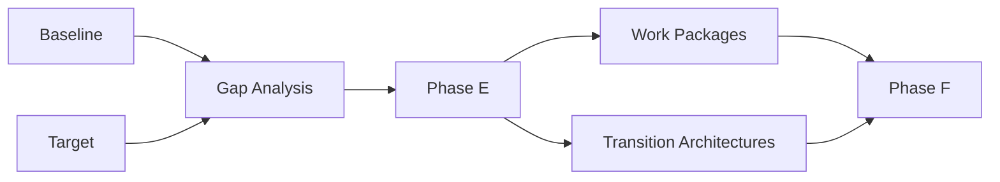

# Gap Analysis

## 1. Definition

La **Gap Analysis** compare une **Baseline Architecture** et une **Target Architecture** afin d’identifier ce qui doit être conservé, supprimé, ajouté ou modifié pour atteindre la cible.

C’est une technique centrale du raisonnement TOGAF parce qu’elle transforme deux états architecturaux en matière exploitable pour la transformation.

Le raisonnement est :

**Baseline → Target → Gaps → candidate changes → work packages / roadmap**.

## 2. Pourquoi cette technique existe

Décrire l’existant et la cible ne suffit pas.

Une organisation doit savoir :

- ce qui existe déjà et reste utile ;
- ce qui manque ;
- ce qui doit disparaître ;
- ce qui doit être remplacé ;
- ce qui doit être modifié ;
- quelles dépendances apparaissent ;
- quelles capacités transitoires sont nécessaires.

La Gap Analysis rend explicite le **travail de transformation** implicite entre Baseline et Target.

## 3. Où elle intervient dans l’ADM

La technique apparaît dans les phases de développement des architectures :

- Phase B — Business Architecture ;
- Phase C — Data Architecture ;
- Phase C — Application Architecture ;
- Phase D — Technology Architecture.

Les gaps sont ensuite consolidés en Phase E pour contribuer à la définition des options de réalisation, work packages et Transition Architectures.

## 4. Types de gaps

### 4.1 Missing capability

Un élément existe dans la Target mais pas dans la Baseline.

Exemple : MayaBank ne possède pas de capacité de real-time payment orchestration.

### 4.2 Removed element

Un élément de la Baseline n’est plus nécessaire dans la Target.

Exemple : suppression d’un moteur legacy de routage devenu redondant.

### 4.3 Changed element

L’élément existe dans les deux états mais doit évoluer.

Exemple : un service de paiement batch devient temps réel et API-enabled.

### 4.4 Consolidation

Plusieurs éléments de la Baseline sont rationalisés dans la Target.

### 4.5 Split

Un élément monolithique est séparé en plusieurs responsabilités cibles.

### 4.6 Dependency gap

La cible suppose une capacité ou un prérequis non disponible.

Exemple : la cible applicative suppose une plateforme d’observabilité qui n’existe pas encore.

## 5. Matrice simple de Gap Analysis

| Baseline | Target | Gap | Action probable |
|---|---|---|---|
| traitement batch | traitement temps réel | capacité real-time absente | créer / transformer |
| logs locaux | observabilité centralisée | monitoring insuffisant | construire plateforme |
| plusieurs API propriétaires | API standards | standardisation absente | rationaliser |
| base legacy | modèle data cible | structure incompatible | migrer / transformer |
| serveur propriétaire | plateforme conteneur | runtime différent | transition technologique |

La colonne « action probable » ne constitue pas encore un Implementation and Migration Plan détaillé.

## 6. Méthode pratique

### Étape 1 — Stabiliser le scope

Comparer des états qui ne couvrent pas le même périmètre produit des faux gaps.

Il faut aligner :

- domaine ;
- niveau de détail ;
- horizon ;
- unités organisationnelles ;
- systèmes concernés.

### Étape 2 — Décrire la Baseline au bon niveau

Ne pas documenter tout l’existant.

Documenter ce qui est nécessaire pour comprendre les écarts avec la cible.

### Étape 3 — Décrire la Target

La Target doit être suffisamment précise pour comparer :

- capabilities ;
- processes ;
- data ;
- applications ;
- technology services ;
- controls ;
- governance requirements.

### Étape 4 — Comparer systématiquement

Pour chaque élément, demander :

- existe-t-il dans Baseline ?
- existe-t-il dans Target ?
- est-il identique ?
- change-t-il de responsabilité ?
- doit-il être supprimé ?
- doit-il être ajouté ?

### Étape 5 — Identifier les conséquences

Un gap de domaine peut provoquer des gaps dans d’autres domaines.

Exemple :

Gap métier : besoin de paiement instantané.

Conséquences :

- Data : modèle d’événements et traçabilité ;
- Application : orchestration et services temps réel ;
- Technology : messaging, HA, observability ;
- Governance : exigences de résilience et sécurité.

### Étape 6 — Consolider

Les gaps de B/C/D ne doivent pas rester des listes indépendantes.

En Phase E, ils sont rapprochés pour identifier :

- changements communs ;
- dépendances ;
- candidate work packages ;
- Transition Architectures ;
- impacts sur la Roadmap.

## 7. Gap Analysis vs Requirements

Un **gap** décrit un écart entre état actuel et état cible.

Une **requirement** décrit quelque chose que l’architecture doit satisfaire.

Exemple :

Requirement : « la plateforme doit supporter le paiement instantané 24/7 ».

Gap : « la Baseline ne dispose pas d’une capacité de traitement temps réel résiliente ».

Les deux sont liés mais non interchangeables.

## 8. Gap Analysis vs Risk Analysis

Gap = différence Baseline/Target.

Risk = événement ou condition incertaine pouvant affecter les objectifs.

Exemple :

Gap : pas de plateforme de streaming.

Risk : manque de compétences internes pour exploiter la future plateforme de streaming.

## 9. Gap Analysis vs Phase E

La Gap Analysis identifie les différences.

Phase E utilise les gaps consolidés pour réfléchir à **comment réaliser** la transformation.

C’est une confusion OGEA-103 importante.

### B/C/D

« Qu’est-ce qui manque entre l’existant et la cible ? »

### E

« Comment regrouper et réaliser les changements nécessaires ? »

## 10. Gap Analysis vs Phase F

Phase F ne consiste pas à découvrir les gaps.

Phase F priorise et séquence les work packages et projets déjà identifiés, selon :

- valeur ;
- coût ;
- risque ;
- dépendances ;
- readiness ;
- contraintes.

## 11. Exemple MayaBank complet

### Business Architecture

Baseline : traitement fragmenté par canal.

Target : capability unifiée Payment Orchestration.

Gap : orchestration transverse absente.

### Data Architecture

Baseline : formats internes multiples.

Target : information canonique ISO 20022 alignée et traçable.

Gap : modèle canonique et lineage incomplets.

### Application Architecture

Baseline : intégrations point-to-point.

Target : API + events + services découplés.

Gap : services d’intégration et événementiels absents.

### Technology Architecture

Baseline : middleware historique et déploiements manuels.

Target : OpenShift, GitOps, observability, scalable messaging.

Gap : platform foundation et automation manquantes.

### Consolidation Phase E

Les gaps convergent vers des candidate work packages :

- WP01 Platform Foundation ;
- WP02 API Foundation ;
- WP03 Event Streaming ;
- WP04 Payment Orchestration ;
- WP05 Observability ;
- WP06 Data Migration.

On voit ici pourquoi **Gap Analysis n’est pas Phase E**, mais l’alimente directement.

## 12. Traceability

Un bon travail d’architecture permet de suivre :

**Driver → Goal → Requirement → Target element → Gap → Work Package → Implementation evidence**.

Cette chaîne est essentielle pour expliquer pourquoi un projet existe.

## 13. Erreurs fréquentes

- comparer des scopes différents ;
- documenter la Baseline excessivement ;
- produire une liste de gaps sans relation ;
- transformer immédiatement chaque gap en projet ;
- oublier les suppressions ;
- oublier les dépendances ;
- confondre gap et requirement ;
- confondre gap et risk ;
- croire que le plan de migration détaillé est produit pendant l’analyse des gaps.

## 14. Pièges OGEA-103

### Piège 1 — où sont identifiés les gaps ?

Principalement lors du développement des architectures B/C/D.

### Piège 2 — où sont-ils consolidés pour la réalisation ?

Phase E.

### Piège 3 — quand priorise-t-on la migration détaillée ?

Phase F.

### Piège 4 — gap = solution ?

Non. Un gap exprime un besoin de changement, pas nécessairement le choix de solution final.

## 15. Foundation questions

### Q1
Quel est le but principal de Gap Analysis ?

A. Comparer Baseline et Target  
B. Créer un Architecture Contract  
C. Approuver une implémentation  
D. Identifier uniquement les risques

**Réponse : A.**

### Q2
Les gaps identifiés dans B/C/D sont particulièrement importants pour quelle phase ?

A. Preliminary  
B. Phase E  
C. Phase G uniquement  
D. Phase H uniquement

**Réponse : B.**

## 16. Practitioner scenario

Une entreprise a terminé Business, Data, Application et Technology Architectures. Chaque équipe produit une liste indépendante de gaps et veut directement créer ses projets.

La meilleure approche TOGAF est de consolider les gaps en Phase E, analyser les dépendances, identifier les candidate work packages et éventuelles Transition Architectures, puis préparer la priorisation détaillée en Phase F.

## 17. English for Architects

Useful sentence:

> We compared the baseline and target architectures, identified the gaps, and consolidated them into candidate work packages.

### Speak it

1. The baseline describes the current state.
2. The target describes the desired state.
3. The gap analysis identifies what must change.

## 18. Interview question

**Question:** How do you perform a gap analysis in an architecture project?

**Answer:**

I compare the baseline and target architectures at the same scope and level of detail. I identify missing, changed and obsolete elements, analyze cross-domain dependencies, and then consolidate the gaps so they can be transformed into work packages and roadmap items.

## 19. Key points to remember

- Gap Analysis = Baseline vs Target.
- Elle s’applique aux domaines B/C/D.
- Elle identifie ajout, suppression, modification et dépendance.
- Les gaps alimentent Phase E.
- Gap ≠ Requirement.
- Gap ≠ Risk.
- Gap Analysis ≠ Migration Planning.
- La traçabilité vers les work packages est essentielle.

---

This chapter is an original educational explanation aligned with the TOGAF Standard, 10th Edition.