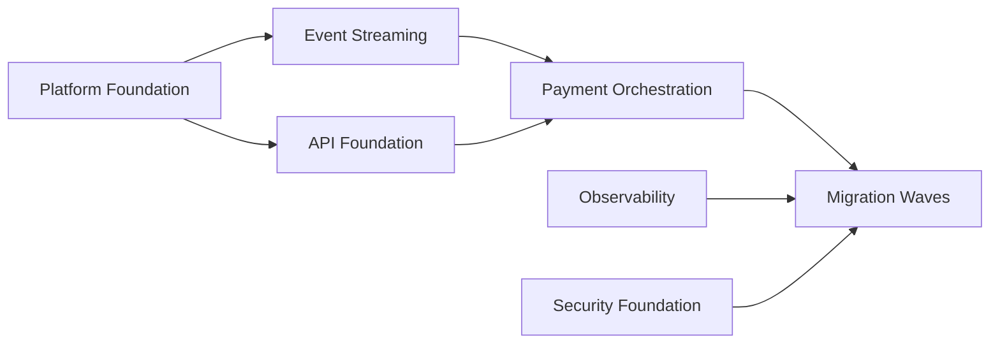

# Migration Planning Techniques

## 1. Definition

Les **Migration Planning Techniques** aident à comparer, prioriser et séquencer les work packages et projets nécessaires pour passer de la Baseline Architecture vers la Target Architecture.

Elles sont surtout associées à **Phase F — Migration Planning**, mais elles utilisent des informations préparées en Phase E :

- work packages ;
- Transition Architectures ;
- dependencies ;
- Architecture Roadmap ;
- benefits ;
- costs ;
- risks ;
- readiness.

## 2. Pourquoi ces techniques existent

Une transformation ne peut pas être séquencée uniquement selon l’ordre préféré des équipes.

Il faut arbitrer :

- valeur ;
- urgence ;
- risque ;
- coût ;
- dépendances ;
- capacité des équipes ;
- contraintes réglementaires ;
- readiness ;
- bénéfices ;
- impact métier.

Le rôle de Phase F est de rendre cette trajectoire réaliste et gouvernable.

## 3. Phase E vs Phase F

Cette distinction est fondamentale.

### Phase E

- consolide les gaps ;
- identifie des solution options ;
- crée candidate work packages ;
- identifie Transition Architectures ;
- structure la Roadmap.

### Phase F

- évalue les work packages ;
- priorise ;
- séquence ;
- coordonne dépendances et projets ;
- finalise l’Implementation and Migration Plan.

## 4. Business Value Assessment

On peut évaluer la valeur selon plusieurs critères :

- contribution stratégique ;
- amélioration client ;
- réduction du risque ;
- conformité ;
- réduction de coût ;
- amélioration opérationnelle ;
- time-to-market.

La valeur n’est pas uniquement financière.

## 5. Risk Assessment

Un work package à forte valeur peut présenter un risque très élevé.

La planification doit comparer valeur et risque.

Exemple :

| Work Package | Value | Risk | Decision |
|---|---:|---:|---|
| Platform Foundation | élevé | moyen | prioritaire |
| Full Legacy Cutover | très élevé | très élevé | plus tard / par vagues |
| Observability | moyen/élevé | faible | prérequis rapide |

## 6. Cost / Benefit Analysis

Comparer :

- investissement ;
- coût opérationnel ;
- coût de migration ;
- coût de coexistence ;
- bénéfices attendus ;
- coût de non-action.

Une Transition Architecture peut avoir un coût temporaire mais réduire fortement le risque global.

## 7. Dependency Analysis

Les dépendances déterminent souvent l’ordre réel.

Exemple MayaBank :

Même si Payment Orchestration crée plus de valeur directe, Platform Foundation peut devoir commencer avant.

## 8. Readiness

La transformation readiness influence le calendrier.

Questions :

- les compétences existent-elles ?
- la plateforme est-elle stable ?
- la gouvernance est-elle opérationnelle ?
- les partenaires sont-ils prêts ?
- les équipes delivery ont-elles de la capacité ?

## 9. Prioritization Matrix

Exemple :

| Critère | Poids | WP01 | WP02 | WP03 |
|---|---:|---:|---:|---:|
| Business Value | 30% | 4 | 5 | 4 |
| Regulatory Urgency | 20% | 3 | 5 | 2 |
| Risk Reduction | 20% | 5 | 3 | 4 |
| Readiness | 15% | 4 | 2 | 3 |
| Dependency Criticality | 15% | 5 | 3 | 4 |

Le scoring est un support à l’arbitrage, pas une vérité mathématique automatique.

## 10. Transition Architectures

Une Transition Architecture est utile lorsque la Target finale ne peut pas être atteinte en une seule étape.

Exemple MayaBank :

- Plateau 0 : legacy ;
- Plateau 1 : OpenShift + API foundation, paiements encore majoritairement legacy ;
- Plateau 2 : orchestration temps réel + coexistence ;
- Plateau 3 : target + decommissioning.

Chaque plateau doit être suffisamment cohérent pour fonctionner.

## 11. Implementation and Migration Plan

Le plan doit faire apparaître :

- work packages ;
- projects ;
- ordre ;
- milestones ;
- dependencies ;
- resources ;
- benefits ;
- risks ;
- transitions ;
- coordination avec portfolio/project management.

## 12. Architecture Roadmap vs Implementation and Migration Plan

### Architecture Roadmap

Vue architecturale de la trajectoire et des work packages/Transition Architectures.

### Implementation and Migration Plan

Plan plus détaillé de mise en œuvre et de migration, consolidé en Phase F.

Ne pas les confondre à l’examen.

## 13. Exemple MayaBank

### Candidate work packages

- WP01 Platform Foundation ;
- WP02 API Foundation ;
- WP03 Event Streaming ;
- WP04 Payment Orchestration ;
- WP05 Observability ;
- WP06 Security Hardening ;
- WP07 Data Migration ;
- WP08 Legacy Decommissioning.

### Séquencement

Wave 1 : WP01 + WP05 + WP06.

Wave 2 : WP02 + WP03.

Wave 3 : WP04 + first payment flow.

Wave 4 : WP07 + migration waves.

Wave 5 : WP08.

Raisons : dépendances, réduction de risque, readiness et continuité de service.

## 14. Erreurs fréquentes

- prioriser seulement sur la valeur ;
- ignorer les dépendances ;
- ignorer readiness ;
- migrer tout en une seule vague ;
- confondre Phase E et F ;
- croire que Roadmap et Implementation and Migration Plan sont identiques ;
- créer une matrice de scoring sans jugement architectural.

## 15. Pièges OGEA-103

- E = identification/structuration des options et work packages.
- F = prioritization/sequencing/planning.
- Les critères ne sont pas seulement financiers.
- Une bonne réponse Practitioner tient compte des dépendances et risques avant le calendrier politique souhaité.

## 16. Foundation questions

### Q1
Dans quelle phase la priorisation et le séquencement de migration sont-ils centraux ?

A. B  
B. D  
C. E  
D. F

**Réponse : D.**

### Q2
Pourquoi utiliser une Transition Architecture ?

A. Pour remplacer la Target Architecture  
B. Pour représenter un état intermédiaire nécessaire  
C. Pour supprimer Requirements Management  
D. Pour définir le stakeholder map

**Réponse : B.**

## 17. Practitioner scenario

Le sponsor veut migrer l’application critique en premier car elle crée le plus de valeur. Mais la cible dépend d’une plateforme, d’observability et de contrôles sécurité non encore disponibles.

La meilleure réponse est d’intégrer ces dépendances et readiness dans la priorisation et de séquencer d’abord les fondations nécessaires.

## 18. English for Architects

> We prioritized the work packages based on value, risk, dependencies, cost and organizational readiness.

### Speak it

1. Phase E identifies the work packages.
2. Phase F prioritizes and sequences them.
3. The migration plan must respect dependencies and readiness.

## 19. Key points

- Migration Planning = value + risk + cost + dependency + readiness.
- E ≠ F.
- Roadmap ≠ Implementation and Migration Plan.
- Transition Architecture = état intermédiaire cohérent.
- Le scoring soutient la décision mais ne remplace pas l’architecture.

---

Original educational content aligned with TOGAF migration planning concepts.