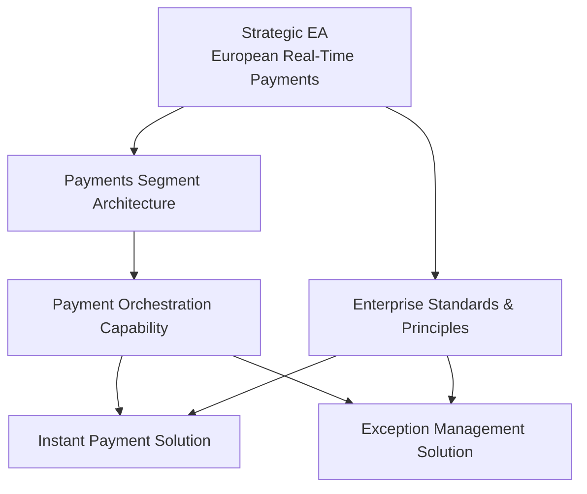

# Levels of Architecture

## 1. Definition

Les **Levels of Architecture** permettent de travailler à différents niveaux de scope et de détail tout en maintenant une cohérence globale.

Une entreprise complexe ne peut pas être décrite utilement dans un seul modèle. Elle a besoin d’architectures qui répondent à des horizons et périmètres différents.

Une façon pédagogique de comprendre les niveaux est :

- **Strategic Architecture** : direction et capacités à long terme ;
- **Segment Architecture** : domaine ou segment métier cohérent ;
- **Capability Architecture** : capacité particulière ;
- **Solution Architecture** : solution concrète permettant la mise en œuvre.

Les appellations et découpages doivent être adaptés au contexte de l’organisation ; l’idée essentielle est la gestion de niveaux cohérents de scope et de détail.

## 2. Pourquoi plusieurs niveaux ?

Sans niveaux, deux dérives apparaissent :

1. Enterprise Architecture devient trop détaillée et impossible à maintenir.
2. Solution Architecture prend des décisions locales sans cohérence avec la stratégie d’entreprise.

Les niveaux permettent de répondre à des questions différentes.

## 3. Strategic Architecture

Questions typiques :

- quelle direction d’entreprise ?
- quelles capabilities prioritaires ?
- quels grands principes ?
- quelles transformations structurantes ?
- quels grands target states ?

Exemple MayaBank :

« devenir une plateforme européenne de paiement temps réel, API-first, résiliente et observable ».

Le niveau stratégique ne définit pas le nombre de pods d’un service.

## 4. Segment Architecture

Un segment correspond à un domaine cohérent de l’entreprise.

Exemples :

- Payments ;
- Customer Identity ;
- Data Platform ;
- Insurance Claims ;
- Supply Chain.

Pour MayaBank, le segment **Payments** peut décrire :

- capabilities ;
- value streams ;
- principales applications ;
- data domains ;
- technology direction ;
- roadmap du segment.

## 5. Capability Architecture

Une architecture peut se focaliser sur une capability transverse ou stratégique.

Exemple : **Real-Time Event Processing Capability**.

Elle peut traverser plusieurs segments et nécessiter :

- data ;
- application services ;
- platform services ;
- security ;
- operating model.

## 6. Solution Architecture

La Solution Architecture transforme les contraintes et objectifs supérieurs en une conception réalisable pour une solution concrète.

Exemple MayaBank :

Solution Architecture du service **Payment Orchestration** :

- interfaces ;
- application components ;
- runtime ;
- resiliency ;
- data flows ;
- secrets ;
- observability ;
- deployment ;
- NFRs.

## 7. Top-down et bottom-up

Le flux n’est pas unidirectionnel.

### Top-down

Enterprise/Strategic Architecture fournit :

- principles ;
- standards ;
- target capabilities ;
- constraints ;
- reference architectures ;
- approved building blocks.

### Bottom-up

Solution Architecture peut révéler :

- limitation d’un standard ;
- nouveau pattern réutilisable ;
- nouvelle requirement ;
- gap d’entreprise ;
- besoin de faire évoluer une reference architecture.

L’architecture fonctionne donc par **cohérence bidirectionnelle**.

## 8. Scope, depth and time horizon

Les niveaux varient selon trois axes :

- **breadth** : largeur du périmètre ;
- **depth** : niveau de détail ;
- **time horizon** : horizon de transformation.

Une Strategic Architecture a souvent un scope large et un niveau de détail plus faible.
Une Solution Architecture a un scope plus étroit et plus de détails de réalisation.

## 9. Relation avec Partitioning

Levels et Partitioning sont liés mais différents.

- Levels = degré de scope/détail dans lequel on travaille.
- Partitioning = manière de découper et distribuer la responsabilité architecturale.

## 10. Relation avec Architecture Repository

Le repository doit permettre de retrouver :

- architectures stratégiques ;
- segment architectures ;
- reference architectures ;
- solution patterns ;
- decisions ;
- standards.

La réutilisation évite que chaque Solution Architect reparte de zéro.

## 11. MayaBank — exemple de cascade

### Strategic

API-first, event-driven where justified, resilient, secure, observable.

### Segment

Payment capabilities, ISO 20022, application landscape, migration roadmap.

### Capability

Payment Orchestration capability and shared building blocks.

### Solution

Concrete runtime, APIs, data flows and deployment design.

## 12. Governance entre niveaux

Une solution doit démontrer son alignement avec :

- architecture principles ;
- target state ;
- standards ;
- reference architectures ;
- NFRs ;
- roadmap.

Si elle dévie, la déviation doit être gouvernée plutôt qu’ignorée.

## 13. Erreurs fréquentes

- Enterprise Architecture trop détaillée ;
- Solution Architecture déconnectée de la stratégie ;
- répéter le même contenu à tous les niveaux ;
- ne pas définir les responsabilités entre niveaux ;
- interdire tout feedback bottom-up ;
- confondre level et architecture domain.

## 14. Pièges OGEA-103

- Niveau d’architecture ≠ domaine Business/Data/Application/Technology.
- Le niveau détermine scope et detail.
- L’ADM peut être appliqué à différents niveaux.
- Les architectures doivent être cohérentes et réutilisables entre niveaux.

## 15. Practitioner scenario

Une équipe solution redéfinit ses propres règles IAM et API alors que des standards d’entreprise existent déjà. La meilleure approche est d’utiliser les architectures et building blocks supérieurs comme contraintes de conception, puis de gouverner explicitement toute déviation nécessaire.

## 16. English for Architects

> We separate strategic, segment, capability and solution concerns so that each architecture is developed at the appropriate level of detail.

### Speak it

1. Enterprise architecture provides direction and constraints.
2. Solution architecture provides implementation detail.
3. Feedback from solutions can improve the enterprise architecture.

## 17. Key points

- Différents niveaux répondent à différentes questions.
- Scope large → généralement moins de détail.
- Solution Architecture doit rester alignée avec la direction d’entreprise.
- Le feedback bottom-up est légitime et gouverné.
- Level ≠ Domain.

---

Original educational content aligned with TOGAF concepts for applying architecture at different levels.