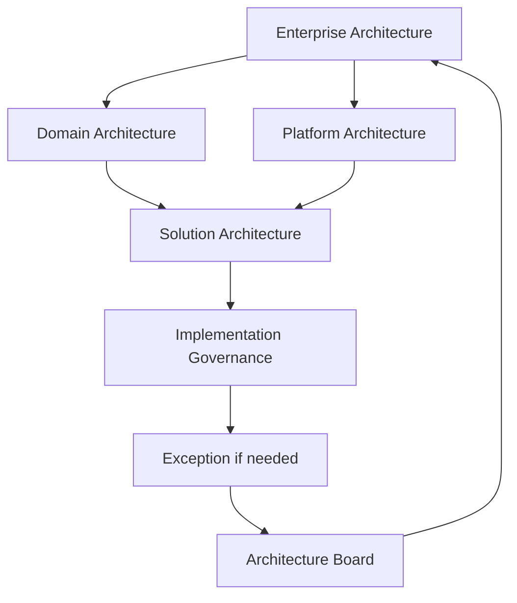

# Applying TOGAF in a Large Enterprise Context

## 1. Why large enterprises are different

Dans une grande entreprise, l’architecture doit fonctionner malgré :

- plusieurs business units ;
- plusieurs pays ;
- plusieurs legal entities ;
- plusieurs équipes d’architecture ;
- technologies historiques ;
- acquisitions ;
- fournisseurs multiples ;
- réglementations différentes ;
- portfolios de transformation parallèles.

Le problème principal n’est donc pas seulement « concevoir une bonne architecture ». Il faut créer une **architecture capability capable de coordonner de nombreuses décisions distribuées**.

## 2. Key principles

Une grande entreprise a besoin de :

- clear principles ;
- architecture partitioning ;
- federated responsibilities ;
- common repository ;
- reference architectures ;
- reusable building blocks ;
- decision rights ;
- exception management ;
- portfolio alignment ;
- cross-domain governance.

## 3. Centralized vs federated architecture

### Fully centralized

Avantages : cohérence forte.

Risques : lenteur, déconnexion du terrain, bottleneck.

### Fully decentralized

Avantages : autonomie locale.

Risques : duplication, divergence, incompatibilité, coûts.

### Federated model

Souvent plus réaliste :

- Enterprise Architecture définit direction et guardrails ;
- Domain Architects gèrent leur domaine ;
- Platform Architects gèrent les capabilities partagées ;
- Solution Architects conçoivent les solutions ;
- Architecture Board arbitre les sujets transverses et exceptions majeures.

## 4. Architecture governance at scale

Il faut distinguer les niveaux de décision.

### Enterprise decisions

- strategic principles ;
- enterprise standards ;
- shared platforms ;
- critical reference architectures.

### Domain decisions

- target state du domaine ;
- domain data ownership ;
- application landscape ;
- domain roadmap.

### Solution decisions

- detailed design ;
- local technology choices within guardrails ;
- NFR implementation ;
- delivery decisions.

Une décision doit être prise au niveau le plus bas capable de la prendre sans nuire à la cohérence globale.

## 5. Enterprise Architecture Repository at scale

Le repository doit éviter deux échecs :

- énorme bibliothèque que personne ne consulte ;
- information dispersée dans des outils locaux.

Il doit permettre de trouver rapidement :

- principles ;
- standards ;
- reference architectures ;
- approved building blocks ;
- target architectures ;
- roadmaps ;
- decisions ;
- exceptions ;
- governance evidence.

## 6. Reuse

La réutilisation est une source majeure de valeur en grande entreprise.

Exemples :

- standard API security pattern ;
- OpenShift deployment pattern ;
- observability building block ;
- event schema governance ;
- HA/DR reference architecture ;
- identity pattern.

Réutiliser ne signifie pas imposer aveuglément. Les building blocks doivent être adaptés ou faire l’objet d’une exception lorsqu’ils ne répondent pas au contexte.

## 7. Cross-domain dependencies

Les transformations majeures traversent plusieurs domaines.

Exemple MayaBank : le programme Payment Transformation dépend de :

- IAM ;
- network ;
- event platform ;
- data governance ;
- security ;
- operations ;
- finance ;
- external partners.

Une architecture locale ne peut donc pas gérer seule toutes les décisions.

## 8. Portfolio alignment

Les roadmaps de domaine doivent être rapprochées du portfolio d’entreprise.

Questions :

- les work packages se chevauchent-ils ?
- plusieurs domaines construisent-ils la même capability ?
- une dépendance partagée bloque-t-elle plusieurs programmes ?
- les priorités sont-elles compatibles ?
- quels investissements créent des reusable assets ?

## 9. Mergers and acquisitions

Un contexte M&A crée des problèmes spécifiques :

- deux Architecture Repositories ;
- standards contradictoires ;
- doublons applicatifs ;
- data ownership ambigu ;
- technologies différentes ;
- cultures de governance différentes.

L’ADM peut être appliqué pour :

1. clarifier drivers et scope ;
2. développer Baseline des deux environnements ;
3. définir Target ;
4. identifier gaps et rationalisation ;
5. créer Transition Architectures ;
6. séquencer la convergence.

## 10. Geographic and regulatory variation

Une architecture globale peut devoir autoriser des variations locales.

Exemple :

Enterprise Principle : centralized identity governance.

Local constraint : réglementation imposant une conservation ou un contrôle spécifique.

La bonne architecture définit :

- ce qui est global ;
- ce qui peut varier ;
- comment une exception est approuvée ;
- comment éviter une divergence permanente.

## 11. Architecture at multiple speeds

Tous les domaines n’évoluent pas au même rythme.

- digital channels : rapide ;
- payment core : contrôlé et critique ;
- regulatory systems : deadline-driven ;
- shared infrastructure : platform lifecycle.

Le tailoring de l’ADM doit refléter ces rythmes sans perdre la cohérence de l’ensemble.

## 12. MayaBank enterprise model

### Enterprise Architecture

Définit :

- principles ;
- strategic target ;
- enterprise standards ;
- shared capability map.

### Payments Domain Architecture

Définit :

- Payment capabilities ;
- ISO 20022 information architecture ;
- application target ;
- payment roadmap.

### Platform Architecture

Définit :

- OpenShift ;
- GitOps ;
- API platform ;
- event streaming ;
- observability.

### Solution Architecture

Définit :

- Payment Orchestrator ;
- concrete APIs ;
- deployment ;
- resilience ;
- NFR implementation.

## 13. Governance flow

Cette boucle permet aux exceptions importantes de faire évoluer les standards si nécessaire.

## 14. Common failure modes

### Architecture ivory tower

Central architecture produit des standards sans comprendre le delivery.

### Local optimization

Chaque domaine optimise ses propres coûts mais augmente le coût global.

### Duplicate platforms

Chaque business unit construit API, event, IAM et observability indépendamment.

### Governance bottleneck

Toutes les petites décisions remontent à l’Architecture Board.

### Uncontrolled federation

Les équipes sont « autonomes » mais les standards deviennent incompatibles.

## 15. How TOGAF helps

TOGAF apporte une structure commune :

- ADM ;
- common terminology ;
- Architecture Capability ;
- Repository ;
- governance ;
- principles ;
- requirements ;
- roadmap ;
- content concepts.

Le framework ne remplace pas l’operating model de l’entreprise. Il aide à le structurer.

## 16. OGEA-103 traps

- TOGAF est applicable aux grandes organisations mais doit être tailored.
- Partitioning et levels réduisent la complexité.
- Federation doit conserver governance et coherence.
- Shared building blocks favorisent la réutilisation.
- Une Architecture Board ne doit pas prendre chaque décision locale.

## 17. Practitioner scenario

Une multinationale possède dix équipes d’architecture locales et cinq plateformes d’API différentes. La direction veut tout centraliser dans une seule équipe.

La meilleure approche n’est pas nécessairement une centralisation totale. Il faut évaluer le partitioning, définir les decision rights, identifier les capabilities réellement partagées, standardiser les building blocks communs et conserver une gouvernance fédérée adaptée.

## 18. English for Architects

> In a large enterprise, we use federated architecture governance: enterprise teams define shared direction and standards, while domain and solution teams retain controlled autonomy.

### Speak it

1. We standardize shared capabilities at enterprise level.
2. Domain architects own their target architectures.
3. Exceptions are escalated only when they have enterprise impact.

## 19. Key points

- Large enterprise = distributed decisions + need for coherence.
- Federation est souvent plus réaliste que centralisation totale.
- Decision rights doivent être explicites.
- Partitioning, Repository et reusable building blocks sont essentiels.
- Global standards peuvent autoriser des variations locales gouvernées.
- Architecture doit rester connectée au portfolio et au delivery.

---

Original educational content aligned with TOGAF application in complex enterprise contexts.