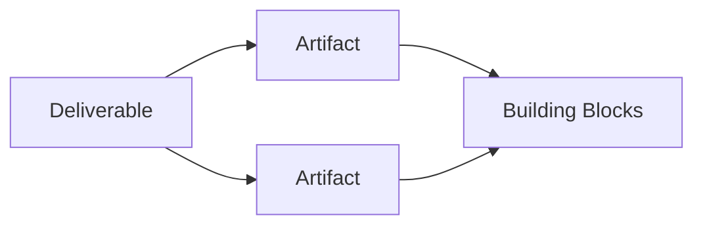

# Architecture Content Framework

## 1. Pourquoi un Content Framework ?

L’ADM explique **comment conduire** le travail d’architecture. L’**Architecture Content Framework** aide à structurer **ce que ce travail produit**.

Sans structure de contenu, deux équipes peuvent utiliser les mêmes phases ADM mais produire des résultats impossibles à comparer, réutiliser ou gouverner.

Le Content Framework fournit donc un vocabulaire pour organiser :

- deliverables ;
- artifacts ;
- building blocks ;
- relations entre ces éléments.

## 2. La relation fondamentale

Une simplification utile est :

**Deliverable = paquet formel de travail**

**Artifact = représentation architecturale**

**Building Block = élément constitutif de l’architecture**

## 3. Pourquoi cette distinction est essentielle

Prenons un **Architecture Definition Document**.

C’est un deliverable. Il peut contenir plusieurs artifacts :

- catalogues ;
- matrices ;
- diagrams ;
- descriptions ;
- views.

Ces artifacts représentent ou décrivent des building blocks :

- business services ;
- applications ;
- data entities ;
- technology services ;
- capabilities.

## 4. Content Framework vs ADM

| ADM | Content Framework |
|---|---|
| méthode de développement | structure des résultats |
| phases et activités | types de contenu |
| répond « comment avancer ? » | répond « que produit-on et comment le structurer ? » |

Ils fonctionnent ensemble.

## 5. Content Metamodel

Le **Content Metamodel** décrit les types d’entités architecturales et leurs relations. Il peut être adapté au contexte de l’organisation.

Exemple :

**Business Service → supported by Application Service → realized by Application Component → hosted on Technology Component**.

Le metamodel rend possible la traçabilité entre domaines.

## 6. Artifacts

Trois familles pédagogiques importantes :

- **Catalogs** : listes structurées ;
- **Matrices** : relations tabulaires entre ensembles ;
- **Diagrams** : représentations visuelles de relations ou structures.

## 7. Building Blocks

Les building blocks représentent des capacités ou composants réutilisables à différents niveaux d’abstraction.

On distingue notamment :

- Architecture Building Block (ABB) ;
- Solution Building Block (SBB).

## 8. Adaptation

Le Content Framework n’impose pas de produire chaque artifact possible. Le contenu doit être **tailored** selon :

- scope ;
- stakeholders ;
- concerns ;
- décision attendue ;
- maturité ;
- niveau d’architecture ;
- mode de delivery.

## 9. Exemple MayaBank

Deliverable : `Architecture Definition Document — Instant Payments`.

Artifacts :

- Capability Map ;
- Application Communication Diagram ;
- Data Entity/Application Matrix ;
- Technology Platform Diagram.

Building blocks représentés :

- Payment Orchestration capability ;
- Fraud Screening service ;
- Payment API ;
- Event Streaming Platform ;
- Observability Service.

## 10. Pièges OGEA-103

- Deliverable ≠ artifact.
- Artifact ≠ building block.
- Le metamodel ≠ un diagramme unique.
- Le Content Framework ne remplace pas l’ADM.
- TOGAF ne demande pas de produire tous les artifacts possibles.

## 11. Foundation question

Quel concept structure les types de contenu produits par le travail d’architecture ?

A. Architecture Content Framework
B. Phase H
C. Business Scenario
D. Architecture Contract

**Réponse : A.**

## 12. Practitioner scenario

Une organisation produit des dizaines de diagrammes sans relation avec les décisions ni avec les éléments réels d’architecture. La meilleure amélioration n’est pas de produire encore plus de vues mais de structurer les artifacts, leurs éléments et leurs relations dans un content metamodel adapté.

## 13. English for Architects

> The Content Framework structures architecture deliverables, artifacts, and building blocks so that architecture work remains consistent and reusable.

## 14. Key points

- ADM = méthode.
- Content Framework = structure du contenu.
- Deliverable contient des artifacts.
- Artifacts représentent des building blocks.
- Le contenu est adapté au contexte.

---

Original educational explanation based on the TOGAF Standard, 10th Edition — Architecture Content.