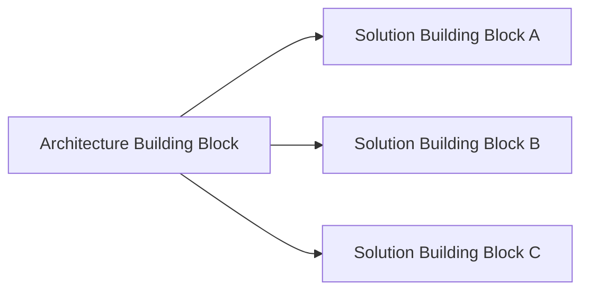

# ABB vs SBB

## 1. Pourquoi cette distinction est difficile

**Architecture Building Block (ABB)** et **Solution Building Block (SBB)** sont proches parce qu’ils décrivent tous deux des éléments de l’architecture. La différence principale tient au **niveau d’abstraction** et à l’intention.

## 2. ABB

Un ABB décrit ce que l’architecture doit fournir ou permettre, sans figer trop tôt la réalisation concrète.

Exemple :

`Secure API Gateway Capability`

Caractéristiques :

- authentification forte ;
- rate limiting ;
- observabilité ;
- haute disponibilité ;
- politiques de sécurité.

## 3. SBB

Un SBB décrit une réalisation plus concrète susceptible de satisfaire l’ABB.

Exemple :

`Product X API Gateway cluster version Y deployed on platform Z`.

## 4. Relation

Plusieurs SBB peuvent être évalués pour réaliser un même ABB.

## 5. Pourquoi ne pas choisir le SBB trop tôt

Choisir immédiatement une solution peut :

- biaiser l’analyse ;
- masquer les vraies requirements ;
- limiter les options ;
- rendre la solution difficile à justifier ;
- créer un verrouillage fournisseur inutile.

La discipline est : **besoin architectural d’abord, solution ensuite**.

## 6. Relation avec B/C/D et E

Phases B/C/D développent les architectures et identifient les building blocks nécessaires.

Phase E cherche des solutions, groupements et work packages : elle rapproche donc le besoin architectural de réalisations concrètes.

## 7. Exemple MayaBank

### ABB

`Event Streaming Platform`

Requirements :

- haute disponibilité ;
- chiffrement ;
- forte volumétrie ;
- multi-environnement ;
- monitoring ;
- intégration IAM.

### SBB candidates

- plateforme Kafka on-premise ;
- service Kafka managé cloud ;
- autre produit compatible.

La sélection dépend ensuite des contraintes MayaBank.

## 8. Attention au caractère relatif

La distinction n’est pas toujours « conceptuel vs produit » de manière absolue. Ce qui est solution à un niveau peut être architecture à un niveau plus détaillé.

Le contexte et le niveau d’abstraction comptent.

## 9. Pièges OGEA-103

- ABB n’est pas automatiquement un diagramme.
- SBB n’est pas toujours un produit commercial.
- Plusieurs SBB peuvent satisfaire un ABB.
- Ne pas confondre building block et work package.

## 10. ABB vs Work Package

- Building Block = élément de l’architecture ou de la solution.
- Work Package = ensemble de travail à réaliser pendant la transformation.

Exemple :

ABB : Observability Service.

Work Package : « Déployer la plateforme d’observabilité commune sur les trois environnements ».

## 11. Foundation question

Quel énoncé décrit le mieux un SBB ?

A. Une préoccupation stakeholder
B. Une réalisation plus concrète d’un besoin architectural
C. Un plan de migration
D. Un deliverable

**Réponse : B.**

## 12. Practitioner scenario

Une équipe affirme : « notre architecture cible est Produit X ». La réponse la plus robuste consiste à revenir aux capabilities, requirements et ABB attendus puis à démontrer pourquoi Produit X constitue le meilleur SBB dans ce contexte.

## 13. English for Architects

> We define the Architecture Building Block first, then evaluate Solution Building Blocks that can satisfy its requirements.

## 14. Key points

- ABB = besoin / élément architectural plus abstrait.
- SBB = réalisation plus concrète.
- Work Package = travail de transformation, pas building block.
- Définir les requirements avant de figer la solution.

---

Original educational explanation based on the TOGAF Standard, 10th Edition.